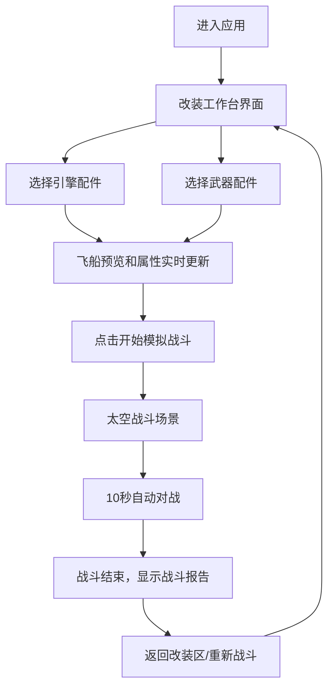

## 1. 产品概述

像素风飞船改装与模拟作战应用，玩家可在工作台上自由组合引擎、武器、护盾、装甲等配件，实时查看飞船战斗力变化，并驾驶改装飞船在太空场景中与AI敌人模拟对战。

- **核心目的**：提供沉浸式的飞船改装体验，通过数值反馈和模拟战斗验证改装方案的优劣
- **目标用户**：太空题材爱好者、改装模拟类游戏玩家
- **产品价值**：低门槛的策略性改装体验，配合像素复古美学风格，打造独特的太空战斗模拟器

## 2. 核心特性

### 2.2 功能模块

1. **飞船改装工作台**：配件选择区、飞船3D像素预览区、属性数值面板
2. **模拟战斗场景**：太空背景、敌我飞船、弹道动画、血条显示
3. **战斗报告面板**：伤害统计、配件效率分析、战斗结果展示

### 2.3 页面详情

| 页面名称 | 模块名称 | 功能描述 |
|-----------|-------------|---------------------|
| 主界面 | 改装工作台 | 6种配件卡片选择，支持引擎/武器各选一种，实时更新预览 |
| 主界面 | 飞船像素预览 | 8x8像素网格飞船，每秒旋转15度，外观随配件动态变化 |
| 主界面 | 属性数值面板 | 战斗力、速度、耐久度的数值+进度条展示 |
| 主界面 | 战斗预览区 | 太空背景，敌我自动对战10秒，弹道动画+血条 |
| 主界面 | 战斗报告面板 | 伤害输出、存活时间、配件效率排行统计 |

## 3. 核心流程

用户进入应用后，默认显示改装工作台界面，可自由选择引擎和武器配件。选择配件后，飞船预览和属性数值实时更新。点击"开始模拟战斗"按钮，切换到战斗模式，系统自动生成AI敌船并开始10秒模拟对战。战斗结束后显示详细的战斗报告，用户可返回改装区重新调整配件，重复体验。

## 4. 用户界面设计

### 4.1 设计风格

- **配色方案**：深色像素风主题
  - 主背景：#1A1A2E
  - 卡片/面板背景：#2D2D44
  - 强调色：#7C5CBF（紫）、#FFD700（金）
  - 进度条颜色：战斗力#FF4444、速度#4488FF、耐久#44BB44
  - 弹道颜色：激光红、导弹橙、电磁炮蓝
- **按钮风格**：圆角8px，背景#4A4A6A，悬停#6A6A8A，点击#3A3A5A，白色文字
- **字体**：等宽字体 monospace，营造复古像素风
- **布局风格**：上下分区（上方改装区左右布局，下方战斗区），响应式适配
- **配件卡片**：140px宽，圆角8px，选中时金色2px边框，悬停时紫色边框

### 4.2 页面设计总览

| 页面名称 | 模块名称 | UI元素 |
|-----------|-------------|-------------|
| 主界面 | 配件选择区 | 6张配件卡片网格，悬停动画、选中高亮 |
| 主界面 | 像素飞船预览 | 8x8方块网格，旋转动画，配件对应颜色方块 |
| 主界面 | 属性数值 | 数值文字+彩色进度条组合 |
| 主界面 | 战斗场景 | 深蓝渐变太空背景，发光弹道，血条动画 |
| 主界面 | 战斗报告 | 圆角面板，统计数据列表，配件效率排行 |

### 4.3 响应式设计

- **桌面端（≥768px）**：改装区左右布局（配件列表左，飞船预览右）
- **移动端（<768px）**：改装区上下布局（配件列表上，飞船预览下）
- 战斗预览区保持全屏宽度不变
- 所有尺寸和间距使用像素单位保持像素风一致性

## 5. 性能要求

- 配件切换响应时间：≤100ms
- 战斗动画帧率：稳定30fps以上
- 弹道动画实现：requestAnimationFrame
- 像素渲染优化：CSS变换而非重排
