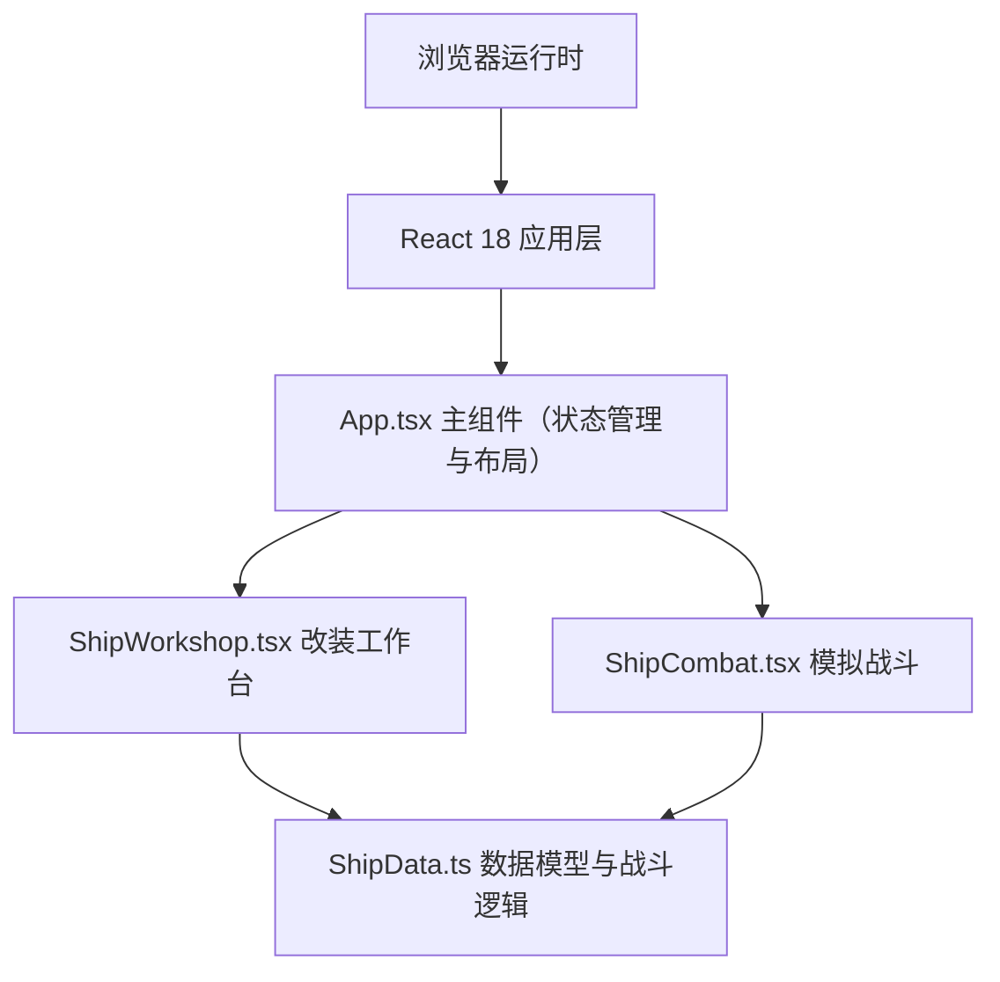

## 1. 架构设计



## 2. 技术说明

- **前端框架**：React@18 + TypeScript@5
- **构建工具**：Vite@5 + @vitejs/plugin-react
- **状态管理**：React useState/useEffect（轻量场景，无需额外状态库）
- **动画方案**：CSS动画（飞船旋转、进度条过渡） + requestAnimationFrame（弹道物理计算）
- **样式方案**：纯CSS（inline style + style标签），避免Tailwind以保持像素风精确控制

## 3. 模块文件结构

| 文件路径 | 职责 |
|-------|------|
| package.json | 项目依赖与脚本配置 |
| vite.config.js | Vite React插件配置 |
| tsconfig.json | TypeScript严格模式配置 |
| index.html | 入口HTML，标题"飞船工坊" |
| src/App.tsx | 主组件：整体布局、视图切换、全局状态 |
| src/ShipWorkshop.tsx | 改装工作台：配件列表、飞船像素预览、属性面板 |
| src/ShipCombat.tsx | 战斗模拟：Canvas/DOM渲染、弹道系统、血条、报告面板 |
| src/ShipData.ts | 数据层：配件定义、飞船属性计算、战斗伤害计算函数 |

## 4. 数据模型定义

### 4.1 核心类型（ShipData.ts）

```typescript
// 配件类型
type PartCategory = 'engine' | 'weapon';

// 武器子类型
type WeaponType = 'laser' | 'missile' | 'railgun';

// 引擎子类型
type EngineType = 'swift' | 'balanced' | 'heavy';

// 配件定义
interface ShipPart {
  id: string;
  name: string;
  category: PartCategory;
  subType: WeaponType | EngineType;
  // 属性加成
  powerBonus: number;      // 战斗力加成
  speedBonus: number;      // 速度加成
  durabilityBonus: number; // 耐久度加成
  // 战斗属性
  damagePerSecond: number; // 每秒伤害
  hitRate: number;         // 命中率 0-1
  shieldAbsorb: number;    // 护盾吸收率 0-1
  // 视觉配置
  projectileColor: string; // 弹道颜色
  description: string;
}

// 飞船实例
interface ShipInstance {
  engine: ShipPart | null;
  weapon: ShipPart | null;
  totalPower: number;
  totalSpeed: number;
  totalDurability: number;
}

// 战斗状态
interface CombatState {
  running: boolean;
  elapsed: number;         // 已用时间(ms)
  playerHp: number;
  playerMaxHp: number;
  enemyHp: number;
  enemyMaxHp: number;
  playerDamageDealt: number;
  enemyDamageDealt: number;
  projectiles: Projectile[];
  result: CombatResult | null;
}

// 弹道
interface Projectile {
  id: number;
  x: number;
  y: number;
  vx: number;
  vy: number;
  color: string;
  source: 'player' | 'enemy';
  damage: number;
}

// 战斗结果
interface CombatResult {
  victory: boolean;
  playerHpPercent: number;
  enemyHpPercent: number;
  playerTotalDamage: number;
  enemyTotalDamage: number;
  survivalTime: number;
  partEfficiency: PartEfficiencyEntry[];
}

// 配件效率条目
interface PartEfficiencyEntry {
  partName: string;
  contribution: number;  // 贡献值（伤害或吸收）
  type: 'damage' | 'absorb';
}
```

### 4.2 配件预设数据

| 配件ID | 名称 | 类型 | 战斗力 | 速度 | 耐久 | DPS |
|--------|------|------|--------|------|------|-----|
| engine_swift | 急速引擎 | engine | 20 | 80 | 30 | - |
| engine_balanced | 平衡引擎 | engine | 35 | 50 | 50 | - |
| engine_heavy | 重型引擎 | engine | 50 | 20 | 80 | - |
| weapon_laser | 激光炮 | weapon | 60 | - | 20 | 25 |
| weapon_missile | 导弹发射器 | weapon | 70 | - | 30 | 20 |
| weapon_railgun | 电磁轨道炮 | weapon | 80 | - | 40 | 35 |

### 4.3 战斗计算函数

- `calculateShipStats(engine, weapon): ShipInstance` 计算飞船总属性
- `createEnemyShip(): ShipInstance` 随机生成AI敌船
- `simulateCombatTick(state, deltaMs): CombatState` 单帧战斗更新
- `computePartEfficiency(engine, weapon, dmgDealt, dmgTaken): PartEfficiencyEntry[]` 计算配件效率
- `determineCombatResult(state): CombatResult` 生成战斗报告

## 5. 性能优化策略

1. **配件切换优化**：纯函数计算 + React浅比较，避免不必要重渲染
2. **战斗循环优化**：requestAnimationFrame + delta时间，固定逻辑步长
3. **动画优化**：CSS transform处理飞船旋转，避免重排
4. **渲染优化**：弹道数量限制，超出屏幕自动回收
5. **内存优化**：战斗结束释放requestAnimationFrame引用
