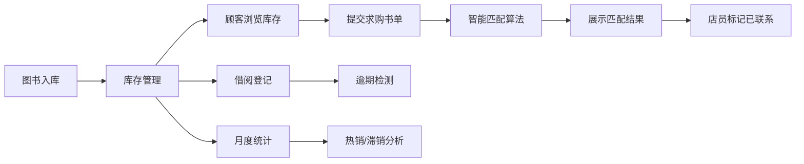

## 1. 产品概述

书屿 - 二手书店存管平台，面向二手书店店主与顾客的线上存书管理与求购匹配应用。实现图书库存追踪、求购书目智能匹配、借阅记录管理及月度销售统计分析。

- 核心目标：提升二手书店运营效率，通过智能匹配加速库存周转
- 目标用户：二手书店店主、店员、购书顾客
- 市场价值：数字化管理 + 智能匹配，降低人工成本，提升顾客体验

## 2. 核心功能

### 2.1 用户角色
| 角色 | 注册方式 | 核心权限 |
|------|----------|----------|
| 店员/店主 | 系统内置 | 图书入库、售出登记、借阅管理、统计查看、求购匹配 |
| 顾客 | 模拟角色 | 浏览库存、提交求购书单 |

### 2.2 功能模块
1. **库存管理**：图书增删改查、分类筛选、价格区间筛选、库存状态追踪
2. **求购匹配**：求购书单提交、智能匹配算法、匹配度展示、状态管理
3. **借阅管理**：借出登记、归还管理、逾期提醒、逾期天数计算
4. **统计分析**：月度热销TOP5、滞销书分析、柱状图可视化

### 2.3 页面详情
| 页面名称 | 模块名称 | 功能描述 |
|----------|----------|----------|
| 主页面 | 顶部导航栏 | 应用名称展示、固定定位 |
| 主页面 | 搜索筛选面板 | 书名/作者/ISBN模糊搜索、分类下拉、价格双滑块 |
| 主页面 | 图书卡片网格 | 封面色块、书名、作者、价格、库存徽章、悬浮动效 |
| 主页面 | 求购匹配面板 | 求购书单列表、匹配推荐区、匹配度百分比 |
| 主页面 | 月度统计面板 | 热销TOP5柱状图、滞销书数量统计 |
| 主页面 | 借阅管理 | 借出操作、借阅人信息、逾期状态、逾期天数 |

## 3. 核心流程

### 3.1 图书入库流程
店员录入图书信息 → BookStore 存储 → 搜索面板展示 → 顾客可浏览

### 3.2 求购匹配流程
顾客提交求购书单 → 系统计算匹配度 → 展示匹配结果 → 店员标记已联系 → 更新求购状态

### 3.3 借阅管理流程
选择图书 → 录入借阅人信息与归还日期 → 更新图书状态 → 逾期自动标记 → 显示逾期天数

## 4. 用户界面设计

### 4.1 设计风格
- **主色调**：暖木色系，主色 #8B7355，辅色 #C4A882
- **背景色**：#F5F0E8（米白暖调）
- **文字色**：#3D3029（深棕）
- **卡片样式**：圆角设计，轻微阴影，悬浮放大效果
- **字体**：优雅衬线字体 + 清晰无衬线正文
- **布局**：左右分栏（30%搜索 / 70%匹配），底部统计区

### 4.2 页面设计概览
| 页面名称 | 模块名称 | UI元素 |
|----------|----------|--------|
| 主页面 | 导航栏 | 深棕背景#3D3029、白色文字、56px高度、固定顶部 |
| 主页面 | 搜索面板 | 搜索框、分类下拉、双滑块价格区间、卡片网格展示 |
| 主页面 | 图书卡片 | 240px宽、12px圆角、#FDFBF7背景、分类配色封面、悬浮放大1.03倍 |
| 主页面 | 求购面板 | 260px宽卡片、14px圆角、#FAF6ED背景、左侧列表右侧推荐 |
| 主页面 | 统计图表 | recharts柱状图、#8B7355主色、#C0392B警告色、数值标签 |
| 主页面 | 借阅状态 | 逾期红色虚线边框#E74C3C、右下角逾期天数 |

### 4.3 响应式设计
- 桌面端（≥768px）：左右分栏布局，30% / 70% 比例
- 移动端（<768px）：左侧面板转为可折叠抽屉，右侧面板占满宽度
- 触控优化：按钮最小尺寸44px，卡片间距适配手指操作

### 4.4 动效设计
- 卡片悬浮：scale(1.03) + 阴影加深，transition 0.2s ease-in-out
- 拖拽排序：缓动过渡 0.2s ease-in-out
- 匹配结果淡入：opacity 0→1，duration 0.4s
- 价格滑块：防抖500ms实时搜索
