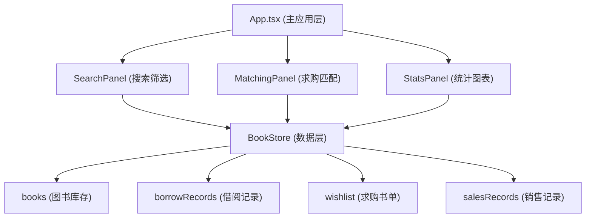
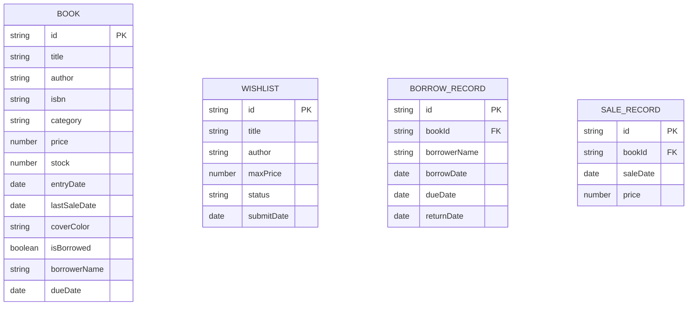

## 1. 架构设计



## 2. 技术说明

- **前端框架**：React 18 + TypeScript
- **构建工具**：Vite 5 + @vitejs/plugin-react
- **图表库**：recharts (柱状图统计)
- **状态管理**：BookStore 单例模式 + useSyncExternalStore / 自定义 Hook
- **样式方案**：CSS Modules / 内联样式 (按需求使用)
- **数据模拟**：内置约 200 条模拟图书数据

## 3. 文件结构

| 文件路径 | 作用 |
|----------|------|
| package.json | 项目依赖与脚本配置 |
| vite.config.js | Vite 构建配置 |
| tsconfig.json | TypeScript 严格模式配置 |
| index.html | 入口页面，标题"书屿" |
| src/App.tsx | 主应用组件，布局路由与状态分发 |
| src/BookStore.ts | 核心数据层，CRUD + 筛选 + 匹配算法 |
| src/SearchPanel.tsx | 搜索筛选 + 图书卡片网格展示 |
| src/MatchingPanel.tsx | 求购书单列表 + 匹配推荐区 |
| src/StatsPanel.tsx | 月度统计柱状图 (热销/滞销) |
| src/types.ts | TypeScript 类型定义 |
| src/utils.ts | 工具函数 (匹配算法、价格计算等) |
| src/mockData.ts | 模拟数据生成 |

## 4. 数据模型

### 4.1 数据模型定义



### 4.2 核心类型定义

```typescript
interface Book {
  id: string;
  title: string;
  author: string;
  isbn: string;
  category: '文学' | '科技' | '生活';
  price: number;
  stock: number;
  entryDate: string;
  lastSaleDate?: string;
  isBorrowed?: boolean;
  borrowerName?: string;
  dueDate?: string;
}

interface WishlistItem {
  id: string;
  title: string;
  author: string;
  maxPrice: number;
  status: '待匹配' | '已联系' | '已完成';
  submitDate: string;
}

interface BorrowRecord {
  id: string;
  bookId: string;
  borrowerName: string;
  borrowDate: string;
  dueDate: string;
  returnDate?: string;
}

interface SaleRecord {
  id: string;
  bookId: string;
  saleDate: string;
  price: number;
}
```

## 5. 核心算法

### 5.1 匹配度计算
- 书名关键词重叠率：权重 0.6
- 作者姓氏重合：权重 0.4
- 匹配度 = 书名重叠率 × 0.6 + 作者匹配度 × 0.4

### 5.2 推荐价格计算
- 基于图书定价 × 折旧系数
- 考虑库存时间、品相等级

### 5.3 滞销判定
- 库存 > 30 天未售出即为滞销
- 统计当前滞销图书总量

## 6. 性能约束

- 搜索响应时间 ≤ 200ms（本地数据 ~200 条）
- 图表渲染时间 ≤ 100ms
- 使用防抖优化价格滑块搜索（500ms）
- 列表虚拟滚动可选（200 条暂不需要）
