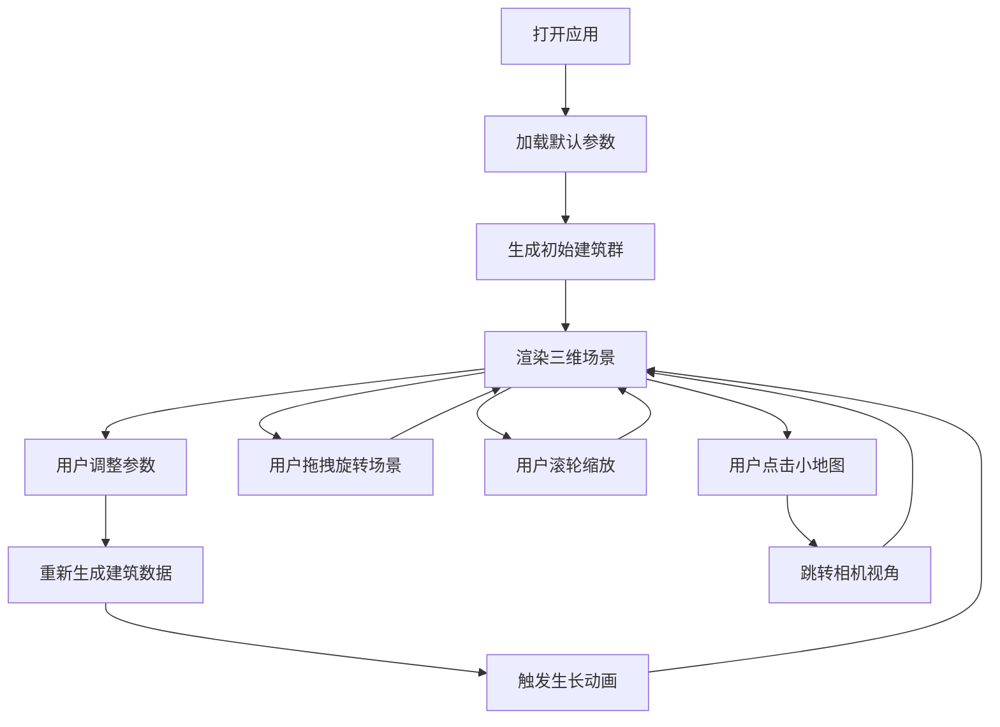

## 1. 产品概述

交互式三维城市天际线生长模拟器，让用户通过拖拽调整城市建设参数，实时观察虚拟城市从平地生长出建筑群的动态过程。

- 主要用途：城市规划可视化、建筑设计演示、教育科普
- 目标用户：城市规划师、建筑设计师、学生、城市建设爱好者
- 核心价值：通过直观的参数调整和三维可视化，帮助用户理解城市建设参数对天际线形态的影响

## 2. 核心特性

### 2.1 用户角色

| 角色 | 注册方式 | 核心权限 |
|------|----------|----------|
| 普通用户 | 无需注册 | 调整参数、观察城市生长、漫游场景、切换视角 |

### 2.2 功能模块

1. **主场景视图**：Three.js三维渲染，展示城市天际线生长过程
2. **控制面板**：五个参数滑块（密度、高度上限、绿化覆盖率、时代风格、日照角度）
3. **小地图指示器**：二维俯视图，显示相机位置，支持快速视角跳转
4. **建筑生成系统**：根据参数动态生成建筑数据和生长动画
5. **相机漫游系统**：支持鼠标拖拽旋转、滚轮缩放、小地图点击跳转

### 2.3 页面详情

| 页面名称 | 模块名称 | 功能描述 |
|---------|---------|----------|
| 主页面 | 三维场景 | 实时渲染城市建筑群、地面网格、渐变天空、建筑生长动画 |
| 主页面 | 控制面板 | 五个参数滑块，实时调整城市参数，数值动态显示 |
| 主页面 | 小地图 | 显示相机位置和方向，点击跳转视角 |

## 3. 核心流程

用户打开应用 → 看到默认参数下的城市天际线 → 拖拽调整参数滑块 → 实时观察城市生长变化 → 鼠标拖拽旋转场景 → 滚轮缩放查看细节 → 点击小地图快速跳转视角

## 4. 用户界面设计

### 4.1 设计风格

- **主色调**：淡蓝色天空(#87CEEB)、浅橙色地平线(#FFDAB9)、灰色地面(#CCCCCC)
- **建筑配色**：
  - 古典风格：米黄(#F5DEB3)、砖红(#A0522D)
  - 现代风格：银灰(#C0C0C0)、玻璃蓝(#4682B4)
  - 未来风格：冷白(#F0F8FF)、霓虹紫(#8A2BE2)
- **控制面板**：半透明白色背景(#FFFFFFCC)，圆角12px，阴影0 4px 20px rgba(0,0,0,0.2)
- **小地图**：深色背景(#1A1A2E)，边框1px solid #4A4A6A，圆角8px
- **字体**：采用现代无衬线字体，简洁清晰

### 4.2 页面设计概述

| 页面名称 | 模块名称 | UI元素 |
|---------|---------|--------|
| 主页面 | 三维场景 | 渐变天空背景、灰色网格地面、动态建筑群、树木绿化、实时阴影 |
| 主页面 | 控制面板 | 五个滑块（带标签和数值显示）、滑块轨道高6px圆角3px |
| 主页面 | 小地图 | 二维俯视图、相机位置箭头、可点击区域 |

### 4.3 响应性

- 桌面端优先设计，全屏展示三维场景
- 控制面板固定在右侧，小地图固定在左下角
- 支持窗口大小变化时自适应调整

### 4.4 3D场景指导

- **环境**：渐变天空背景（顶部#87CEEB到底部#FFDAB9），灰色网格地面（网格线#CCCCCC，透明度0.3）
- **光照**：方向光模拟日照，角度可调节，启用阴影投射
- **相机**：透视相机，初始位置可俯瞰整个城市，支持OrbitControls控制
- **动画**：建筑从地面升起动画，时长1-2秒，使用easeOutCubic缓动函数
- **性能**：建筑数量不超过200栋，确保30FPS以上流畅运行
