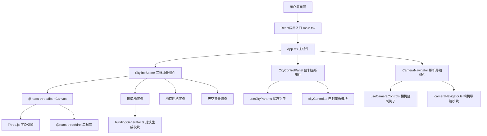

## 1. 架构设计



## 2. 技术描述

- **前端框架**: React@18 + TypeScript@5 + Vite@5
- **三维渲染**: Three@0.160 + @react-three/fiber@8 + @react-three/drei@9
- **构建工具**: Vite@5 配合 @vitejs/plugin-react@4
- **无后端**: 纯前端应用，所有逻辑在客户端执行

## 3. 目录结构

```
auto285/
├── index.html                 # 入口HTML
├── package.json              # 项目依赖
├── vite.config.js            # Vite配置
├── tsconfig.json             # TypeScript配置
└── src/
    ├── main.tsx              # React应用入口
    ├── App.tsx               # 主应用组件
    ├── skylineScene.tsx      # 三维场景组件
    ├── buildingGenerator.ts  # 建筑生成与动画模块
    ├── cityControl.ts        # 控制面板与状态管理
    └── cameraNavigator.ts    # 相机导航与视角控制
```

## 4. 模块职责

### 4.1 buildingGenerator.ts
- 导出 `generateBuildings(params)`: 根据参数生成建筑数据数组
- 导出 `animateBuildingRise(building, progress)`: 计算建筑生长动画进度
- 建筑数据结构: `{ id, position: [x, y, z], height, color, width, depth, animationDelay }`
- 最大建筑数量: 200栋

### 4.2 cityControl.ts
- 导出 `useCityParams()` 钩子: 管理所有城市参数状态
- 导出 `CityControlPanel` 组件: 渲染右侧控制面板
- 参数类型:
  - density: 0-100 (建筑密度百分比)
  - maxHeight: 10-200 (建筑高度上限)
  - greenCoverage: 0-100 (绿化覆盖率百分比)
  - eraStyle: 0-100 (0=古典, 50=现代, 100=未来)
  - sunAngle: 0-360 (日照角度)

### 4.3 cameraNavigator.ts
- 导出 `useCameraControls()` 钩子: 管理相机状态
- 导出 `CameraNavigator` 组件: 渲染小地图指示器
- 功能: 视角跳转、旋转漫游、位置同步

### 4.4 skylineScene.tsx
- 导出 `SkylineScene` 组件: Three.js场景主容器
- 包含: Canvas、环境光照、地面网格、天空背景、建筑群渲染
- 使用 @react-three/drei 的 OrbitControls 进行相机控制

## 5. 数据类型定义

```typescript
interface BuildingData {
  id: number;
  position: [number, number, number];
  height: number;
  width: number;
  depth: number;
  color: string;
  animationDelay: number;
}

interface CityParams {
  density: number;
  maxHeight: number;
  greenCoverage: number;
  eraStyle: number;
  sunAngle: number;
}

interface CameraState {
  position: [number, number, number];
  target: [number, number, number];
}
```

## 6. 性能优化策略

1. **建筑数量限制**: 最多200栋建筑，避免性能瓶颈
2. **实例化渲染**: 考虑使用 InstancedMesh 渲染相似建筑
3. **阴影优化**: 限制阴影贴图分辨率，只对主要建筑启用阴影
4. **动画节流**: 使用 requestAnimationFrame 批量更新动画状态
5. **材质复用**: 相同颜色建筑复用材质对象
