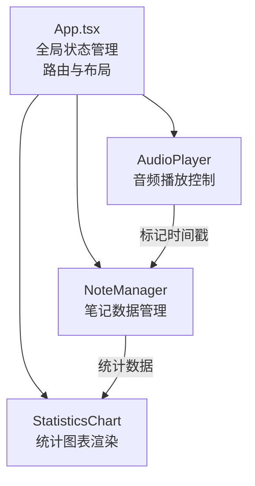
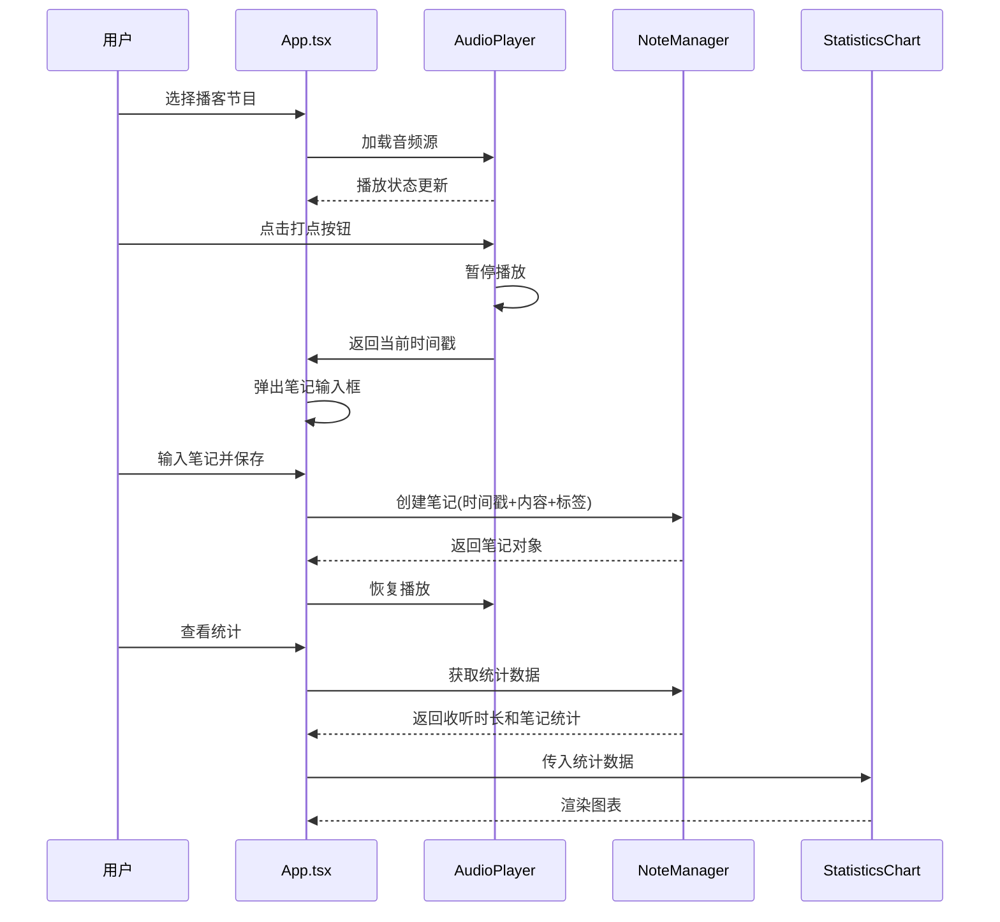

# PodNotes 技术架构文档

## 1. 技术选型

| 类别 | 技术 | 版本 | 选型理由 |
|------|------|------|----------|
| 前端框架 | React | ^18.2.0 | 组件化开发，生态成熟，性能优秀 |
| 语言 | TypeScript | ^5.0.0 | 类型安全，提升代码可维护性 |
| 构建工具 | Vite | ^5.0.0 | 开发体验好，热更新快，构建速度快 |
| 图表库 | Recharts | ^2.10.0 | 基于React的图表库，API友好，性能良好 |
| 样式方案 | 原生CSS + CSS变量 | - | 轻量无依赖，便于主题定制 |

## 2. 项目结构

```
d:\Pro\tasks\auto286\
├── package.json              # 项目依赖配置
├── vite.config.js            # Vite构建配置
├── tsconfig.json             # TypeScript配置
├── index.html                # HTML入口文件
└── src/
    ├── AudioPlayer.ts        # 音频播放模块（独立类）
    ├── NoteManager.ts        # 笔记管理模块（独立类）
    ├── StatisticsChart.tsx   # 统计图表组件
    ├── App.tsx               # 主应用组件
    └── styles.css            # 全局样式
```

## 3. 模块架构设计

### 3.1 模块职责划分



### 3.2 数据流设计



## 4. 核心模块设计

### 4.1 AudioPlayer 模块

**职责**：音频加载、播放控制、打点标记

```typescript
class AudioPlayer {
  private audio: HTMLAudioElement;
  private isPlaying: boolean;
  private currentTime: number;
  private duration: number;
  
  constructor();
  loadAudio(src: string): Promise<void>;
  play(): void;
  pause(): void;
  togglePlay(): boolean;
  seek(time: number): void;
  skipBackward(seconds: number = 15): void;
  skipForward(seconds: number = 15): void;
  markTimestamp(): number;  // 返回当前时间戳
  getCurrentTime(): number;
  getDuration(): number;
  getIsPlaying(): boolean;
  onTimeUpdate(callback: (time: number) => void): void;
  onLoadedMetadata(callback: (duration: number) => void): void;
  destroy(): void;
}
```

**性能优化**：
- 时间更新事件节流，避免频繁渲染
- 音频资源预加载
- 打点操作使用 `performance.now()` 确保精度

### 4.2 NoteManager 模块

**职责**：笔记CRUD、分类过滤、统计数据

```typescript
class NoteManager {
  private notes: Note[];
  private podcasts: Podcast[];
  private listeningSessions: ListeningSession[];
  private storageKey: string;
  
  constructor();
  private loadFromStorage(): void;
  private saveToStorage(): void;
  
  // 播客管理
  addPodcast(podcast: Omit<Podcast, 'id' | 'createdAt'>): Podcast;
  getPodcasts(): Podcast[];
  getPodcastById(id: string): Podcast | undefined;
  
  // 笔记管理
  addNote(note: Omit<Note, 'id' | 'createdAt' | 'updatedAt'>): Note;
  updateNote(id: string, updates: Partial<Note>): Note | undefined;
  deleteNote(id: string): boolean;
  getNotesByPodcast(podcastId: string): Note[];
  
  // 搜索过滤
  filterNotes(options: {
    podcastId?: string;
    tag?: string;
    searchText?: string;
  }): Note[];
  
  // 统计数据
  getWeeklyListeningStats(): { week: string; hours: number }[];
  getPodcastNoteStats(): { podcast: string; count: number }[];
  getTotalStats(): { totalListeningHours: number; totalNotes: number };
  
  // 收听记录
  addListeningSession(session: Omit<ListeningSession, 'id'>): void;
}
```

**性能优化**：
- 使用 `localStorage` 持久化存储
- 搜索使用前缀树或正则匹配优化
- 数据变更后批量写入存储，避免频繁IO

### 4.3 StatisticsChart 组件

**职责**：基于Recharts渲染统计图表

```typescript
interface StatisticsChartProps {
  weeklyData: { week: string; hours: number }[];
  podcastNoteData: { podcast: string; count: number }[];
  totalStats: { totalListeningHours: number; totalNotes: number };
}
```

**组件结构**：
- `WeeklyBarChart` - 每周收听时长柱状图
- `PodcastNoteLineChart` - 节目笔记数量折线图
- `StatsSummary` - 统计汇总卡片

## 5. 状态管理

### 5.1 全局状态（App.tsx）

```typescript
interface AppState {
  currentPage: 'home' | 'player' | 'notes' | 'statistics';
  selectedPodcastId: string | null;
  seekToTimestamp: number | null;
  noteModalState: {
    isOpen: boolean;
    timestamp: number;
    editingNoteId: string | null;
  } | null;
}
```

### 5.2 状态更新流程

1. 页面切换：`currentPage` 更新 → 渲染对应页面组件
2. 进入播放页：`selectedPodcastId` 设置 → AudioPlayer 加载音频
3. 从笔记跳转：`seekToTimestamp` 设置 → 播放页加载后自动跳转
4. 打点/编辑笔记：`noteModalState` 设置 → 弹窗显示

## 6. 关键性能优化点

### 6.1 音频打点延迟优化
- 使用 `performance.now()` 获取高精度时间戳
- 打点按钮点击事件使用 `onMouseDown` 而非 `onClick`，减少约100-200ms延迟
- 暂停操作同步执行，不等待状态更新

### 6.2 笔记列表渲染优化
- 使用 `React.memo` 包装笔记列表项组件
- 笔记过滤使用 `useMemo` 缓存结果
- 列表虚拟化（50条以内可省略，但预留接口）

### 6.3 图表性能优化
- Recharts 启用 `isAnimationActive` 但控制动画时长
- 数据变化时使用 `shouldComponentUpdate` 或 `React.memo` 避免重渲染
- 图表容器固定高度，避免布局抖动

## 7. 响应式布局实现

### 7.1 CSS变量与媒体查询
```css
:root {
  --sidebar-width: 240px;
  --sidebar-bg: #1E1B4B;
  --content-bg: #F3F4F6;
  --primary-1: #6366F1;
  --primary-2: #8B5CF6;
  --accent: #F59E0B;
  --transition: all 0.2s ease;
}

@media (max-width: 768px) {
  :root {
    --sidebar-width: 0px;
  }
}
```

### 7.2 布局切换逻辑
- 桌面端（≥768px）：左侧固定导航 + 右侧内容区
- 移动端（<768px）：顶部标题 + 内容区 + 底部Tab导航

## 8. 模拟数据实现

### 8.1 预设占位音频
```typescript
const PLACEHOLDER_AUDIOS = [
  { title: '技术前沿播客', filename: 'tech-podcast.mp3', duration: 1800 },
  { title: '商业思维访谈', filename: 'business-podcast.mp3', duration: 2400 },
  { title: '人文历史漫谈', filename: 'history-podcast.mp3', duration: 2100 },
];
```

### 8.2 预设封面颜色
```typescript
const COVER_COLORS = [
  '#6366F1', '#8B5CF6', '#EC4899', '#F59E0B', 
  '#10B981', '#3B82F6', '#EF4444', '#F97316'
];
```

### 8.3 模拟音频加载
由于使用本地占位音频，创建一个静默音频Blob或使用在线测试音频。

## 9. 构建与部署

### 9.1 依赖安装
```bash
npm install
```

### 9.2 开发启动
```bash
npm run dev
```

### 9.3 生产构建
```bash
npm run build
```
