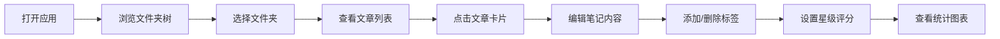

## 1. 产品概述
读览（DuLan）是一款收藏文章聚合与阅读笔记整理应用，帮助用户统一管理分散在各处的文章链接和阅读笔记，实现按主题聚合、快速检索和阅读统计。
- 核心问题：用户收藏的文章链接分散在浏览器书签、笔记应用和剪藏工具中，难以统一管理
- 目标用户：有大量阅读收藏习惯、需要整理阅读笔记的知识工作者
- 产品价值：提供一站式的文章收藏、笔记管理和阅读数据分析平台

## 2. 核心功能

### 2.1 功能模块
1. **文件夹导航树**：左侧文件夹分类管理，支持展开/折叠
2. **文章信息卡列表**：瀑布流展示文章卡片，支持星标、排序、拖拽排序
3. **笔记详情面板**：文章笔记编辑、标签管理
4. **阅读统计图表**：基于标签和星级的数据分析可视化
5. **虚拟滚动列表**：高性能文章列表渲染

### 2.2 页面详情
| 页面名称 | 模块名称 | 功能描述 |
|---------|---------|---------|
| 主页面 | 文件夹导航树 | 展示所有文件夹层级，点击切换当前文件夹，显示文章数量 |
| 主页面 | 文章列表区 | 瀑布流展示文章卡片，支持虚拟滚动、星标切换、多种排序方式 |
| 主页面 | 笔记编辑面板 | 多行文本编辑笔记，回车添加标签胶囊，支持标签删除 |
| 主页面 | 统计图表面板 | 滑入式面板，展示条形图（文件夹文章数按标签分组）和雷达图（各标签平均星级） |

## 3. 核心流程
用户打开应用 → 浏览左侧文件夹树 → 选择文件夹查看文章列表 → 点击文章卡片查看/编辑笔记 → 添加标签和星级评分 → 查看阅读统计图表

## 4. 用户界面设计

### 4.1 设计风格
- 主色调：浅色主题，主背景色 #F3F4F6
- 卡片背景：#FFFFFF，边框 #E5E7EB，圆角 12px
- 强调色：#6366F1（聚焦边框），#4338CA（标签文字），#E0E7FF（标签背景）
- 标签色系：#93C5FD、#FDE68A、#A7F3D0、#FCA5A5、#C4B5FD
- 字体：系统默认无衬线字体
- 字号：标题 16px（#1F2937），摘要 14px（#6B7280），图表标签 12px

### 4.2 页面设计概述
| 页面名称 | 模块名称 | UI 元素 |
|---------|---------|---------|
| 主页面 | 布局 | 左右分栏，左侧 240px 文件夹树，右侧文章列表+笔记面板（320px滑出） |
| 主页面 | 文章卡片 | 宽 280px，高约 160px，来源图标圆形 32x32px，悬停上移 4px 阴影加深 |
| 主页面 | 文件夹树 | 背景 #F9FAFB，emoji 图标 📂/📁，展开折叠动画 0.3s |
| 主页面 | 笔记面板 | 背景 #F9FAFB，输入框圆角 8px，标签胶囊圆角 |
| 主页面 | 统计图表 | 背景 #FFFFFF，圆角 12px，右侧滑入动画 0.4s，占 50% 宽度 |

### 4.3 响应式设计
- 桌面端（≥768px）：左右分栏布局正常显示
- 移动端（<768px）：左侧文件夹树默认隐藏，左上角汉堡按钮点击抽屉式展开（从左滑入 240px，半透明遮罩 rgba(0,0,0,0.5)）

### 4.4 交互动效
- 卡片悬停：上移 4px，阴影从 rgba(0,0,0,0.08) 加深到 rgba(0,0,0,0.12)
- 文件夹展开/折叠：最大高度过渡 0.3s
- 统计面板：右侧滑入，过渡 0.4s ease-out
- 可点击元素 hover：颜色加深或轻微放大 1.05 倍
