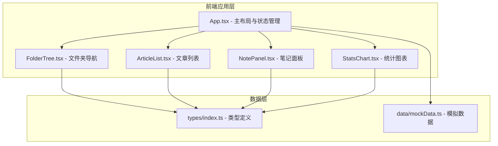
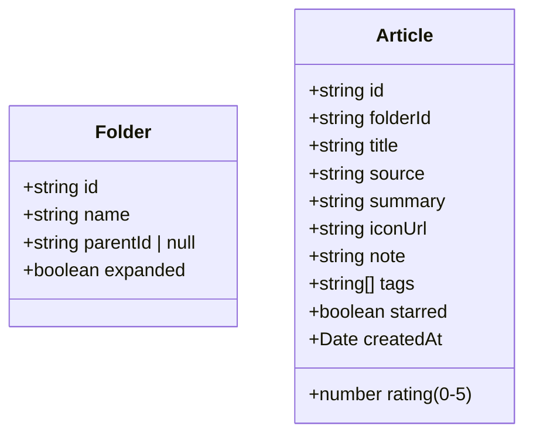

## 1. 架构设计



## 2. 技术说明
- 前端框架：React 18 + TypeScript
- 构建工具：Vite + @vitejs/plugin-react
- 图表库：recharts
- 状态管理：React 组件本地状态（useState/useEffect），无额外状态管理库
- 样式方案：内联样式 + CSS（style 属性），无需 CSS 框架

## 3. 文件结构与数据流向

```
src/
├── main.tsx                 # 应用入口，渲染 App
├── App.tsx                  # 主布局，持有全局状态（folders, articles, selectedFolderId, selectedArticleId, showStats）
│   │                        # 数据流向：从 mockData 导入初始数据 → 向下传递给子组件
│   ├── components/
│   │   ├── FolderTree.tsx   # 接收 folders + selectedFolderId → 渲染树 → onSelect 回调通知 App
│   │   ├── ArticleList.tsx  # 接收 articles + selectedFolderId + sortMode → 过滤排序 → onSelect/onToggleStar 回调
│   │   ├── NotePanel.tsx    # 接收 selectedArticle → 编辑笔记/标签 → onUpdate 回调更新 App 数据
│   │   └── StatsChart.tsx   # 接收所有 articles → 计算统计数据 → 渲染 recharts 图表
│   ├── data/
│   │   └── mockData.ts      # 导出 folders(5+) 和 articles(50篇)，每个文件夹至少 10 篇
│   └── types/
│       └── index.ts         # 导出 Folder, Article 接口定义
```

## 4. 数据模型

### 4.1 类型定义



### 4.2 模拟数据规范
- 文件夹数量：至少 5 个，形成层级结构
- 文章总数：50 篇，每文件夹至少 10 篇
- 文章字段：标题、来源网站名、摘要（2行）、图标URL、笔记内容、标签数组（2-4个）、星级（0-5）、星标状态、收藏时间

## 5. 性能优化

| 优化点 | 实现方案 | 性能目标 |
|-------|---------|---------|
| 列表渲染 | 虚拟滚动（只渲染可视区域内卡片） | 50 篇文章首屏 < 500ms |
| 卡片高度 | 固定约 160px | 虚拟滚动计算准确 |
| 数据计算 | 统计数据 useMemo 缓存 | 计算 < 10ms |
| 状态更新 | 局部状态，避免不必要重渲染 | 文件夹切换无闪烁 |
| 动画 | CSS transition，GPU 加速 | 流畅 60fps |

## 6. 调用关系

1. **App.tsx → FolderTree.tsx**：传 `folders`, `selectedFolderId`, `onSelect`
2. **App.tsx → ArticleList.tsx**：传 `articles`, `selectedFolderId`, `selectedArticleId`, `sortMode`, `onSelectArticle`, `onToggleStar`, `onSortChange`
3. **App.tsx → NotePanel.tsx**：传 `article`（选中的），`onUpdateNote`, `onAddTag`, `onRemoveTag`, `onChangeRating`
4. **App.tsx → StatsChart.tsx**：传 `articles`, `folders`，统计数据由组件内部 useMemo 计算
