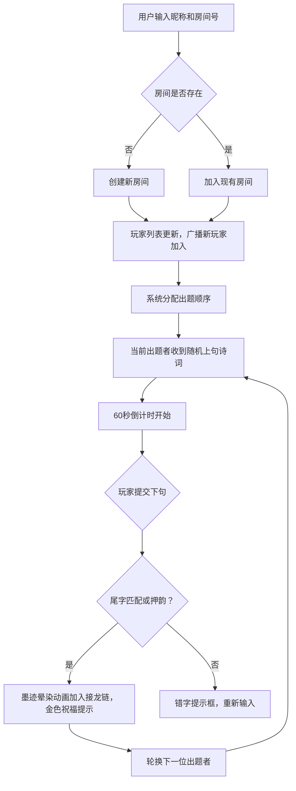

## 1. 产品概述
在线诗词接龙游戏，支持多人实时对战的古风诗词互动平台
- 核心价值：以游戏化方式传承中华古诗词文化，玩家通过对出诗句接龙互动娱乐
- 目标用户：诗词爱好者、学生、朋友聚会娱乐场景

## 2. 核心功能

### 2.1 用户角色
| 角色 | 注册方式 | 核心权限 |
|------|----------|----------|
| 普通玩家 | 输入昵称 | 创建/加入房间、出题、接龙 |

### 2.2 功能模块
1. **主页**：昵称输入、房间号输入、创建/加入按钮
2. **房间页面**：玩家列表、出题面板、接龙链、倒计时、游戏状态

### 2.3 页面详情
| 页面名称 | 模块名称 | 功能描述 |
|----------|----------|----------|
| 主页 | 入口表单 | 昵称输入、房间号输入、创建房间、加入房间、古风装饰背景 |
| 房间页 | 玩家列表 | 显示昵称、头像、状态，新玩家滑入动画，笛音提示 |
| 房间页 | 出题面板 | 显示上句诗词、60秒倒计时、输入框、提交按钮 |
| 房间页 | 接龙链 | 卷轴动画展示、墨迹晕染、悬停显示出处 |
| 房间页 | 结果反馈 | 成功金色祝福提示、失败错字提示、鼓点倒计时音效 |

## 3. 核心流程
用户输入昵称和房间号 → 创建或加入房间 → 系统分配出题顺序 → 当前出题者收到上句 → 60秒内输入下句 → 系统检测尾字匹配/押韵 → 成功则加入接龙链 → 轮换下一位出题者 → 游戏循环

## 4. 用户界面设计
### 4.1 设计风格
- **主色调**：墨黑(#1a1a1a)、宣纸白(#f5f0e6)、朱红(#c9302c)
- **按钮风格**：毛笔笔触描边效果，悬停时墨晕扩散
- **字体**：楷体/宋体（CDN Web字体）
- **布局**：居中宣纸背景，边缘仿古卷轴装饰
- **图标**：水墨风格SVG图标

### 4.2 页面设计概览
| 页面名称 | 模块名称 | UI元素 |
|----------|----------|--------|
| 主页 | 入口区域 | 宣纸纹理背景、卷轴边框、毛笔字体标题、输入框、按钮 |
| 房间页 | 玩家列表 | CSS Grid布局、渐变彩色轮廓、头像SVG、滑入动画 |
| 房间页 | 出题面板 | 毛笔输入动画、倒计时、笔触按钮 |
| 房间页 | 接龙链 | 卷轴动画、墨迹粒子、宣纸纹理、悬停tooltip |

### 4.3 响应式设计
- 桌面端：侧边栏玩家列表 + 主内容区
- 移动端：玩家列表收纳为抽屉式，顶部菜单按钮展开
- 触摸优化：按钮最小44px，滑动手势支持

### 4.4 动画与音效
- 新玩家加入：从右侧滑入 + 清脆笛音
- 提交成功：墨迹晕染 + 金色祝福弹窗
- 倒计时最后1秒：急促鼓点声
- 接龙链：卷轴展开动画 + 水墨粒子飘落
