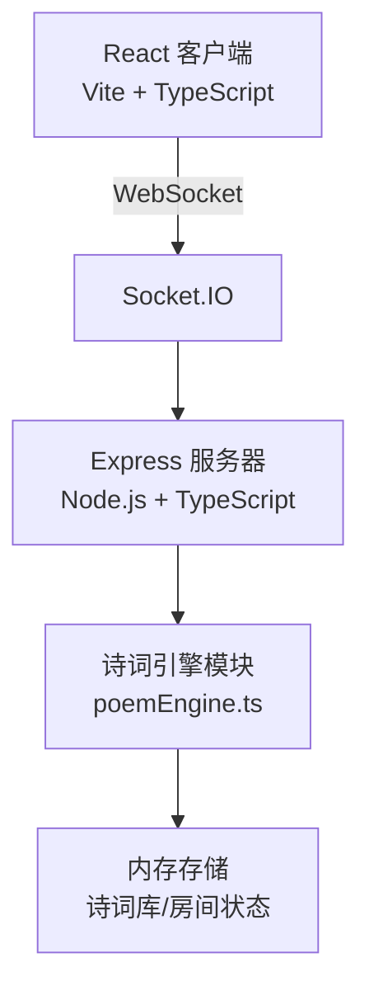
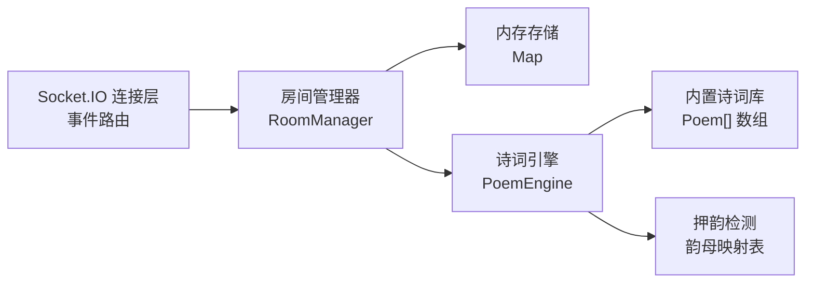
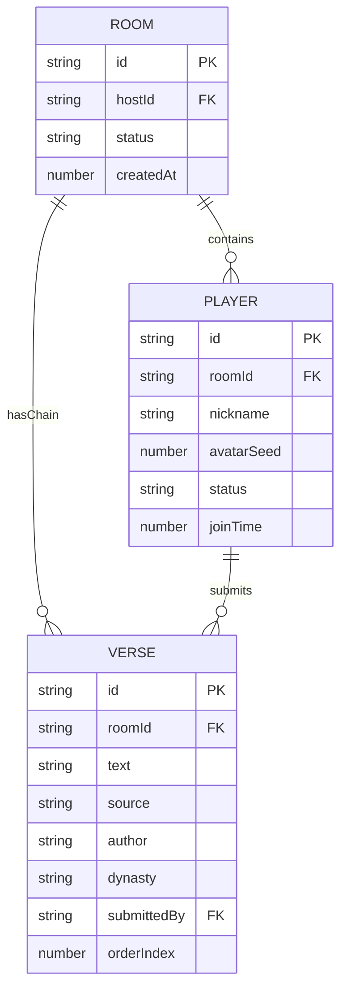

## 1. 架构设计



## 2. 技术描述
- **前端**: React 18 + TypeScript + Vite + Socket.IO Client + React Router
- **后端**: Node.js + Express 4 + TypeScript + Socket.IO
- **实时通信**: Socket.IO（房间机制、事件广播）
- **状态管理**: React useState/useReducer（局部状态），无需全局状态库
- **样式方案**: CSS Modules + 内联动画关键帧，无Tailwind（纯CSS实现水墨风格）
- **构建工具**: Vite（带 @vitejs/plugin-react，路径别名 @ 指向 src）

## 3. 路由定义
| 路由 | 用途 |
|------|------|
| / | 主页：输入昵称和房间号，创建/加入房间 |
| /room/:id | 房间页面：游戏主界面，包含玩家列表、出题面板、接龙链 |

## 4. API / Socket 事件定义

### 客户端 → 服务端
| 事件名 | 参数 | 说明 |
|--------|------|------|
| createRoom | { nickname: string } | 创建房间，返回房间号 |
| joinRoom | { roomId: string, nickname: string } | 加入指定房间 |
| submitVerse | { roomId: string, verse: string } | 提交诗句接龙 |
| leaveRoom | { roomId: string } | 离开房间 |

### 服务端 → 客户端
| 事件名 | 参数 | 说明 |
|--------|------|------|
| roomCreated | { roomId: string } | 房间创建成功 |
| playerJoined | { player: Player } | 新玩家加入通知 |
| playerLeft | { playerId: string } | 玩家离开通知 |
| roomState | { players: Player[], chain: Verse[], currentPlayerId: string, promptVerse: Verse, timeLeft: number } | 房间全量状态同步 |
| newPrompt | { verse: Verse, playerId: string } | 新出题，指定玩家作答 |
| verseResult | { success: boolean, message: string, chain?: Verse[] } | 接龙检测结果 |
| timeTick | { timeLeft: number } | 倒计时每秒更新 |

### TypeScript 类型定义
```typescript
interface Player {
  id: string;       // uuid
  nickname: string;
  avatarSeed: number;
  isHost: boolean;
  status: 'waiting' | 'answering';
  joinTime: number;
}

interface Verse {
  text: string;         // 诗句文本
  previous?: string;    // 上句（如果有的话）
  source: string;       // 诗名
  author: string;       // 作者
  dynasty: string;      // 朝代
  lastChar: string;     // 尾字
  firstChar: string;    // 首字
  submittedBy?: string; // 提交玩家ID
}
```

## 5. 服务器架构



## 6. 数据模型

### 6.1 数据模型定义


### 6.2 诗词库数据结构
```typescript
interface Poem {
  title: string;
  author: string;
  dynasty: string;
  lines: string[];  // 每行一句
}
```
内置约100首常见唐诗宋词，覆盖常见押韵字。
