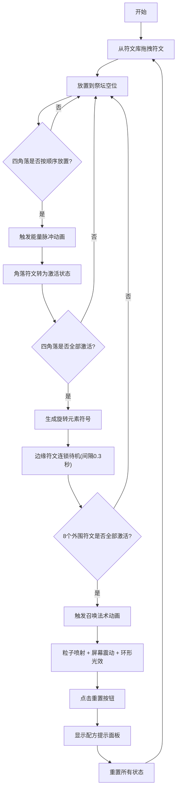

## 1. 产品概述

符文祭坛模拟器是一款用于奇幻游戏原型开发的可视化工具，模拟古代魔法符文在元素祭坛上的激活与共鸣过程。通过直观的视觉反馈，帮助游戏设计师和开发者展示不同元素符文（火、水、风、地、光、暗）按照特定排列顺序点燃祭坛时产生的连锁能量激发、符文状态变化和最终召唤法术效果。

### 产品价值
- 为游戏原型开发提供可交互的符文魔法系统演示
- 通过视觉化动画直观呈现符文组合的能量连锁反应
- 支持快速验证不同符文配方的法术效果

## 2. 核心功能

### 2.1 用户角色
本工具为单用户应用，无需角色区分。

### 2.2 功能模块
1. **祭坛网格模块**：3x3 网格渲染、符文拖放放置、状态管理、连锁反应逻辑
2. **符文库模块**：右侧符文面板、符文拖拽源、数量管理、重置事件响应
3. **动画引擎模块**：能量脉冲、粒子喷射、屏幕震动、环形光效等动画效果
4. **配方系统模块**：四角落符文激活检测、连锁反应触发、召唤法术判定、配方名称提示

### 2.3 页面详情

| 页面名称 | 模块名称 | 功能描述 |
|-----------|-------------|---------------------|
| 主页面 | 祭坛网格 | 3x3 网格，支持符文拖放放置，显示符文三种状态（未激活/待机/激活），处理角落激活顺序检测 |
| 主页面 | 符文库 | 6种符文卡片展示，显示剩余数量，拖拽源支持，透明阴影跟随效果 |
| 主页面 | 重置按钮 | 圆形重置按钮，点击后清除所有状态，显示配方提示面板 |
| 主页面 | 动画层 | Canvas 动画层，渲染能量脉冲、粒子效果、屏幕震动、环形光效 |

## 3. 核心流程

### 用户操作流程
1. 用户从右侧符文库拖拽符文到 3x3 祭坛网格的空位
2. 当四个角落符文按特定顺序放置时，触发中心能量脉冲动画
3. 被激活的角落符文从暗淡转为高亮发光状态
4. 四角落全部激活后，中心生成旋转元素符号，相邻边缘符文连锁进入待机状态
5. 所有 8 个外围符文激活后，触发召唤法术动画（粒子喷射 + 屏幕震动 + 环形光效）
6. 点击重置按钮，清除所有状态并显示当前完成的配方名称

## 4. 用户界面设计

### 4.1 设计风格
- **整体风格**：暗黑奇幻风格，神秘魔法氛围
- **主背景**：深紫色渐变（从 #1A0A2E 到 #0D0D2B）
- **祭坛背景**：半透明深灰（rgba(255,255,255,0.05)）
- **网格线**：深金色 #8B7355
- **主色调**：深紫、深金、符文元素色（火#FF4444、水#4488FF、风#88FF88、地#AA8844、光#FFFF88、暗#8844AA）
- **按钮风格**：圆形重置按钮，背景 #FF5252，悬浮放大 1.1 倍
- **符文卡片**：80x80px，圆角 8px，未激活边框 1px #4A3F6B，激活边框 2px #FFD700 加外发光
- **过渡动画**：所有交互 0.2-0.3 秒 CSS 过渡

### 4.2 字体选择
- **标题字体**：Cinzel Decorative（奇幻风格衬线字体）
- **正文字体**：Crimson Pro（优雅的衬线字体，适合神秘氛围）
- **避免使用**：Inter、Roboto、Arial 等通用字体

### 4.3 页面设计概述

| 页面名称 | 模块名称 | UI 元素 |
|-----------|-------------|-------------|
| 主页面 | 祭坛区域 | 3x3 网格布局，居中对齐，占视口宽度 60%，深紫渐变背景，深金网格线 |
| 主页面 | 符文库面板 | 右侧面板，宽 180px，半透明黑色背景（rgba(0,0,0,0.6)），圆角 16px，符文卡片垂直排列 |
| 主页面 | 重置按钮 | 右上角圆形按钮，直径 40px，红色背景，白色重置图标 |
| 主页面 | 动画 Canvas | 覆盖整个祭坛区域，透明背景，用于渲染粒子和光效 |
| 主页面 | 提示面板 | 居中弹出，圆角 12px，半透明黑色背景，白色文本，淡入淡出动画 |

### 4.4 响应式设计
- **桌面端（>768px）**：祭坛占 60%，符文库占 30%，左右间距 10px，水平布局
- **移动端（≤768px）**：符文库移至祭坛下方，祭坛和符文库宽度均占 100%，垂直布局
- **触控优化**：增大触控区域，拖拽支持触摸事件

### 4.5 动画细节
- **能量脉冲**：圆形波纹从中心扩散，持续 1.5 秒，颜色随符文组合变化
- **符文发光**：激活时光强度 0.3→1.0，过渡 0.5 秒，饱和度 0.2→1.0
- **连锁反应**：边缘符文逐个待机，间隔 0.3 秒
- **元素符号旋转**：角速度 0.02rad/frame，颜色由符文混合
- **粒子喷射**：50 个粒子，大小 3-8px，生命周期 2 秒，颜色渐变到白色
- **屏幕震动**：偏移量 2px，持续 0.5 秒
- **环形光效**：半径 1→5，透明度 0.8→0

## 5. 性能要求
- 动画帧率稳定在 50fps 以上
- 粒子数量不超过 60 个
- 使用 CSS 过渡和 Canvas 动画结合
- 合理使用 requestAnimationFrame
