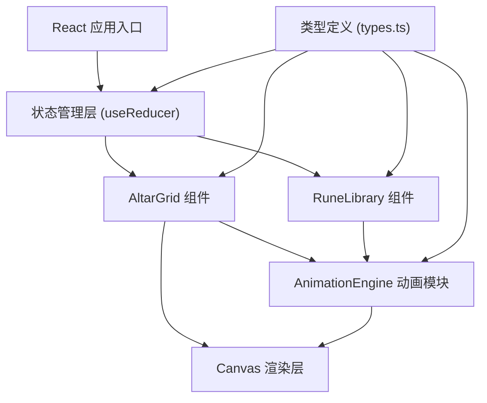

## 1. 架构设计



## 2. 技术描述

### 技术栈
- **前端框架**：React@18 + TypeScript@5
- **构建工具**：Vite@5
- **React 插件**：@vitejs/plugin-react@4
- **状态管理**：React useReducer + Context
- **动画方案**：CSS Transitions + Canvas 2D API + requestAnimationFrame
- **拖拽实现**：HTML5 Drag and Drop API + 自定义拖拽幽灵效果

### 初始化方式
使用 Vite 官方 React TypeScript 模板初始化项目：
```bash
npm create vite@latest . -- --template react-ts
```

### 后端
无后端依赖，纯前端应用。

### 数据库
无需数据库，使用内存状态管理，符文配方数据硬编码在配置中。

## 3. 项目文件结构

```
auto290/
├── index.html                 # 入口 HTML
├── package.json               # 依赖配置
├── vite.config.js             # Vite 配置
├── tsconfig.json              # TypeScript 配置
└── src/
    ├── main.tsx               # 应用入口
    ├── App.tsx                # 根组件
    ├── App.css                # 全局样式
    ├── types.ts               # 类型定义
    ├── AnimationEngine.ts     # 动画引擎模块
    ├── AltarGrid.tsx          # 祭坛网格组件
    ├── RuneLibrary.tsx        # 符文库组件
    └── index.css              # 基础样式
```

## 4. 类型定义 (types.ts)

```typescript
// 符文元素类型
export type RuneElement = 'fire' | 'water' | 'wind' | 'earth' | 'light' | 'dark';

// 符文状态枚举
export enum RuneState {
  INACTIVE = 'inactive',   // 未激活：灰暗，饱和度0.2
  STANDBY = 'standby',     // 待机：默认颜色，饱和度0.6
  ACTIVE = 'active'        // 激活：高亮发光，饱和度1.0
}

// 网格位置接口
export interface GridPosition {
  row: number;  // 0-2
  col: number;  // 0-2
}

// 符文数据接口
export interface Rune {
  id: string;
  element: RuneElement;
  state: RuneState;
  position: GridPosition | null;  // null 表示在符文库中
}

// 符文库项接口
export interface RuneLibraryItem {
  element: RuneElement;
  count: number;
  maxCount: number;
}

// 祭坛单元格接口
export interface AltarCell {
  position: GridPosition;
  rune: Rune | null;
  isCorner: boolean;
  isEdge: boolean;
  isCenter: boolean;
}

// 配方接口
export interface RuneRecipe {
  name: string;
  corners: [RuneElement, RuneElement, RuneElement, RuneElement]; // [左上, 右上, 左下, 右下]
  edges?: [RuneElement | null, RuneElement | null, RuneElement | null, RuneElement | null]; // [上, 右, 下, 左]
  spellName: string;
}

// 粒子接口
export interface Particle {
  id: number;
  x: number;
  y: number;
  vx: number;
  vy: number;
  size: number;
  color: string;
  life: number;
  maxLife: number;
}

// 动画状态接口
export interface AnimationState {
  pulse: {
    active: boolean;
    startTime: number;
    duration: number;
    color: string;
  } | null;
  particles: Particle[];
  screenShake: {
    active: boolean;
    startTime: number;
    duration: number;
    intensity: number;
  } | null;
  ringEffect: {
    active: boolean;
    startTime: number;
    duration: number;
    color: string;
  } | null;
  rotatingSymbol: {
    active: boolean;
    angle: number;
    color: string;
  } | null;
}

// 应用状态接口
export interface AppState {
  altarCells: AltarCell[];
  library: RuneLibraryItem[];
  animationState: AnimationState;
  completedRecipe: RuneRecipe | null;
  showRecipePanel: boolean;
  activationOrder: GridPosition[];
  draggedRune: Rune | null;
}
```

## 5. 核心模块设计

### 5.1 AnimationEngine.ts (纯函数动画模块)

```typescript
// 触发能量脉冲动画
export function triggerPulse(
  ctx: CanvasRenderingContext2D,
  centerX: number,
  centerY: number,
  color: string,
  duration: number = 1500
): void

// 触发粒子喷射
export function triggerParticleBurst(
  particles: Particle[],
  centerX: number,
  centerY: number,
  baseColor: string,
  count: number = 50
): Particle[]

// 触发屏幕震动
export function triggerScreenShake(
  element: HTMLElement,
  intensity: number = 2,
  duration: number = 500
): void

// 触发环形光效
export function triggerRingEffect(
  ctx: CanvasRenderingContext2D,
  centerX: number,
  centerY: number,
  color: string,
  duration: number = 1500
): void

// 渲染所有动画（每帧调用）
export function renderAnimations(
  ctx: CanvasRenderingContext2D,
  animationState: AnimationState,
  currentTime: number
): void

// 更新粒子状态
export function updateParticles(particles: Particle[]): Particle[]

// 混色函数
export function mixColors(colors: string[]): string
```

### 5.2 AltarGrid.tsx 组件

主要职责：
- 渲染 3x3 祭坛网格
- 处理符文拖放放置
- 管理符文状态转换
- 检测角落激活顺序
- 触发连锁反应
- 协调召唤法术动画

### 5.3 RuneLibrary.tsx 组件

主要职责：
- 渲染右侧符文库面板
- 显示符文图标和剩余数量
- 提供拖拽源
- 响应重置事件更新数量

### 5.4 状态管理

使用 `useReducer` 管理复杂状态：
- `PLACE_RUNE`：放置符文到祭坛
- `REMOVE_RUNE`：从祭坛移除符文
- `UPDATE_RUNE_STATE`：更新符文状态
- `TRIGGER_PULSE`：触发脉冲动画
- `TRIGGER_SPELL`：触发召唤法术
- `RESET_ALTAR`：重置祭坛
- `SHOW_RECIPE_PANEL`：显示配方面板
- `HIDE_RECIPE_PANEL`：隐藏配方面板

## 6. 配方数据

```typescript
export const RUNE_RECIPES: RuneRecipe[] = [
  {
    name: "元素平衡法阵",
    corners: ['fire', 'water', 'earth', 'wind'],
    spellName: "四元素召唤"
  },
  {
    name: "光暗交织阵",
    corners: ['light', 'dark', 'light', 'dark'],
    spellName: "黄昏召唤"
  },
  {
    name: "烈焰风暴阵",
    corners: ['fire', 'wind', 'fire', 'wind'],
    spellName: "炎爆术召唤"
  },
  {
    name: "大地洪流阵",
    corners: ['water', 'earth', 'water', 'earth'],
    spellName: "地震术召唤"
  },
  {
    name: "圣光净化阵",
    corners: ['light', 'light', 'light', 'light'],
    spellName: "天使召唤"
  },
  {
    name: "暗影腐蚀阵",
    corners: ['dark', 'dark', 'dark', 'dark'],
    spellName: "恶魔召唤"
  }
];
```

## 7. 性能优化策略

1. **动画优化**：
   - 使用 `requestAnimationFrame` 进行 Canvas 渲染
   - 粒子对象池复用，避免频繁 GC
   - 限制最大粒子数为 60

2. **React 优化**：
   - 使用 `React.memo` 避免不必要重渲染
   - 拆分组件，局部更新状态
   - 使用 `useCallback` 和 `useMemo` 缓存回调和计算值

3. **CSS 优化**：
   - 使用 `transform` 和 `opacity` 做动画，触发 GPU 加速
   - 避免在动画中修改 `layout` 属性
   - 使用 `will-change` 提示浏览器优化

## 8. 构建配置

### vite.config.js
```javascript
import { defineConfig } from 'vite';
import react from '@vitejs/plugin-react';

export default defineConfig({
  plugins: [react()],
  server: {
    port: 5173,
    open: true
  }
});
```

### tsconfig.json
```json
{
  "compilerOptions": {
    "target": "ES2020",
    "useDefineForClassFields": true,
    "lib": ["ES2020", "DOM", "DOM.Iterable"],
    "module": "ESNext",
    "skipLibCheck": true,
    "moduleResolution": "bundler",
    "allowImportingTsExtensions": true,
    "resolveJsonModule": true,
    "isolatedModules": true,
    "noEmit": true,
    "jsx": "preserve",
    "strict": true,
    "noUnusedLocals": true,
    "noUnusedParameters": true,
    "noFallthroughCasesInSwitch": true
  },
  "include": ["src"],
  "references": [{ "path": "./tsconfig.node.json" }]
}
```

### package.json
```json
{
  "name": "rune-altar-simulator",
  "private": true,
  "version": "0.1.0",
  "type": "module",
  "scripts": {
    "dev": "vite",
    "build": "tsc && vite build",
    "preview": "vite preview"
  },
  "dependencies": {
    "react": "^18.2.0",
    "react-dom": "^18.2.0"
  },
  "devDependencies": {
    "@types/react": "^18.2.43",
    "@types/react-dom": "^18.2.17",
    "@vitejs/plugin-react": "^4.2.1",
    "typescript": "^5.2.2",
    "vite": "^5.0.8"
  }
}
```
