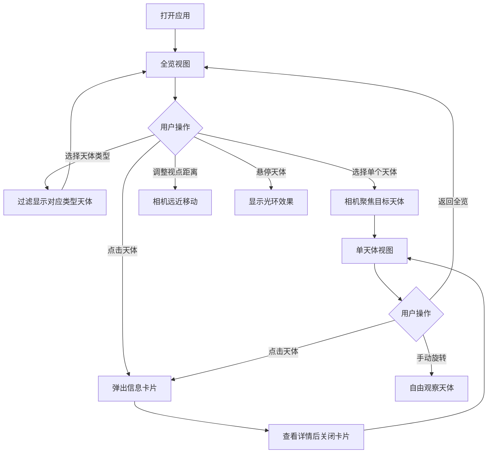

## 1. 产品概述

深空天体数据可视化是一款面向天文爱好者社团的交互式三维线上展览应用，将深空天体（星云、星系、星团）的观测数据转化为可交互的三维粒子模型，让参观者自由探索不同天体的形态、颜色和空间分布关系。

- 目标用户：天文爱好者社团成员及线上展览参观者
- 核心价值：通过沉浸式三维可视化，将抽象的天文观测数据转化为直观可交互的空间体验，提升天文科普教育效果

## 2. 核心功能

### 2.1 用户角色

| 角色 | 注册方式 | 核心权限 |
|------|----------|----------|
| 参观者 | 无需注册 | 浏览天体、切换视角、查看天体详情 |
| 管理员 | 无需注册 | 同参观者（数据为预置模拟数据） |

### 2.2 功能模块

1. **三维场景页**：全屏3D深空场景，展示星云/星系/星团粒子模型、背景星场、信息标签
2. **控制面板**：悬浮式交互面板，提供天体选择、视点控制、自动旋转开关

### 2.3 页面详情

| 页面名称 | 模块名称 | 功能描述 |
|----------|----------|----------|
| 三维场景页 | 深空背景 | 深空渐变背景（#0a0a1a→#1a0a20）+ 1000颗静态星星粒子 |
| 三维场景页 | 天体粒子系统 | 星云（半透明云团）、星系（螺旋盘）、星团（球状簇）三种粒子形态 |
| 三维场景页 | 信息标签 | 天体上方悬浮标签，始终面向相机，含连接线 |
| 三维场景页 | 悬停光环 | 鼠标悬停天体时出现金色光环 |
| 三维场景页 | 信息卡片 | 点击天体弹出详情卡片（类型、距离、视星等、发现者、年龄） |
| 控制面板 | 天体选择 | 下拉选择器切换单个天体/全览视图 |
| 控制面板 | 视点距离 | 滑块控制相机距离（5-50） |
| 控制面板 | 自动旋转 | 开关控制全览视图自动旋转 |
| 控制面板 | 视角信息 | 右下角显示相机坐标和朝向角度 |

## 3. 核心流程

参观者打开应用后进入全览视图，所有天体在三维空间中可见，场景缓慢自动旋转。参观者可通过左上角控制面板选择特定天体类型进行筛选，或选择单个天体聚焦查看。聚焦后相机平滑移动到目标天体附近，用户可手动旋转视角观察天体细节。鼠标悬停天体时出现光环提示，点击弹出详细信息卡片。

## 4. 用户界面设计

### 4.1 设计风格

- 主色调：深蓝紫（#0a0a1a, #1a0a20, #1a1a2e）
- 点缀色：金色（#FFD700）、青色（#00CED1）、紫色（#8A2BE2）
- 文字色：#E0E0FF（主文字）、#C0C0E0（面板文字）、#808090（辅助信息）
- 按钮风格：深色半透明，细边框，圆角
- 字体：12px-16px，科技感无衬线体
- 布局风格：全屏3D场景 + 悬浮控制面板
- 动效：控制面板0.3s滑入动画、天体光环悬停效果、相机平滑过渡

### 4.2 页面设计概览

| 页面名称 | 模块名称 | UI元素 |
|----------|----------|--------|
| 三维场景页 | 深空背景 | 渐变色背景 + 1000颗1-3px白色到淡蓝色星星粒子 |
| 三维场景页 | 星云天体 | 500-1000个半透明粒子（3-8px），颜色渐变，云团形态 |
| 三维场景页 | 星系天体 | 800-1500个粒子螺旋排列，中心#FFD700→边缘#7B68EE渐变 |
| 三维场景页 | 星团天体 | 300-600个粒子球状分布，#A9A9A9→#FFFFFF，1-3px |
| 三维场景页 | 信息标签 | 半透明黑色圆角矩形，白色12px文字，细线连接天体 |
| 三维场景页 | 悬停光环 | 半径比天体大20%，#FFD700，透明度0.3 |
| 三维场景页 | 信息卡片 | 280px宽，圆角16px，深色半透明背景，左侧类型色条 |
| 控制面板 | 面板整体 | 260px宽，圆角12px，背景#0a0a1aBB，边框#3a3a5a |
| 控制面板 | 下拉选择器 | 背景#1a1a2e，文字#C0C0E0 |
| 控制面板 | 滑块 | 轨道#2a2a3a，把手#4a4a6a |
| 控制面板 | 视角信息 | 右下角，12px，#808090 |

### 4.3 响应式设计

- 桌面端（≥768px）：左上角悬浮控制面板，右下角视角信息，鼠标交互
- 移动端（<768px）：控制面板变为底部全宽抽屉（可收缩），视角信息隐藏，支持单指旋转、双指缩放触控操作

### 4.4 三维场景指引

- 环境/氛围：深空宇宙感，深蓝紫渐变背景，静态星场营造深空氛围
- 灯光设置：无方向光，使用粒子自发光（材质emissive）呈现天体
- 相机设置：透视相机，FOV 60°，近裁面0.1，远裁面1000，通过OrbitControls控制
- 构图与焦点：全览视图下所有天体居中分布，单天体视图聚焦于目标天体
- 交互与动画：鼠标悬停光环、点击信息卡片、相机平滑过渡、螺旋盘旋转、全览自动旋转
- 后处理效果：无（优先保证性能55FPS+）
- 资源来源：所有天体数据为预置模拟数据，粒子为程序化生成
- 性能预算：55FPS+，初始加载≤3秒，每帧最多更新200个粒子
