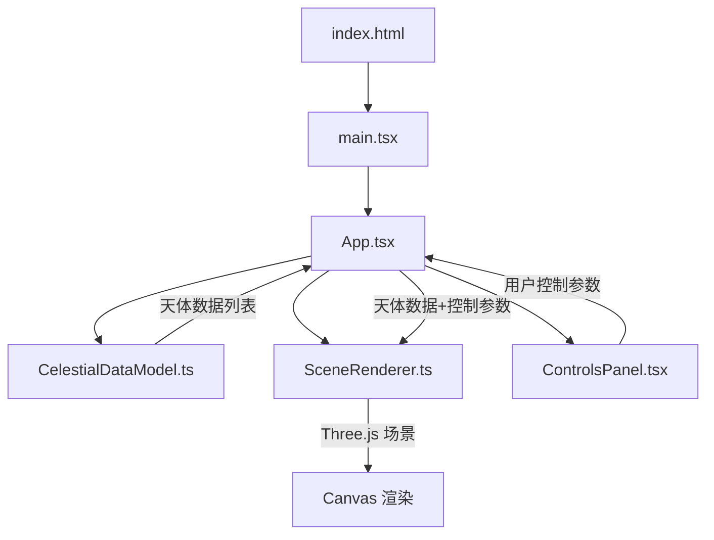
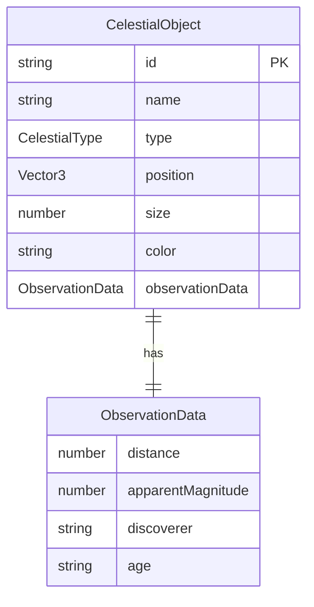

## 1. 架构设计



**数据流向**：
1. `App.tsx` 初始化时调用 `CelestialDataModel` 获取天体数据列表
2. `App.tsx` 将天体数据传递给 `SceneRenderer` 进行三维渲染
3. `ControlsPanel` 接收用户操作，通过回调通知 `App.tsx`
4. `App.tsx` 将控制参数传递给 `SceneRenderer` 更新场景状态
5. `SceneRenderer` 在 requestAnimationFrame 循环中持续更新粒子位置与相机

## 2. 技术说明

- 前端：React@18 + TypeScript + Three.js + Vite
- 初始化工具：vite-init（react-ts 模板）
- 后端：无（纯前端，数据为模拟数据）
- 数据库：无（使用 CelestialDataModel 模块内置模拟数据）

**核心依赖**：
- react, react-dom：UI 框架
- typescript：类型安全
- vite, @vitejs/plugin-react：构建工具
- three, @types/three：三维渲染引擎

## 3. 路由定义

| 路由 | 用途 |
|------|------|
| / | 主页面，全屏3D场景 + 控制面板 |

单页应用，无路由切换。

## 4. API 定义

无后端 API。所有数据由 `CelestialDataModel.ts` 模块在本地提供。

## 5. 服务器架构图

无后端服务。

## 6. 数据模型

### 6.1 数据模型定义



### 6.2 数据定义

```typescript
type CelestialType = 'nebula' | 'galaxy' | 'starcluster';

interface Vector3 {
  x: number;
  y: number;
  z: number;
}

interface ObservationData {
  distance: number;
  apparentMagnitude: number;
  discoverer: string;
  age: string;
}

interface CelestialObject {
  id: string;
  name: string;
  type: CelestialType;
  position: Vector3;
  size: number;
  color: string;
  observationData: ObservationData;
}
```

### 6.3 模拟数据（约10个天体）

| 名称 | 类型 | 坐标 | 大小 | 颜色 |
|------|------|------|------|------|
| 猎户座星云 | 星云 | (0, 0, 0) | 5 | #8A2BE2 |
| 鹰状星云 | 星云 | (-15, 5, -10) | 4 | #9370DB |
| 蟹状星云 | 星云 | (10, -3, 8) | 3 | #BA55D3 |
| 仙女座星系 | 星系 | (20, 10, -20) | 6 | #FFD700 |
| 旋涡星系 | 星系 | (-25, -5, 15) | 5 | #DAA520 |
| 草帽星系 | 星系 | (5, 15, -30) | 4 | #B8860B |
| 昴星团 | 星团 | (12, 8, 5) | 3 | #A9A9A9 |
| 半人马座ω | 星团 | (-8, -10, -15) | 4 | #C0C0C0 |
| M13球状星团 | 星团 | (30, 0, 10) | 3 | #D3D3D3 |
| 毕星团 | 星团 | (-20, 3, 20) | 2 | #FFFFFF |

## 7. 文件结构

```
项目根目录/
├── package.json                          # 依赖与脚本
├── vite.config.js                        # Vite + React 插件配置
├── tsconfig.json                         # TypeScript 严格模式配置
├── index.html                            # 入口页面
├── src/
│   ├── main.tsx                          # React 入口，渲染 App
│   ├── App.tsx                           # 主组件，初始化场景与数据流
│   ├── scene/
│   │   └── SceneRenderer.ts              # Three.js 场景渲染器
│   ├── data/
│   │   └── CelestialDataModel.ts         # 天体数据模型
│   └── components/
│       └── ControlsPanel.tsx             # 控制面板组件
```

**调用关系**：
- `main.tsx` → `App.tsx`（渲染）
- `App.tsx` → `CelestialDataModel.ts`（获取数据）
- `App.tsx` → `SceneRenderer.ts`（传递数据+控制参数）
- `App.tsx` → `ControlsPanel.tsx`（传递回调+状态）
