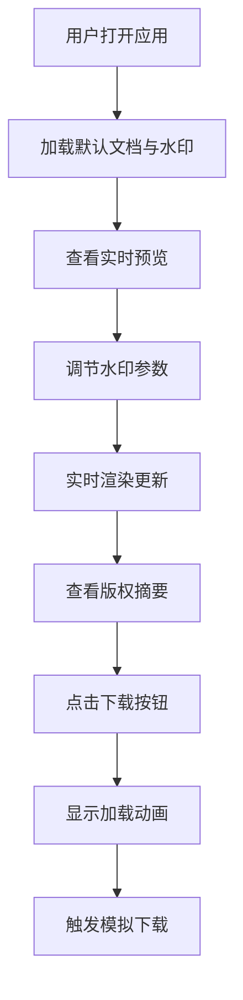

## 1. 产品概述

个人文档水印与版权声明生成器，为用户提供文档水印添加、实时预览和版权信息导出功能。

- 面向需要为文档添加版权保护的个人用户、企业文档管理员
- 解决文档分发过程中的版权归属确认和机密标识问题，提供可视化的水印参数调节和一键导出能力

## 2. 核心功能

### 2.1 用户角色

| 角色 | 注册方式 | 核心权限 |
|------|---------|---------|
| 普通用户 | 无需注册 | 使用水印调节、实时预览、下载HTML文件 |

### 2.2 功能模块

1. **文档展示区**：模拟文档内容展示，叠加水印覆盖层
2. **水印调节面板**：透明度、旋转角度、重复间距、字体样式调节
3. **版权摘要卡片**：展示文档元数据和水印参数快照，提供下载功能

### 2.3 页面详情

| 页面名称 | 模块名称 | 功能描述 |
|---------|---------|---------|
| 主页面 | 文档展示区 | 白色背景，展示模拟文档内容，倾斜45度半透明水印平铺覆盖 |
| 主页面 | 水印调节面板 | 毛玻璃悬浮面板，含滑块控件实时调节水印参数 |
| 主页面 | 版权摘要卡片 | 展示文档标题/作者/时间和水印参数，点击下载触发模拟下载 |

## 3. 核心流程

用户打开应用 → 查看默认文档和水印效果 → 调节水印参数（透明度/角度/间距/字体）→ 实时预览变化 → 查看版权摘要卡片 → 点击下载HTML → 显示加载动画 → 模拟下载完成

## 4. 用户界面设计

### 4.1 设计风格

- 主色调：#6366F1（靛蓝）→ #8B5CF6（紫罗兰）渐变
- 中性色：#F3F4F6 / #E5E7EB / #D1D5DB / #FFFFFF
- 按钮风格：圆角，渐变背景，悬停微交互
- 字体：Inter（Google Fonts）
- 布局：三栏式（文档区 + 悬浮面板 + 底部卡片）
- 视觉特效：毛玻璃背景、平滑过渡动画、渐变滑块

### 4.2 页面设计概述

| 页面名称 | 模块名称 | UI元素 |
|---------|---------|--------|
| 主页面 | 文档展示区 | 白色A4风格页面，文字排版，45度倾斜水印平铺，transition动画 |
| 主页面 | 水印调节面板 | 毛玻璃背景(rgba(255,255,255,0.3) + blur(10px))，280px宽，圆角16px，渐变滑块 |
| 主页面 | 版权摘要卡片 | 宽85%最大800px，圆角12px，灰色渐变背景，两列布局，加载旋转动画 |

### 4.3 响应式

- 桌面端优先设计
- 悬浮面板在移动端改为底部抽屉形式
- 文档区自适应容器宽度

### 4.4 性能要求

- 水印参数调节时实时预览帧率 ≥ 30fps
- 首屏加载时间 ≤ 2秒
- 所有参数调节使用 0.3s ease-in-out 平滑过渡
