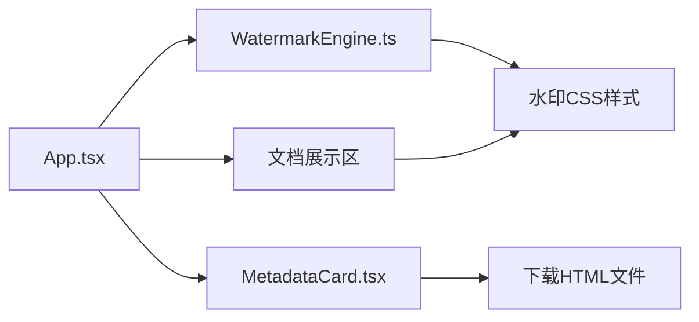

## 1. 架构设计



## 2. 技术说明

- 前端框架：React@18 + TypeScript
- 构建工具：Vite@latest
- 状态管理：React useState（轻量场景，无需zustand）
- 样式方案：原生CSS + CSS Modules（按用户指定文件结构）
- 字体：Google Fonts - Inter

## 3. 目录结构

```
├── package.json
├── index.html
├── vite.config.js
├── tsconfig.json
└── src/
    ├── App.tsx              # 主组件，布局管理与状态协调
    ├── watermark/
    │   └── WatermarkEngine.ts  # 水印样式生成引擎
    └── copyright/
        └── MetadataCard.tsx    # 版权摘要卡片组件
```

## 4. 模块职责

### 4.1 WatermarkEngine.ts
- 接收：文本内容、水印参数（文字、透明度、角度、间距、字体）
- 返回：水印CSS样式字符串、文档HTML模板
- 纯函数模块，无副作用

### 4.2 MetadataCard.tsx
- 接收：文档元数据（标题、作者、生成时间）、水印参数快照
- 渲染：版权摘要卡片UI
- 功能：下载按钮加载动画、触发HTML文件下载

### 4.3 App.tsx
- 状态管理：水印参数、文档内容、元数据
- 布局：文档展示区（左）+ 调节面板（右悬浮）+ 摘要卡片（下）
- 协调：将参数传入WatermarkEngine，将数据传入MetadataCard
