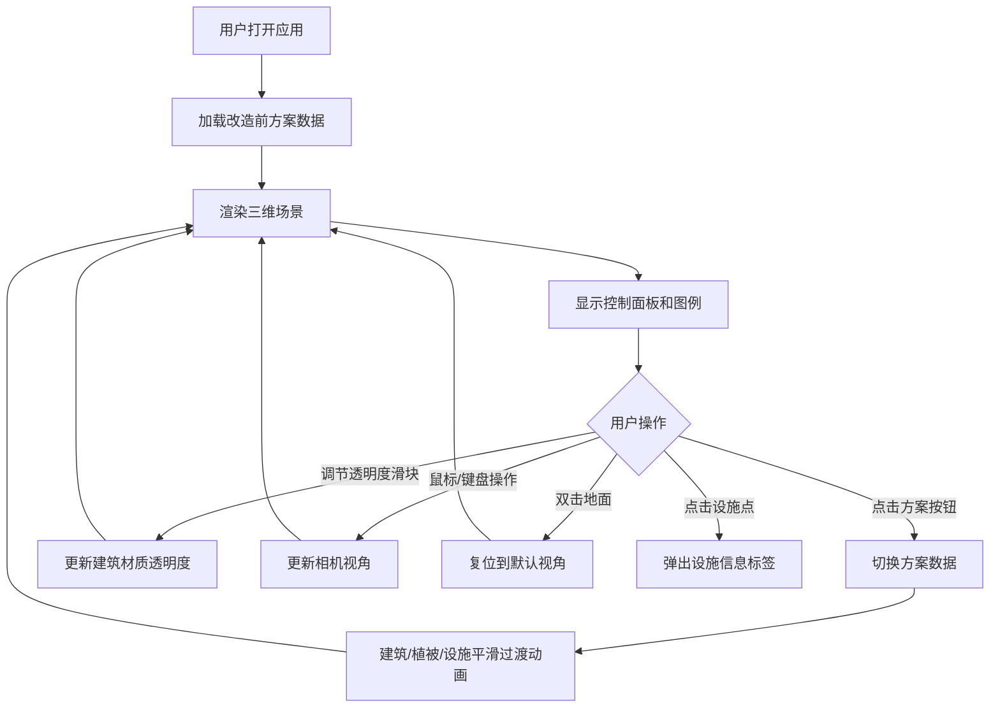

## 1. 产品概述

本应用是一款面向城市规划师的交互式三维旧工业区改造方案对比工具，通过三维可视化方式呈现改造前后的建筑布局、绿化覆盖率和公共设施分布，支持多方案动态切换以直观评估视觉影响。

- 核心目标：为规划决策提供直观的三维对比展示，降低方案沟通成本
- 目标用户：城市规划师、建筑师、政府决策人员

## 2. 核心特性

### 2.1 功能模块

1. **三维场景渲染**：建筑布局、植被系统、公共设施标识、天空环境
2. **方案切换对比**：改造前/方案A/方案B三套数据平滑过渡切换
3. **控制面板**：方案切换按钮、视角复位、建筑透明度调节
4. **图例系统**：建筑功能颜色标注，方案切换时自动更新
5. **视角控制**：轨道控制、键盘漫游、双击复位
6. **性能监控**：实时帧率显示

### 2.2 页面详情

| 页面名称 | 模块名称 | 功能描述 |
|-----------|-------------|---------------------|
| 主界面 | 三维场景区 | 渲染地面、建筑、植被、公共设施，支持轨道控制和键盘漫游 |
| 主界面 | 左侧控制面板 | 方案切换按钮组（改造前/方案A/方案B）、视角复位按钮、透明度滑块 |
| 主界面 | 右上角图例 | 半透明悬浮面板，标注建筑功能颜色，随方案更新 |
| 主界面 | 右下角帧率显示 | 绿色字体实时显示当前FPS |

## 3. 核心流程

用户打开应用后，默认以俯瞰45°角展示改造前的工业场景。用户可通过左侧控制面板切换不同改造方案，观察建筑颜色、高度、位置的平滑过渡变化，以及植被和公共设施的增减。用户可通过鼠标拖拽旋转视角、滚轮缩放、键盘WASD平移，双击地面可复位到默认视角。点击公共设施小球可查看详细信息。

## 4. 用户界面设计

### 4.1 设计风格

- 主色调：深灰渐变（#2C2C3A → #3A3A4A）作为控制面板背景，科技蓝（#4A90D9）作为强调色
- 建筑色：原工业建筑砖红（#B22222），改造后米黄（#F5DEB3）
- 设施色：学校蓝色（#4169E1）、医院红色（#DC143C）、文化中心金色（#FFD700）
- 植被色：树冠绿色渐变（#228B22 → #32CD32），树干褐色（#8B4513）
- 按钮风格：圆角矩形，高40px，圆角8px，选中态科技蓝，未选中态深灰，悬停态中灰
- 滑块样式：轨道高4px圆角2px，滑块直径16px科技蓝
- 过渡动画：所有控件0.2秒过渡，方案切换1秒ease-in-out动画

### 4.2 页面设计概述

| 页面名称 | 模块名称 | UI元素 |
|-----------|-------------|-------------|
| 主界面 | 控制面板 | 宽240px深灰渐变背景，圆角12px，内边距16px，方案切换按钮组，视角复位按钮，透明度滑块 |
| 主界面 | 三维场景区 | 全屏渲染区，灰色半透明网格地面，渐变天空盒，立方体建筑带线框，粒子系统树木，发光小球设施 |
| 主界面 | 图例面板 | 右上角悬浮，半透明黑色背景rgba(0,0,0,0.6)，圆角8px，颜色色块+标签 |
| 主界面 | 帧率显示 | 右下角绿色字体14px |

### 4.3 响应式设计

桌面端优先设计，控制面板固定左侧240px宽度，三维场景自适应剩余空间。

### 4.4 三维场景指导

- **环境**：渐变天空盒（#87CEEB → #FFFFFF），灰色半透明网格地面
- **光照**：太阳光投射阴影（shadow map 1024，shadow bias 0.001），斜影效果
- **相机**：默认俯瞰45°角，OrbitControls控制，滚轮缩放0.5倍速，WASD平移0.5单位/帧
- **交互**：方案切换1秒平滑过渡，设施点2秒脉动光环动画，树木始终面向相机
- **性能**：InstancedMesh渲染建筑和树木，上限150建筑/300树木/20设施，目标30FPS以上
