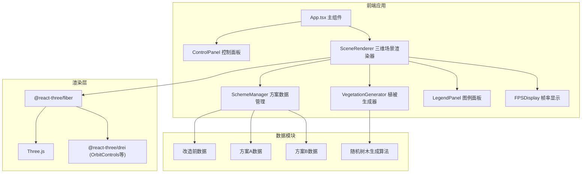

## 1. 架构设计



**数据流向：**
1. `App.tsx` → 维护方案索引和透明度状态 → 传递给 `SceneRenderer` 和 `ControlPanel`
2. `ControlPanel` → 用户交互 → 回调更新 `App.tsx` 状态
3. `SceneRenderer` → 调用 `SchemeManager.getScheme(index)` 获取建筑/设施数据
4. `SceneRenderer` → 调用 `VegetationGenerator.generate(scheme)` 获取树木粒子数据
5. `SceneRenderer` → 通过 `@react-three/fiber` 渲染到 Three.js 场景

## 2. 技术描述

- 前端框架：React 18 + TypeScript
- 构建工具：Vite 5 + @vitejs/plugin-react
- 三维渲染：Three.js + @react-three/fiber + @react-three/drei
- 状态管理：React useState（轻量状态，无需额外状态库）
- 后端：无（纯前端应用，数据内置在模块中）

## 3. 项目文件结构

| 文件路径 | 职责描述 |
|----------|----------|
| `package.json` | 项目依赖配置：react, react-dom, typescript, vite, @vitejs/plugin-react, three, @react-three/fiber, @react-three/drei |
| `vite.config.js` | Vite配置，启用React插件 |
| `tsconfig.json` | TypeScript严格模式配置 |
| `index.html` | 应用入口HTML |
| `src/main.tsx` | React入口，渲染App组件 |
| `src/App.tsx` | 主组件，管理全局状态（方案索引、透明度），组合子组件 |
| `src/components/SceneRenderer.tsx` | 三维场景渲染器，搭建R3F Canvas，包含地面、天空、建筑、植被、设施 |
| `src/components/ControlPanel.tsx` | 左侧控制面板，方案切换、视角复位、透明度滑块 |
| `src/components/LegendPanel.tsx` | 右上角图例面板 |
| `src/components/FPSDisplay.tsx` | 右下角帧率显示 |
| `src/modules/SchemeManager.ts` | 方案数据管理模块，存储三套方案数据 |
| `src/modules/VegetationGenerator.ts` | 植被分布生成模块，根据绿化区域生成树木数据 |
| `src/types/index.ts` | TypeScript类型定义 |

## 4. 核心数据模型

### 4.1 建筑数据

```typescript
interface Building {
  id: string;
  position: [number, number, number]; // x, y, z 坐标
  size: [number, number, number];     // 宽, 高, 深
  color: string;                      // 颜色
  type: 'industrial' | 'residential' | 'commercial' | 'facility';
}
```

### 4.2 公共设施数据

```typescript
interface PublicFacility {
  id: string;
  type: 'school' | 'hospital' | 'culture';
  position: [number, number, number];
  name: string;
  area: number; // 占地面积（平方米）
}
```

### 4.3 绿化区域数据

```typescript
interface GreenArea {
  boundary: [number, number][]; // 多边形边界点
  coverageRate: number;         // 覆盖率 0-1
}
```

### 4.4 树木数据

```typescript
interface TreeData {
  position: [number, number, number];
  height: number;       // 0.5-1.2
  crownRadius: number;  // 0.3-0.8
}
```

### 4.5 方案数据

```typescript
interface SchemeData {
  name: string;
  buildings: Building[];
  facilities: PublicFacility[];
  greenAreas: GreenArea[];
}
```

## 5. 性能优化策略

1. **InstancedMesh**：使用实例化网格批量渲染建筑和树木，减少draw call
2. **数量上限**：建筑≤150，树木≤300，设施≤20
3. **阴影优化**：shadow map尺寸限制为1024，设置合理的shadow bias
4. **动画性能**：使用requestAnimationFrame和插值实现平滑过渡，避免每帧创建新对象
5. **植被生成**：使用伪随机数，预计算树木位置，生成耗时≤10ms
