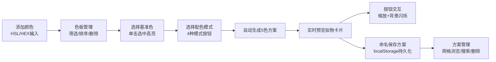

## 1. 产品概述
个人色彩调色板与配色方案管理应用，帮助设计师和开发者创建、管理和预览色彩搭配方案。
- 核心目标：提供直观的色彩编辑、和谐配色方案自动生成、拟物化预览和本地方案持久化功能
- 目标用户：UI设计师、前端开发者、美术创作者

## 2. 核心功能

### 2.1 功能模块
1. **色板编辑区**：HSL滑块/HEX输入添加颜色、色块卡片展示、按HSV属性筛选与排序
2. **配色方案生成区**：4种配色模式选择（互补/类似/三色/分裂互补）、5色方案生成展示
3. **预览区**：拟物卡片实时预览配色效果、交互动画反馈
4. **方案管理区**：命名保存方案到localStorage、网格视图浏览、搜索与删除

### 2.2 页面详情
| 页面名称 | 模块名称 | 功能描述 |
|-----------|-------------|---------------------|
| 主应用页 | 色板添加模块 | HSL三滑块+HEX输入框，实时预览当前颜色，点击添加到色板 |
| 主应用页 | 色块卡片列表 | 3列网格，80x80px色块卡片，悬浮缩放+边框高亮，右下角圆形删除按钮 |
| 主应用页 | 筛选工具栏 | 色相分类（7档）、饱和度高/低、明度高/低筛选器，实时生效 |
| 主应用页 | 方案模式选择 | 4个模式按钮组（互补/类似/三色/分裂互补），当前选中高亮 |
| 主应用页 | 5色方案条 | 水平排列5个60x60px色块，整体圆角6px，无间隔 |
| 主应用页 | 拟物预览卡片 | 220x300px圆角卡片，含背景、标题、正文、带边框按钮，按钮点击缩放+背景闪烁 |
| 主应用页 | 方案保存管理 | 命名输入+保存按钮，已保存方案200x120px网格卡片，5色缩略图+名称+日期+删除+搜索 |

## 3. 核心流程
用户通过HSL滑块或HEX输入添加自定义颜色到色板，色板按色相/饱和度/明度筛选展示色块；用户单击选中一个基准色，选择配色模式后系统自动生成5色和谐方案；预览区即时渲染拟物卡片展示配色效果，点击按钮触发缩放与背景闪烁动画；用户可命名保存当前方案到本地存储，在方案管理区浏览/搜索/删除已保存方案。

## 4. 用户界面设计

### 4.1 设计风格
- **主题色**：暗色主题，主背景#121220，色板区#1A1A2E，预览区#1E1E30，文字#E0E0F0
- **阴影风格**：统一rgba(0,0,0,0.3)阴影，选中态阴影提升至rgba(0,0,0,0.25)
- **按钮风格**：圆角按钮，配色方案按钮带2px边框色
- **字体**：系统无衬线字体族，标题18px粗体，正文12px常规，按钮文本16px白色
- **布局**：桌面端左右两列flex布局(1:1比例)，<800px时自动堆叠为单列
- **动画**：所有交互使用0.2s-0.3s ease-out过渡，按钮点击0.2s ease-in-out缩放反馈

### 4.2 页面设计概述
| 页面名称 | 模块名称 | UI元素 |
|-----------|-------------|-------------|
| 主应用页 | 色板添加模块 | HSL范围滑块（3个）、HEX文本输入、实时预览色块、添加按钮 |
| 主应用页 | 筛选工具栏 | 色相下拉选择器、饱和度高/低切换、明度高/低切换 |
| 主应用页 | 色块网格 | 3列CSS Grid，gap:12px，80x80px卡片，圆角8px，悬浮1.05倍缩放 |
| 主应用页 | 模式按钮组 | 4个水平排列按钮，选中态边框3px solid #333 |
| 主应用页 | 5色方案条 | 水平Flex容器，整体border-radius:6px，overflow:hidden |
| 主应用页 | 拟物预览卡片 | 220x300px，border-radius:12px，box-shadow:0 4px 20px rgba(0,0,0,0.3)，内边距统一 |
| 主应用页 | 方案保存区域 | 命名输入框、保存按钮、搜索框、200x120px方案卡片网格 |

### 4.3 响应式设计
- **桌面端（≥800px）**：左右两列flex布局，色板编辑区与预览区各占50%宽度
- **移动端（<800px）**：自动flex-direction:column堆叠为单列，各模块全宽展示
- **触控优化**：色块卡片、按钮、删除图标均保证最小44x44px触控区域

