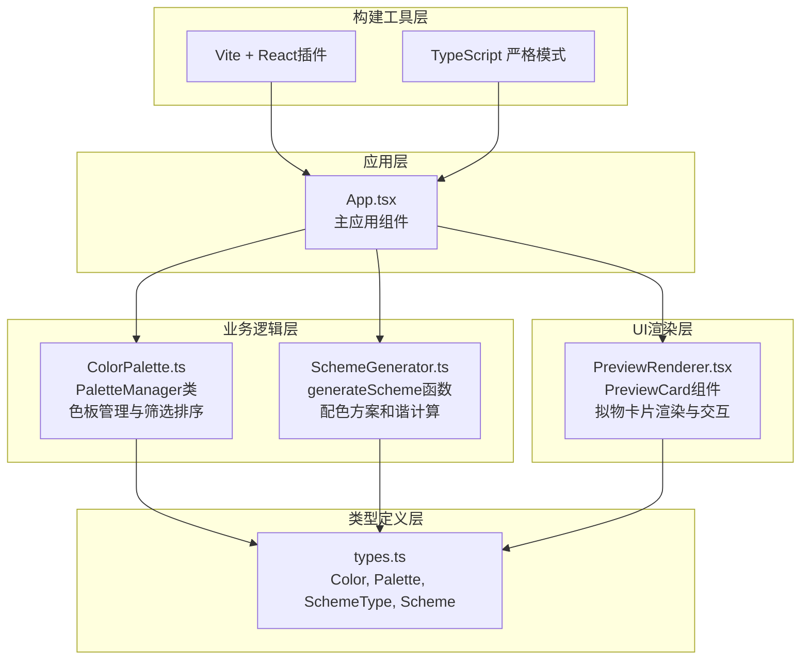

## 1. 架构设计



## 2. 技术说明
- **前端框架**：React 18 + TypeScript（严格模式）
- **构建工具**：Vite 5 + @vitejs/plugin-react
- **样式方案**：原生CSS + CSS Modules（内联样式处理动态颜色）
- **数据持久化**：localStorage存储已保存配色方案
- **性能优化**：HSL滑块拖动使用useRef直读，React.memo包装PreviewCard，useMemo缓存筛选结果和配色方案计算

## 3. 文件结构说明
| 文件路径 | 职责说明 |
|----------|----------|
| package.json | 项目依赖与启动脚本（dev: vite） |
| vite.config.js | Vite配置，启用React插件 |
| tsconfig.json | TypeScript配置，开启严格模式 |
| index.html | Vite入口HTML页面 |
| src/types.ts | Color/Palette/SchemeType/Scheme等核心类型定义 |
| src/ColorPalette.ts | PaletteManager类：颜色增删、按色相/饱和度/明度检索排序 |
| src/SchemeGenerator.ts | generateScheme函数：4种模式（互补/类似/三色/分裂互补）的5色和谐方案计算 |
| src/PreviewRenderer.tsx | PreviewCard组件：220x300px拟物卡片渲染、按钮缩放反馈、背景闪烁动画 |
| src/App.tsx | 主应用集成：色板编辑区、筛选、模式选择、方案条、预览区、方案保存管理 |
| src/main.tsx | React应用挂载入口 |
| src/index.css | 全局样式：暗色主题、布局、动画、响应式规则 |

## 4. 核心数据模型

### 4.1 类型定义
```typescript
// src/types.ts

export interface Color {
  id: string;
  hex: string;
  hsl: { h: number; s: number; l: number };
  name?: string;
}

export interface Palette {
  colors: Color[];
  selectedColorId: string | null;
}

export type SchemeType = 'complementary' | 'analogous' | 'triadic' | 'split-complementary';

export interface Scheme {
  id: string;
  name: string;
  type: SchemeType;
  colors: Color[];
  baseColorId: string;
  createdAt: number;
}

export interface SavedScheme extends Scheme {
  id: string;
  name: string;
  createdAt: number;
}
```

### 4.2 PaletteManager类方法签名
```typescript
class PaletteManager {
  constructor(initialColors?: Color[]);
  addColor(color: Omit<Color, 'id'>): Color;
  removeColor(id: string): void;
  getColors(): Color[];
  getColorById(id: string): Color | undefined;
  setSelectedColor(id: string | null): void;
  getSelectedColor(): Color | undefined;
  filterByHueCategory(category: HueCategory | 'all'): Color[];
  filterBySaturation(level: 'high' | 'low' | 'all'): Color[];
  filterByLightness(level: 'high' | 'low' | 'all'): Color[];
  sortByHue(): Color[];
  sortBySaturation(): Color[];
  sortByLightness(): Color[];
  getColorsWithFilters(filters: FilterOptions): Color[];
}
```

### 4.3 配色方案生成算法说明
| 模式 | 算法规则（基于基准色HSL） |
|------|---------------------------|
| 互补 (complementary) | H±180°, 基准色+2个相近色+2个互补相近色 |
| 类似 (analogous) | H±30°, H±60°，5个连续色相 |
| 三色 (triadic) | H, H±120°，每个色再取一邻近色 |
| 分裂互补 (split-complementary) | H, (H+150°), (H+210°)，每色取一邻近色 |

## 5. 性能设计要点
- HSL滑块事件使用原生onChange，状态更新通过useState批处理，避免每帧多次渲染
- 色板筛选结果使用useMemo依赖[colors, filters]缓存
- SchemeGenerator纯函数计算，useMemo缓存基准色+模式的计算结果
- PreviewCard使用React.memo包装，避免父组件重渲染时的不必要重绘
- 所有动画使用CSS transform/opactiy属性，保证GPU加速60fps流畅

