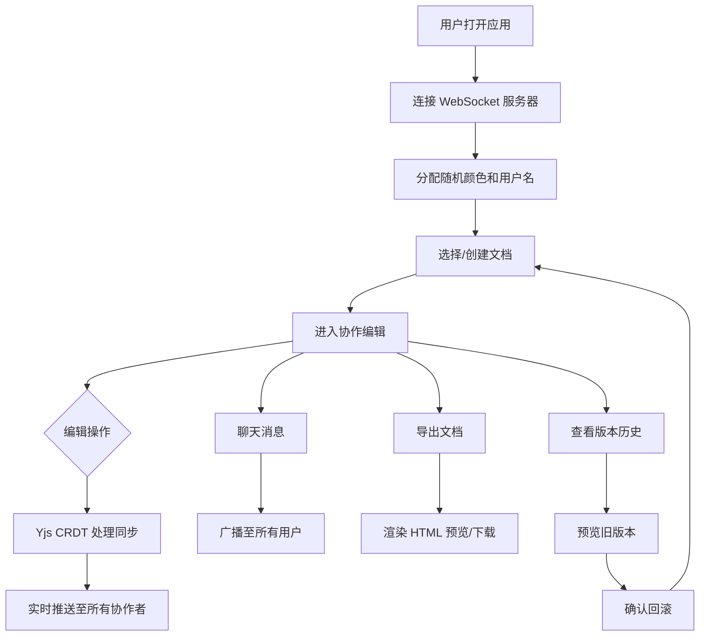

## 1. 产品概述

CoDoc 是一个多人实时协作的在线 Markdown 文档编辑器，旨在解决团队同时编辑文档时内容冲突和实时同步困难的问题。通过 CRDT 算法（Yjs）实现无冲突协作编辑，结合光标实时显示、文件树管理、文档导出、即时聊天和版本历史回滚等功能，为团队提供高效、流畅的协同编辑体验。

- 目标用户：需要多人协作编写文档的开发团队、技术团队、项目组
- 核心价值：消除协作编辑冲突，实时同步延迟 <500ms，提供完整的文档管理工具链

## 2. 核心功能

### 2.1 用户角色

| 角色 | 进入方式 | 核心权限 |
|------|----------|----------|
| 协作者 | 自动分配随机用户名和颜色 | 编辑文档、管理文件、发送聊天、导出文档、查看历史版本 |

### 2.2 功能模块

1. **协作编辑器页面**：核心编辑区、光标实时显示、OT/CRDT 同步
2. **文件树侧边栏**：文档列表、增删改操作、拖拽调节宽度
3. **聊天侧边栏**：即时消息、时间戳、自动滚动
4. **导出功能**：Markdown 渲染为 HTML 预览和下载
5. **版本历史**：时间线展示、版本预览、回滚确认

### 2.3 页面详情

| 页面名称 | 模块名称 | 功能描述 |
|----------|----------|----------|
| 协作编辑器 | 实时编辑区 | 多人同时编辑 Markdown，光标和选中内容以不同颜色显示，内容通过 Yjs CRDT 实时同步（延迟 <500ms） |
| 协作编辑器 | 光标显示层 | 叠加在编辑器上方，显示其他协作者的光标位置和用户名标签，每人分配随机颜色 |
| 文件树侧边栏 | 文档列表 | 树形展示所有文档，点击切换编辑内容（加载 <200ms） |
| 文件树侧边栏 | 文件操作 | 创建、重命名、删除文档，操作有微缩放动画过渡 |
| 文件树侧边栏 | 宽度调节 | 拖拽分隔条调节宽度，拖拽时有亮度反馈 |
| 聊天侧边栏 | 消息列表 | 显示所有协作者的聊天消息，包含发送时间和用户颜色标识 |
| 聊天侧边栏 | 消息输入 | 输入框发送文字消息，新消息自动平滑滚动到底部，消息气泡有淡入动画 |
| 聊天侧边栏 | 展开/收起 | 默认收起，点击聊天图标展开 |
| 导出功能 | HTML 预览 | 将当前 Markdown 渲染为美观的 HTML 页面预览 |
| 导出功能 | 下载 | 触发 HTML 文件下载，预览页面保持与编辑器一致的样式和代码高亮 |
| 版本历史 | 时间线 | 编辑器底部显示版本时间线，标注时间和操作摘要 |
| 版本历史 | 版本预览 | 点击某个历史版本可预览该版本的内容 |
| 版本历史 | 回滚操作 | 点击"回滚"按钮后弹出确认弹窗，确认后恢复到该版本 |

## 3. 核心流程

1. 用户打开应用，自动连接 WebSocket 协作服务器，分配随机颜色和用户名
2. 用户在文件树中选择或创建文档，编辑器加载内容
3. 多人同时编辑时，Yjs CRDT 处理冲突，内容实时同步推送
4. 用户可通过聊天侧边栏与其他协作者沟通
5. 用户可导出当前文档为 HTML 预览并下载
6. 用户可查看版本历史，预览旧版本并回滚

## 4. 用户界面设计

### 4.1 设计风格

- 主色：蓝色系 #2196F3，用于主要按钮、选中态、链接
- 强调色：橙色 #FF9800，用于未保存状态指示
- 背景：浅灰白渐变（#f5f7fa 到 #e8ecf1）
- 编辑器主题：半高亮 Markdown 主题（代码块浅灰背景、标题加粗蓝色下划线）
- 按钮：圆角，悬停时轻微上浮阴影过渡（0.2s ease）
- 字体：编辑器使用等宽字体（JetBrains Mono），UI 使用无衬线字体
- 布局：左侧文件树 + 中间编辑器 + 右侧聊天栏，三栏自适应

### 4.2 页面设计概览

| 页面名称 | 模块名称 | UI 元素 |
|----------|----------|---------|
| 协作编辑器 | 编辑区域 | 等宽字体编辑器、行号、语法高亮、多色光标叠加层 |
| 文件树 | 文件列表 | 树形结构、文件图标、悬停高亮、选中态蓝色背景 |
| 文件树 | 操作按钮 | 新建/重命名/删除图标按钮，微缩放动画 |
| 文件树 | 拖拽分隔条 | 垂直分隔线，拖拽时亮度增加反馈 |
| 聊天栏 | 消息气泡 | 圆角气泡、淡入动画、用户颜色标识、时间戳 |
| 聊天栏 | 输入框 | 底部固定输入框、发送按钮 |
| 导出 | 预览弹窗 | 居中弹窗、HTML 渲染预览、下载按钮 |
| 版本历史 | 时间线 | 底部水平时间线、时间节点、版本标签 |

### 4.3 响应式适配

- 桌面端（≥768px）：三栏布局，文件树左侧、编辑器中间、聊天栏右侧
- 移动端（<768px）：文件树自动折叠为汉堡菜单，聊天栏变为底部抽屉
- 所有交互按钮保持可点击区域 ≥ 44px

### 4.4 3D 场景

不适用
