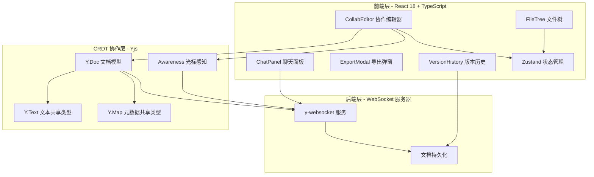
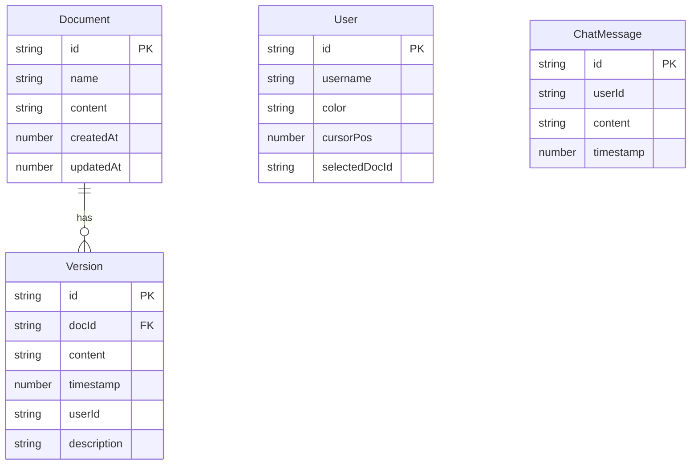

## 1. 架构设计



## 2. 技术说明

- 前端：React 18 + TypeScript + Vite
- 初始化工具：vite-init (react-ts 模板)
- 样式：CSS + Tailwind CSS
- 状态管理：Zustand
- 协作引擎：Yjs（CRDT 库）+ y-websocket（WebSocket 通信）
- 编辑器：CodeMirror 6（通过 y-codemirror.next 绑定 Yjs）
- Markdown 预览：react-markdown + rehype-highlight
- 拖拽分隔：react-split-pane
- 后端：y-websocket 内置服务器（Node.js）
- 数据持久化：内存 + 本地文件系统（开发阶段）

## 3. 路由定义

| 路由 | 用途 |
|------|------|
| / | 主编辑器页面，包含文件树、编辑区、聊天栏 |

## 4. API 定义

### 4.1 WebSocket 协议

基于 y-websocket 标准协议：
- 文档同步消息（Yjs 更新增量）
- Awareness 消息（光标位置、用户信息）
- 聊天消息（自定义协议扩展）

### 4.2 自定义消息类型

```typescript
interface ChatMessage {
  type: 'chat'
  userId: string
  username: string
  color: string
  content: string
  timestamp: number
}

interface VersionSnapshot {
  type: 'version'
  docId: string
  content: string
  timestamp: number
  userId: string
  description: string
}

interface FileOperation {
  type: 'file-op'
  operation: 'create' | 'rename' | 'delete'
  docId: string
  name?: string
  oldName?: string
}
```

## 5. 服务器架构

y-websocket 内置服务器处理所有协作通信，无需独立后端框架。

## 6. 数据模型

### 6.1 数据模型定义



### 6.2 文件组织

```
├── package.json
├── vite.config.ts
├── tsconfig.json
├── index.html
├── server.js                  # y-websocket 协作服务器
├── src/
│   ├── main.tsx               # 入口
│   ├── App.tsx                # 根组件
│   ├── CollabEditor.tsx       # 核心编辑器组件
│   ├── FileTree.tsx           # 文件树组件
│   ├── ChatPanel.tsx          # 聊天侧边栏组件
│   ├── ExportModal.tsx        # 导出组件
│   ├── VersionHistory.tsx     # 版本历史组件
│   ├── store.ts               # Zustand 状态管理
│   ├── style.css              # 全局样式
│   └── types.ts               # 类型定义
```
