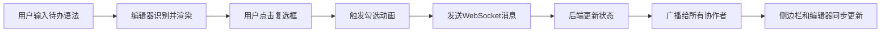

## 1. 产品概述

待办事项协作编辑应用，解决长文本协作编辑中待办事项分散、难以集中查看和状态同步的问题。支持多人实时协作编辑，自动识别文档中的待办事项并提供集中管理功能。

- 核心价值：将文档中的待办事项自动提取、集中管理、实时同步
- 目标用户：需要协作编写文档并追踪任务进度的团队用户
- 市场价值：提升团队协作效率，减少任务遗漏和状态不一致

## 2. 核心特性

### 2.1 用户角色
| 角色 | 注册方式 | 核心权限 |
|------|----------|----------|
| 协作者 | 自动分配模拟用户 | 编辑文档、创建/修改/删除待办事项、查看侧边栏 |

### 2.2 功能模块
1. **富文本编辑器**：支持Markdown待办语法识别、复选框渲染、点击状态切换
2. **待办事项侧边栏**：待办列表汇总、分组展示、搜索筛选、批量操作
3. **协作同步模块**：WebSocket实时同步、多用户光标显示、冲突处理

### 2.3 页面详情
| 页面名称 | 模块名称 | 功能描述 |
|----------|----------|----------|
| 主编辑页 | 富文本编辑器 | 输入"- [ ] 文本"自动识别为待办，渲染为可点击复选框，点击触发状态切换动画 |
| 主编辑页 | 待办侧边栏 | 可折叠、可拖拽调整宽度，分组显示未完成/已完成事项，支持定位和批量操作 |
| 主编辑页 | 协作功能 | 多用户彩色光标显示，状态实时同步，冲突检测与提示 |

## 3. 核心流程

用户打开编辑页面 → 输入待办事项语法 → 系统自动识别并渲染复选框 → 用户点击复选框切换状态 → 状态实时同步到后端 → 广播给所有在线协作者 → 侧边栏自动更新列表

## 4. 用户界面设计

### 4.1 设计风格
- 主色调：深蓝 #1a2332，辅助色：绿色 #2ecc71，背景色：白色 #ffffff，侧边栏：浅灰 #f5f7fa
- 按钮风格：圆角设计，悬停上浮效果，点击缩放反馈
- 字体：采用现代无衬线字体，标题18px粗体，正文14px常规
- 布局：极简卡片式布局，左侧浮动工具栏，右侧可折叠侧边栏
- 图标：使用lucide-react线性图标，保持简洁风格

### 4.2 页面设计概览
| 页面名称 | 模块名称 | UI元素 |
|----------|----------|--------|
| 主编辑页 | 富文本编辑器 | 白色卡片容器、灰色边框、内边距24px、浮动工具栏、待办复选框（圆角、绿色填充、白色对勾） |
| 主编辑页 | 待办侧边栏 | 浅灰背景、拖拽手柄、分组标题（未完成/已完成）、列表项（悬停上浮、阴影增加）、状态圆点 |
| 主编辑页 | 协作功能 | 彩色用户光标、冲突提示（顶部短暂浮出）、庆祝动画（五彩纸屑飘落） |

### 4.3 响应式设计
- 桌面端（≥1024px）：侧边栏常驻，宽度200-500px可拖拽
- 平板端（768-1023px）：侧边栏折叠为汉堡菜单，点击滑出
- 手机端（<768px）：编辑器全屏，侧边栏以底部滑出模态框展示

### 4.4 动画与交互
- 复选框勾选：打勾动画 + 闪烁一次（150ms）
- 状态文字：灰色删除线（已完成）/ 蓝色文字（未完成），平滑过渡200ms
- 列表项：悬停translateY(-2px) + 阴影增加，点击scale(0.98)
- 侧边栏拖拽：边缘显示拖拽手柄，松开后宽度平滑过渡300ms
- 定位高亮：淡入高亮，2秒后自动淡出
- 删除动画：向左滑动并淡出（300ms）
- 全部完成：按钮脉冲光效，触发五彩纸屑庆祝动画
