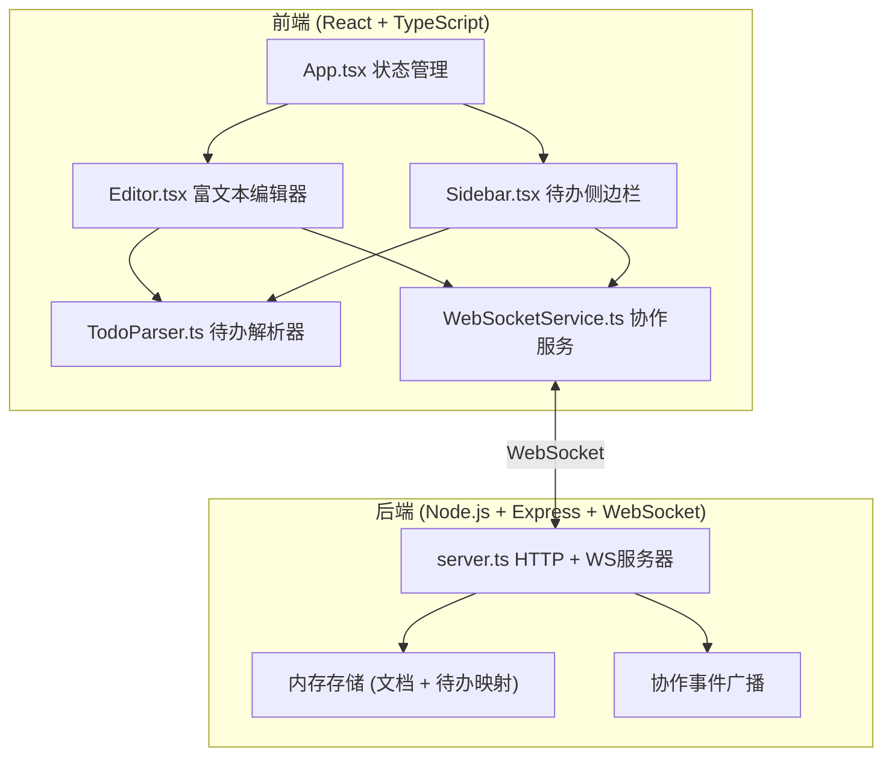
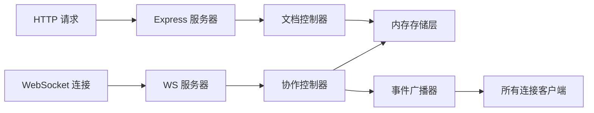
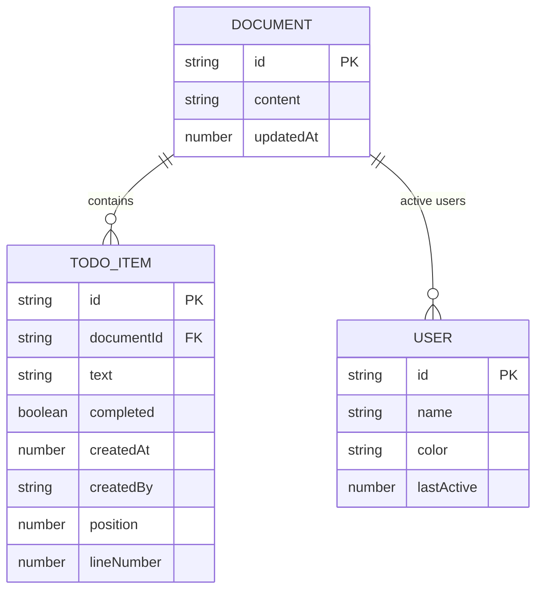

## 1. 架构设计



## 2. 技术描述

- **前端**：React 18 + TypeScript + Vite + react-quill + zustand
- **构建工具**：Vite 5
- **后端**：Express 4 + ws (WebSocket) + 内存存储
- **状态管理**：zustand
- **图标库**：lucide-react
- **样式方案**：Tailwind CSS 3 + CSS变量

## 3. 路由定义
| 路由 | 用途 |
|------|------|
| / | 主编辑页面 |

## 4. API 定义

### 4.1 类型定义
```typescript
interface TodoItem {
  id: string;
  text: string;
  completed: boolean;
  createdAt: number;
  createdBy: string;
  position: number;
  lineNumber: number;
}

interface User {
  id: string;
  name: string;
  color: string;
  cursorPosition?: number;
}

interface DocumentState {
  id: string;
  content: string;
  todos: TodoItem[];
  users: User[];
}

interface WSMessage {
  type: 'TODO_TOGGLE' | 'TODO_DELETE' | 'TODO_CREATE' | 'CONTENT_CHANGE' | 
        'CURSOR_MOVE' | 'USER_JOIN' | 'USER_LEAVE' | 'BULK_COMPLETE';
  payload: any;
  userId: string;
  timestamp: number;
}
```

### 4.2 HTTP API
| 方法 | 路径 | 描述 |
|------|------|------|
| GET | /api/documents/:id | 获取文档内容和待办列表 |
| PUT | /api/documents/:id | 更新文档内容 |
| GET | /api/documents/:id/todos | 获取待办列表 |
| PATCH | /api/documents/:id/todos/:todoId | 更新单个待办状态 |
| DELETE | /api/documents/:id/todos/:todoId | 删除待办 |

### 4.3 WebSocket 事件
| 事件类型 | 触发时机 | 广播范围 |
|----------|----------|----------|
| TODO_TOGGLE | 用户切换待办状态 | 所有协作者 |
| TODO_CREATE | 用户创建新待办 | 所有协作者 |
| TODO_DELETE | 用户删除待办 | 所有协作者 |
| CONTENT_CHANGE | 文档内容变更 | 所有协作者 |
| CURSOR_MOVE | 用户光标移动 | 所有协作者 |
| USER_JOIN | 新用户加入 | 所有协作者 |
| USER_LEAVE | 用户离开 | 所有协作者 |
| BULK_COMPLETE | 全部完成操作 | 所有协作者 |

## 5. 服务器架构图



## 6. 数据模型

### 6.1 数据模型定义



### 6.2 内存数据结构
```typescript
// 内存存储结构
const store = {
  documents: new Map<string, {
    content: string;
    todos: Map<string, TodoItem>;
    updatedAt: number;
  }>(),
  connections: new Map<string, {
    userId: string;
    documentId: string;
    ws: WebSocket;
  }>()
};
```

## 7. 项目文件结构

```
auto30/
├── package.json
├── vite.config.js
├── tsconfig.json
├── index.html
├── src/
│   ├── App.tsx              # 主应用组件，状态管理
│   ├── main.tsx             # 入口文件
│   ├── index.css            # 全局样式
│   ├── editor/
│   │   ├── Editor.tsx       # 富文本编辑器组件
│   │   └── TodoParser.ts    # 待办事项解析工具
│   ├── todo/
│   │   └── Sidebar.tsx      # 待办侧边栏组件
│   ├── collaboration/
│   │   └── WebSocketService.ts  # WebSocket客户端服务
│   ├── store/
│   │   └── useDocumentStore.ts  # zustand状态管理
│   ├── types/
│   │   └── index.ts         # TypeScript类型定义
│   └── utils/
│       └── animations.css   # 动画样式
├── server/
│   └── server.ts            # Express + WebSocket服务器
└── shared/
    └── types.ts             # 共享类型定义
```
