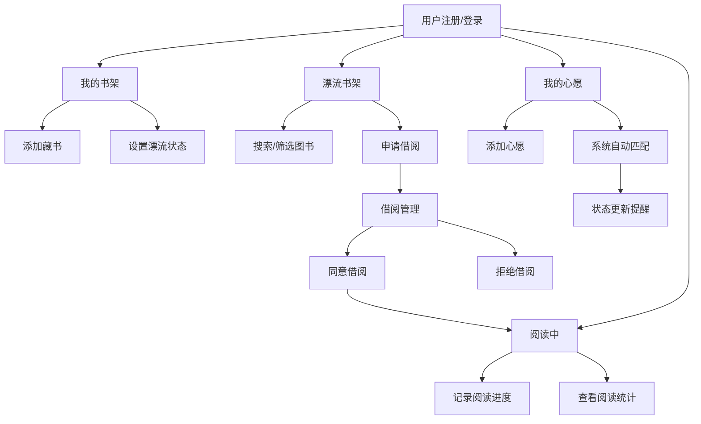

## 1. 产品概述

社区图书漂流与阅读心愿清单管理应用，连接爱书之人，让闲置图书流动起来，帮助用户发现、分享和记录阅读旅程。

- **主要目的**：构建一个图书共享社区，用户可以发布闲置藏书、申请借阅他人图书、管理阅读心愿清单，并记录阅读进度
- **解决问题**：闲置图书浪费、找书困难、阅读缺乏记录与社交互动
- **目标用户**：所有热爱阅读、愿意分享图书的人群
- **产品价值**：促进知识共享，建立阅读社区，降低阅读成本，提升阅读体验

## 2. 核心功能

### 2.1 用户角色

| 角色 | 注册方式 | 核心权限 |
|------|----------|----------|
| 普通用户 | 用户名+邮箱+密码注册 | 发布藏书、申请借阅、管理心愿清单、记录阅读进度 |

### 2.2 功能模块

1. **用户管理模块**：用户注册、登录、个人资料编辑
2. **藏书漂流模块**：个人书架管理、漂流书架浏览、借阅申请与审批
3. **心愿清单模块**：心愿添加、自动匹配提醒、状态管理
4. **阅读进度模块**：借阅图书管理、进度记录、阅读统计

### 2.3 页面详情

| 页面名称 | 模块名称 | 功能描述 |
|---------|----------|----------|
| 登录/注册页 | 用户管理 | 用户注册表单（用户名、邮箱、密码）、登录表单 |
| 我的书架页 | 藏书漂流 | 四列网格展示用户藏书，添加图书模态框，状态切换下拉菜单 |
| 漂流书架页 | 藏书漂流 | 两列瀑布流展示所有可借阅图书，搜索栏、筛选器，交错飞入动画 |
| 借阅管理页 | 藏书漂流 | 待处理借阅请求列表，同意/拒绝按钮，缩放动画 |
| 我的心愿页 | 心愿清单 | 时间轴样式心愿列表，添加心愿，自动匹配漂流图书，渐变动画 |
| 阅读中页 | 阅读进度 | 当前借阅图书列表，进度条记录，顶部阅读统计数字 |

## 3. 核心流程

### 3.1 图书漂流流程
用户注册登录后，可在个人书架添加藏书并设置为"可借阅"状态。其他用户在漂流书架浏览可借阅图书，点击申请借阅并选择借阅期限。图书持有者收到借阅请求后，可同意或拒绝。借阅成功后，借阅者可在"阅读中"页面记录阅读进度。

### 3.2 心愿匹配流程
用户添加心愿图书后，系统每隔30秒自动扫描全局漂流书架。若发现匹配图书，心愿状态变为"已找到"并提示用户。用户可手动标记心愿为"已收录"进行归档。

### 3.3 Mermaid 流程图

## 4. 用户界面设计

### 4.1 设计风格

**色彩方案：**
- 主色调：深紫 `#7C4DFF`（导航选中指示）、蓝色 `#2196F3`（主操作按钮）
- 状态色：绿色 `#4CAF50`（可借阅/已读进度）、橙色 `#FF9800`（已借出）、灰色 `#9E9E9E`（保留中）、红色 `#F44336`（拒绝）
- 背景色：深色导航 `#1E1E2E`、内容区浅灰 `#F5F5F5`、卡片底色 `#FAFAFA`
- 封面色池：浅蓝 `#BBDEFB`、浅绿 `#C8E6C9`、浅黄 `#FFF9C4`、浅粉 `#F8BBD0`、浅紫 `#E1BEE7`、浅橙 `#FFE0B2`

**排版风格：**
- 标题字体：现代无衬线字体，大号加粗用于统计数字（36px）
- 正文字体：清晰易读的无衬线字体
- 关键数字：36px 加粗，颜色 `#333`

**组件风格：**
- 卡片：圆角 12-16px，1px 边框 `#E0E0E0`，悬浮上移 4px 并加深阴影
- 按钮：圆角 8px，悬浮变深色，0.2-0.3 秒过渡动画
- 模态框：半透明遮罩，圆角 16px，内边距 24px
- 进度条：高度 6px，圆角 3px，0.4 秒宽度延展动画
- Toast 提示：圆角 8px，内边距 12px 24px，顶部滑入，3 秒消失

**动效设计：**
- 卡片悬浮：上移 4px，阴影加深，0.3 秒过渡
- 列表加载：交错飞入动画，卡片依次从下方滑入
- 状态变化：背景色渐变 0.5 秒，通知条从右向左滑入
- 按钮交互：0.2 秒缩放动画

### 4.2 页面设计概述

| 页面名称 | 模块名称 | UI 元素 |
|---------|----------|---------|
| 登录/注册页 | 用户管理 | 居中表单卡片，输入框带图标，提交按钮带动效 |
| 我的书架页 | 藏书漂流 | 四列网格（卡片 280px），添加图书按钮，状态标签 |
| 漂流书架页 | 藏书漂流 | 两列瀑布流（320-400px），顶部搜索栏+筛选器，用户头像 |
| 借阅管理页 | 藏书漂流 | 请求列表按时间倒序，借阅者头像，同意/拒绝按钮 |
| 我的心愿页 | 心愿清单 | 时间轴布局，圆形序号，状态条，渐变背景动画 |
| 阅读中页 | 阅读进度 | 顶部三大统计数字，进度条，快速记录铅笔图标 |

**整体布局：**
- 左侧固定导航栏（220px，深色背景）
- 用户头像（60px 圆形）、用户名、四个导航项（24px 图标）
- 选中项左侧 4px 紫色竖条，悬浮背景变浅 `#2A2A3E`
- 右侧内容区（浅灰背景），1200px 居中容器，上下 32px 内边距

### 4.3 响应性

- 采用桌面优先设计
- 主要针对桌面端优化
- 可通过媒体查询适配平板设备
- 触控区域最小 44x44px 确保可点击性

### 4.4 性能优化

- 使用 React.lazy + Suspense 实现代码分割，页面切换 < 200ms
- 初始加载 20 条数据，滚动加载更多（每次 10 条）
- 搜索防抖 300ms，减少不必要渲染
- CSS 动画优先使用 transform 和 opacity，保持 50fps 以上
- 图片使用占位符（纯色背景+首字母），避免图片加载延迟
