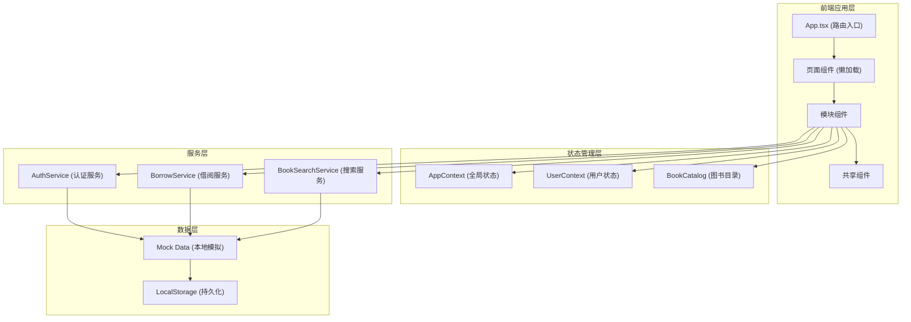

## 1. 架构设计



## 2. 技术描述

- **前端框架**：React 18 + TypeScript
- **构建工具**：Vite 5.x + @vitejs/plugin-react
- **路由管理**：react-router-dom 6.x
- **状态管理**：React Context API（自定义实现 update/subscribe 接口）
- **样式方案**：CSS Modules + CSS Variables（不使用 Tailwind，按需求自定义样式）
- **数据持久化**：LocalStorage
- **动画实现**：纯 CSS 动画 + CSS Transitions/Keyframes
- **模拟数据**：内置 Mock 数据，无需后端服务

## 3. 目录结构

```
src/
├── main.tsx                 # 应用入口
├── App.tsx                  # 根组件，路由配置
├── modules/
│   ├── user/
│   │   ├── UserManager.tsx  # 用户管理模块
│   │   ├── Login.tsx        # 登录页
│   │   └── Register.tsx     # 注册页
│   ├── bookshelf/
│   │   ├── BookShelf.tsx    # 我的书架
│   │   ├── DriftShelf.tsx   # 漂流书架
│   │   └── BorrowManage.tsx # 借阅管理
│   └── wishlist/
│       ├── Wishlist.tsx     # 心愿清单
│       └── ReadingProgress.tsx # 阅读进度
├── shared/
│   ├── components/
│   │   ├── BookCard.tsx     # 图书卡片组件
│   │   ├── Modal.tsx        # 模态框组件
│   │   ├── Toast.tsx        # Toast 提示组件
│   │   ├── Navbar.tsx       # 导航栏组件
│   │   └── ProgressBar.tsx  # 进度条组件
│   ├── stores/
│   │   └── AppContext.tsx   # 全局上下文
│   ├── services/
│   │   ├── AuthService.ts   # 认证服务
│   │   ├── BorrowService.ts # 借阅服务
│   │   └── BookSearchService.ts # 搜索服务
│   ├── types/
│   │   └── index.ts         # TypeScript 类型定义
│   ├── utils/
│   │   ├── mockData.ts      # 模拟数据
│   │   ├── colors.ts        # 颜色工具
│   │   └── storage.ts       # 存储工具
│   └── styles/
│       └── variables.css    # 全局样式变量
├── index.html
├── vite.config.js
├── tsconfig.json
└── package.json
```

## 4. 路由定义

| 路由 | 页面 | 说明 |
|------|------|------|
| `/login` | 登录页 | 用户登录表单 |
| `/register` | 注册页 | 用户注册表单 |
| `/` | 我的书架 | 个人藏书列表（默认页，登录后跳转） |
| `/drift` | 漂流书架 | 所有可借阅图书列表 |
| `/borrow` | 借阅管理 | 待处理借阅请求 |
| `/wishlist` | 我的心愿 | 阅读心愿清单 |
| `/reading` | 阅读中 | 当前借阅图书与进度 |

## 5. 类型定义

```typescript
// 用户类型
interface User {
  id: string;
  username: string;
  email: string;
  password: string;
  avatarColor: string;
  createdAt: number;
}

// 图书状态
type BookStatus = 'available' | 'borrowed' | 'reserved';

// 图书类型
interface Book {
  id: string;
  title: string;
  author: string;
  ownerId: string;
  status: BookStatus;
  coverColor: string;
  createdAt: number;
  currentBorrowerId?: string;
  borrowDueDate?: number;
  totalPages?: number;
  currentPage?: number;
}

// 借阅请求状态
type BorrowRequestStatus = 'pending' | 'approved' | 'rejected';

// 借阅请求
interface BorrowRequest {
  id: string;
  bookId: string;
  requesterId: string;
  ownerId: string;
  duration: number; // 7/14/30 天
  note: string;
  status: BorrowRequestStatus;
  createdAt: number;
}

// 心愿状态
type WishStatus = 'searching' | 'found' | 'collected';

// 心愿清单
interface Wish {
  id: string;
  userId: string;
  title: string;
  author: string;
  note?: string;
  status: WishStatus;
  matchedBookId?: string;
  createdAt: number;
}

// 全局应用状态
interface AppState {
  currentUser: User | null;
  books: Book[];
  borrowRequests: BorrowRequest[];
  wishes: Wish[];
}

// 上下文接口
interface AppContextType {
  state: AppState;
  update: (updates: Partial<AppState>) => void;
  subscribe: (listener: () => void) => () => void;
}
```

## 6. 核心模块数据流向

### 6.1 用户管理模块 (UserManager)
```
表单输入 → AuthService.register/login → 更新 UserContext → 路由跳转
```

### 6.2 藏书漂流模块 (BookShelf)
```
读取 UserContext → 展示藏书列表 → 触发借阅操作 → BorrowService → 刷新状态
```

### 6.3 心愿清单模块 (Wishlist)
```
用户输入 → BookSearchService.search → 展示匹配结果 → 添加心愿 → 定时扫描匹配
```

## 7. 性能优化策略

1. **代码分割**：使用 `React.lazy` + `Suspense` 对各页面组件进行懒加载
2. **虚拟列表/分页**：初始加载 20 条，滚动到底部加载更多（每次 10 条）
3. **防抖搜索**：搜索输入 300ms 防抖，避免频繁过滤
4. **记忆化渲染**：使用 `React.memo` 包裹卡片组件，使用 `useMemo`/`useCallback` 优化
5. **CSS 动画优化**：使用 `transform` 和 `opacity` 属性实现动画，避免触发重排
6. **状态最小化**：将状态提升到必要的最低层级，避免不必要的重渲染

## 8. 关键实现要点

### 8.1 防抖 Hook
```typescript
function useDebounce<T>(value: T, delay: number): T
```

### 8.2 无限滚动 Hook
```typescript
function useInfiniteScroll<T>(
  items: T[],
  initialCount: number,
  loadMoreCount: number
): { visibleItems: T[], hasMore: boolean, loadMore: () => void }
```

### 8.3 WebSocket 模拟
使用 `setTimeout`/`setInterval` 模拟实时通知，结合自定义事件系统实现通知分发。

### 8.4 心愿匹配算法
- 忽略大小写和标点符号
- 书名或作者任一匹配即可
- 30秒轮询检查新上架图书

### 8.5 通知系统
使用 React Context 管理全局通知队列，实现 Toast 和通知条的统一管理。
