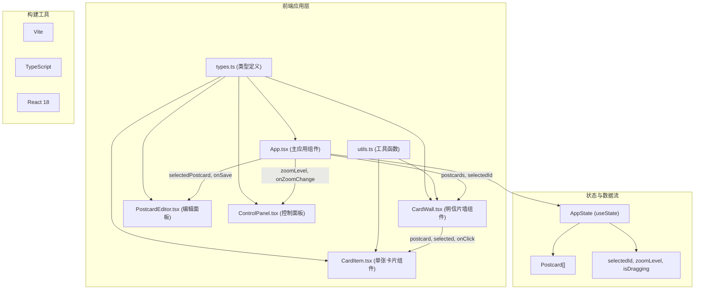
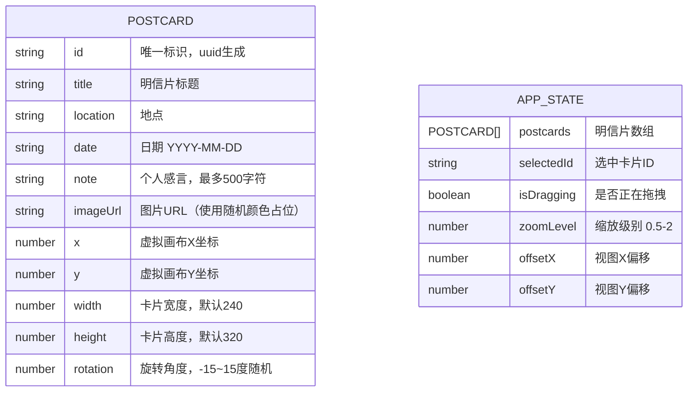

## 1. 架构设计



## 2. 技术描述

- **前端框架**：React 18 + TypeScript
- **构建工具**：Vite 5 + @vitejs/plugin-react
- **状态管理**：React useState（单状态提升至App.tsx）
- **工具库**：uuid（唯一ID生成）
- **样式方案**：内联样式 + CSS 动画（无第三方UI库）
- **项目初始化**：使用 `vite-init` 模板创建 react-ts 项目

**技术栈选型理由**：
- 轻量级状态管理（useState）足够应对本应用复杂度，避免引入zustand等额外库
- 使用内联样式便于实现动态计算的位置、旋转和缩放
- TypeScript严格模式确保类型安全
- Vite提供快速的开发体验和构建性能

## 3. 路由定义

| 路由 | 用途 |
|------|------|
| / | 明信片墙主页（单页应用，无其他路由） |

## 4. 数据模型

### 4.1 数据模型定义



### 4.2 TypeScript 类型定义

```typescript
// src/types.ts
export interface Postcard {
  id: string;
  title: string;
  location: string;
  date: string;
  note: string;
  imageUrl: string;
  x: number;
  y: number;
  width: number;
  height: number;
  rotation: number;
}

export interface AppState {
  postcards: Postcard[];
  selectedId: string | null;
  isDragging: boolean;
  zoomLevel: number;
  offsetX: number;
  offsetY: number;
}

export type ViewState = {
  offsetX: number;
  offsetY: number;
  zoomLevel: number;
};
```

### 4.3 初始数据

应用启动时预设5张明信片，数据示例：

```typescript
// src/utils.ts - 初始数据生成
const PRESET_COLORS = ['#E8B4B8', '#B8D4E8', '#C8E8B8', '#E8D4B8', '#D4B8E8', '#E8E0B8'];
const CARD_WIDTH = 240;
const CARD_HEIGHT = 320;
const MIN_SPACING = 30;

// 随机位置生成算法，确保卡片不重叠
function generateNonOverlappingPositions(count: number, canvasWidth: number, canvasHeight: number): Array<{x: number, y: number, rotation: number, color: string}> {
  const positions = [];
  const maxAttempts = 100;
  
  for (let i = 0; i < count; i++) {
    let attempts = 0;
    let validPosition = null;
    
    while (attempts < maxAttempts && !validPosition) {
      const x = Math.random() * (canvasWidth - CARD_WIDTH - 100) + 50;
      const y = Math.random() * (canvasHeight - CARD_HEIGHT - 100) + 50;
      const rotation = (Math.random() - 0.5) * 30; // -15 ~ 15度
      const color = PRESET_COLORS[Math.floor(Math.random() * PRESET_COLORS.length)];
      
      const overlaps = positions.some(pos => {
        const dx = Math.abs(x - pos.x);
        const dy = Math.abs(y - pos.y);
        return dx < CARD_WIDTH + MIN_SPACING && dy < CARD_HEIGHT + MIN_SPACING;
      });
      
      if (!overlaps) {
        validPosition = { x, y, rotation, color };
      }
      attempts++;
    }
    
    if (validPosition) {
      positions.push(validPosition);
    }
  }
  
  return positions;
}
```

## 5. 文件结构与调用关系

```
d:\Pro\tasks\auto301\
├── index.html                     # 入口HTML，挂载点<div id="root">
├── package.json                   # 依赖与脚本配置
├── tsconfig.json                  # TypeScript严格模式配置
├── vite.config.js                 # Vite配置，React插件
└── src/
    ├── main.tsx                   # 应用入口，渲染App组件
    ├── App.tsx                    # 主应用组件，状态管理中心
    │                              # 数据流：接收用户交互→更新state→通知子组件
    ├── types.ts                   # Postcard和AppState类型定义
    │                              # 被所有组件引用
    ├── utils.ts                   # 工具函数：初始数据生成、碰撞检测
    ├── CardWall.tsx               # 明信片墙组件
    │                              # 接收：postcards, selectedId, zoomLevel, offsetX, offsetY
    │                              # 处理：滚轮缩放、拖拽平移、视口剔除优化
    │                              # 回调：onCardClick, onViewChange
    ├── CardItem.tsx               # 单张卡片组件
    │                              # 接收：postcard, selected, onClick
    │                              # 渲染：带旋转角度的卡片UI
    ├── PostcardEditor.tsx         # 编辑面板组件
    │                              # 接收：selectedPostcard, onSave, onClose
    │                              # 渲染：模态框、表单、按钮
    │                              # 回调：onSave更新state
    └── ControlPanel.tsx           # 控制面板组件
                                   # 接收：zoomLevel, onZoomChange, onReset
                                   # 渲染：缩放滑块、重置按钮
                                   # 回调：onZoomChange, onReset
```

**数据流方向**：
```
用户交互事件
    ↓
App.tsx (useState) ←─────┐
    ↓                     │
┌───┼───┬─────────┐       │
│   │   │         │       │
↓   ↓   ↓         ↓       │
CardWall  ControlPanel  PostcardEditor
    ↓                     ↑
CardItem                  │
    ↓                     │
  点击事件 ───────────────┘
```

## 6. 性能优化策略

1. **视口剔除（Viewport Culling）**：
   - 在CardWall组件中，计算每张卡片的世界坐标边界
   - 与当前视口（考虑缩放和偏移）求交
   - 仅渲染在可视区域内的卡片

2. **CSS 硬件加速**：
   - 使用 `transform: translate3d()` 和 `scale3d()` 触发GPU加速
   - 避免在动画过程中触发reflow

3. **事件节流**：
   - 滚轮事件使用 `requestAnimationFrame` 节流
   - 拖拽事件合并到下一帧渲染

4. **React 渲染优化**：
   - 使用 `React.memo` 包裹CardItem组件
   - 使用 `useCallback` 缓存回调函数
   - 避免在render中创建新对象/数组

5. **平滑动画**：
   - 所有变换使用CSS transition：`transform 0.3s ease`
   - 缩放操作以鼠标位置为中心，避免跳动感
