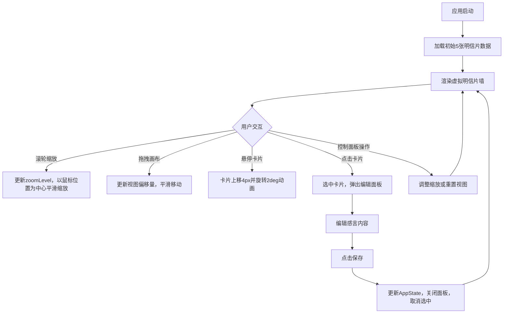

## 1. 产品概述
虚拟明信片墙浏览与收藏管理应用，为数字游民博主提供一个交互式作品集展示平台。访客可以通过拖拽平移和滚轮缩放的方式在虚拟墙壁上浏览博主多年旅行收集的明信片和手绘地图，每张卡片都包含地点、日期和个人感言。

- **核心目标**：打造沉浸式的旅行记忆展示体验，让用户能够自由探索和互动
- **目标用户**：数字游民博主及其访客、旅行爱好者
- **产品价值**：将静态的明信片收藏转化为可交互的虚拟展览，增强情感连接和浏览趣味性

## 2. 核心功能

### 2.1 用户角色
| 角色 | 注册方式 | 核心权限 |
|------|----------|----------|
| 访客 | 无需注册 | 浏览明信片墙、缩放查看、点击查看详情、阅读感言 |

### 2.2 功能模块
1. **明信片墙页面**：虚拟画布渲染、拖拽平移、滚轮缩放、卡片展示
2. **卡片组件**：单张明信片渲染、悬停动画、选中高亮、点击交互
3. **编辑面板**：明信片详情展示、感言编辑、保存功能
4. **控制面板**：缩放滑块、重置视图按钮

### 2.3 页面详情
| 页面名称 | 模块名称 | 功能描述 |
|----------|----------|----------|
| 明信片墙 | 虚拟画布 | 3000px×2000px虚拟空间，支持拖拽平移和滚轮缩放，以鼠标位置为缩放中心 |
| 明信片墙 | 卡片渲染 | 根据位置数据渲染明信片，支持旋转角度，视口外卡片跳过渲染优化性能 |
| 卡片组件 | 交互反馈 | 悬停上移4px并旋转2deg，选中缩放1.05并高亮边框 |
| 编辑面板 | 详情展示 | 模态框形式，显示大图、地点、日期和可编辑的感言文本区 |
| 编辑面板 | 保存功能 | 保存感言内容，更新应用状态，关闭面板 |
| 控制面板 | 缩放控制 | 滑块控制全局缩放0.5-2，步长0.1，平滑过渡动画 |
| 控制面板 | 重置视图 | 将视图中心恢复到(0,0)，缩放重置为1 |

## 3. 核心流程

用户打开应用 → 看到预设的5张明信片随机分布在墙上 → 鼠标滚轮缩放（以鼠标位置为中心）→ 按住左键拖拽平移视图 → 悬停卡片查看动画效果 → 点击卡片选中并弹出编辑面板 → 编辑个人感言 → 点击保存更新内容 → 关闭面板继续浏览

## 4. 用户界面设计

### 4.1 设计风格
- **整体风格**：复古旅行手帐风格，温暖怀旧的色调
- **主色调**：浅灰背景 `#F5F0EB`，米白卡片 `#FDF5E6`，深棕文字 `#3E2723`
- **点缀色**：边框棕 `#D2B48C`，选中高亮 `#8B4513`，次级文字 `#6D4C41`、`#8D6E63`
- **字体**：Georgia 衬线字体，营造复古书籍感
- **按钮风格**：圆角8px，渐变或纯色背景，点击缩放0.95动画
- **视觉层次**：通过阴影深度、卡片旋转、位置错落营造立体感

### 4.2 页面设计概述
| 页面名称 | 模块名称 | UI元素 |
|----------|----------|--------|
| 明信片墙 | 虚拟画布 | 3000×2000px浅灰背景，卡片随机分布带旋转角度，缩放0.3s平滑过渡 |
| 明信片墙 | 卡片组件 | 240×320px米白卡片，2px棕边框，12px圆角，4px阴影，200px图片区，Georgia字体文字 |
| 明信片墙 | 选中状态 | 缩放1.05，边框变`#8B4513`，阴影加深 |
| 编辑面板 | 模态框 | 半透明遮罩`#00000080`，600px宽白色面板，16px圆角，8px阴影，0.2s缩放淡入动画 |
| 编辑面板 | 表单元素 | 400px大图，地点日期只读，textarea可编辑（500字符限制），focus边框`#8B4513` |
| 编辑面板 | 按钮 | 保存按钮渐变`#8B4513`到`#A0522D`，关闭按钮`#EEE`背景 |
| 控制面板 | 固定面板 | 左上角固定，`#2C2C2CE0`半透明深色，12px圆角，16px内边距 |
| 控制面板 | 控件 | 200px滑块（轨道`#555`，滑块`#D2B48C`），重置按钮`#5C4033`背景，hover变`#8B4513` |

### 4.3 响应式
- **桌面端（>768px）**：控制面板左上角固定竖排，编辑面板600px宽居中
- **移动端（≤768px）**：控制面板变为顶部固定横条（flex行布局），缩放滑块宽度120px，编辑面板宽度90%视口宽（最小300px）
- **触摸优化**：支持触摸拖拽和双指缩放

### 4.4 动画与交互细节
- **卡片悬停**：上移4px + 旋转2deg，0.3s ease
- **缩放过渡**：所有卡片0.3s ease平滑缩放
- **面板弹出**：0.2s ease-out，从0.9倍缩放到1倍，透明度0→1
- **按钮点击**：0.1s缩放0.95后恢复
- **拖拽光标**：拖拽时cursor改为grabbing
- **性能优化**：视口外卡片跳过渲染，支持最多20张卡片流畅运行，帧率≥45fps
