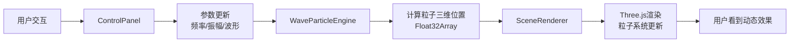

## 1. 产品概述

交互式三维声波粒子音景可视化仪，通过音频波形参数实时驱动三维粒子群形成动态图案，为用户提供沉浸式的音画联动体验。目标用户包括音乐爱好者、视觉设计师、教育工作者等，可用于音乐可视化、声波教学演示、艺术创作等场景。

## 2. 核心功能

### 2.1 功能模块
1. **主场景页面**：三维粒子可视化、视角控制、实时渲染
2. **控制面板模块**：波形选择、频率调节、振幅调节
3. **粒子引擎模块**：声波公式计算、粒子位置更新、平滑过渡

### 2.2 页面详情
| 页面名称 | 模块名称 | 功能描述 |
|-----------|-------------|---------------------|
| 主页面 | 三维粒子场景 | 2000个粒子根据声波参数实时形成动态图案，支持鼠标拖拽旋转视角、滚轮缩放 |
| 主页面 | 控制面板 | 四种波形选择按钮、频率滑块（10-440Hz）、振幅滑块（0.1-2.0），参数实时生效 |
| 主页面 | 粒子引擎 | 基于声波公式计算粒子位置，60fps更新，0.15秒平滑过渡 |

## 3. 核心流程
用户打开页面 → 看到默认正弦波形驱动的粒子动画 → 选择不同波形（正弦/方波/三角/锯齿）→ 调整频率和振幅参数 → 粒子群实时变换形态 → 拖拽鼠标旋转视角 → 滚轮缩放观察细节

## 4. 用户界面设计

### 4.1 设计风格
- **主色调**：深空蓝渐变背景（顶部#0b0b1a到底部#1a1a3a），粒子颜色从深蓝#1a237e渐变到亮青#00e5ff
- **强调色**：#4a90d9（按钮选中、滑块）
- **界面主题**：全局暗色主题，背景#0d0d1a，控制面板背景#16162a，边框#2a2a4a
- **文字颜色**：#ccc，字体大小16px
- **控件样式**：圆角12px，内边距24px，悬停高亮过渡0.2秒
- **按钮状态**：选中时背景#4a90d9文字白色，未选时背景#2a2a4a文字#aaa

### 4.2 页面设计概述
| 页面名称 | 模块名称 | UI元素 |
|-----------|-------------|-------------|
| 主页面 | 布局结构 | Flex布局，粒子场景占flex 3，控制面板占flex 1，中间1px边框分隔 |
| 主页面 | 三维场景 | 深空渐变背景，圆形粒子（3px），支持OrbitControls拖拽旋转 |
| 主页面 | 控制面板 | 波形按钮组（4个）、频率滑块、振幅滑块，CSS Module样式隔离 |

### 4.3 响应式
- 桌面端：左侧控制面板（flex 1），右侧粒子场景（flex 3）
- 移动端（<768px）：控制面板在上方，粒子场景在下方，min-height 400px

### 4.4 3D场景指导
- **环境**：深空蓝渐变背景，营造宇宙空间感
- **光照**：粒子自发光，无需额外光源
- **相机**：PerspectiveCamera，初始距离适中，支持OrbitControls拖拽旋转、缩放
- **粒子系统**：THREE.Points + BufferGeometry，使用Float32Array存储位置数据
- **动画**：60fps更新，粒子位置使用lerp平滑过渡（0.15秒）
- **性能**：粒子位置更新<0.1ms，保持60fps稳定帧率

## 5. 性能指标
- 帧率：稳定60fps
- 粒子位置计算时间：<0.1ms
- 参数变化过渡时间：0.15秒
- 粒子数量：2000个
