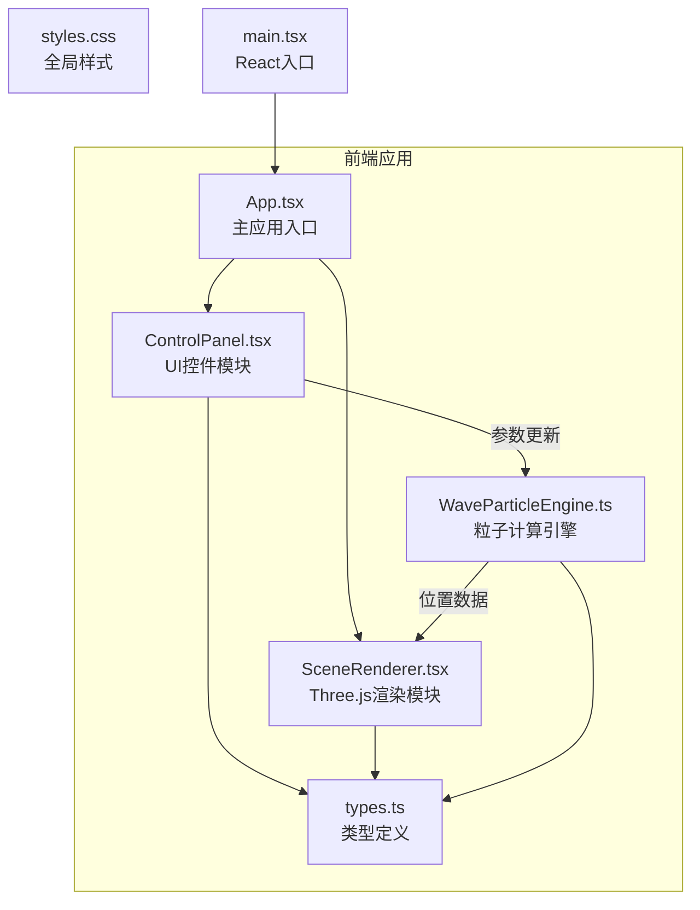

## 1. 架构设计



## 2. 技术描述

- **前端框架**：React@18 + TypeScript@5 + Vite@5
- **3D渲染**：Three.js + @react-three/fiber@8 + @react-three/drei@9
- **构建工具**：Vite
- **状态管理**：React useState/useRef 本地状态
- **样式方案**：CSS Modules + 全局CSS
- **性能优化**：BufferGeometry + Float32Array + requestAnimationFrame

## 3. 目录结构
```
auto302/
├── package.json
├── vite.config.js
├── tsconfig.json
├── index.html
├── src/
│   ├── main.tsx
│   ├── types.ts
│   ├── WaveParticleEngine.ts
│   ├── SceneRenderer.tsx
│   ├── ControlPanel.tsx
│   ├── ControlPanel.module.css
│   ├── styles.css
```

## 4. 模块职责

### 4.1 types.ts
- `WaveType` 枚举：sine, square, triangle, sawtooth
- `ParticleConfig` 接口：frequency, amplitude, waveType
- `Particle` 类：x, y, z 位置，color，size

### 4.2 WaveParticleEngine.ts
- 独立的粒子计算引擎
- 接收波形参数，计算2000个粒子的三维位置
- 使用声波公式：
  - 正弦：sin(x)
  - 方波：sign(sin(x))
  - 三角：asin(sin(x))
  - 锯齿：2*asin(sin(x))/pi
- 输出 Float32Array 格式的位置数据
- 支持lerp平滑过渡（0.15秒）
- 60fps更新频率

### 4.3 SceneRenderer.tsx
- 使用 @react-three/fiber 的 Canvas 组件
- 创建 Three.js 场景、相机、粒子系统（Points + BufferGeometry
- 使用 @react-three/drei 的 OrbitControls 处理相机拖拽旋转和缩放
- 接收 WaveParticleEngine 计算的位置数据更新粒子几何体
- 深空蓝渐变背景
- 粒子颜色根据高度从深蓝到亮青渐变

### 4.4 ControlPanel.tsx
- 波形选择按钮组（4个）
- 频率滑块（10-440Hz，步长1
- 振幅滑块（0.1-2.0，步长0.1
- 使用 CSS Module 控制样式
- 通过回调将参数传给 WaveParticleEngine

### 4.5 styles.css
- 全局暗色主题
- Flex 布局，桌面端左右分栏
- 响应式断点 768px
- 粒子场景 min-height 400px

## 5. 数据流向
ControlPanel → WaveParticleEngine → SceneRenderer

## 6. 性能优化策略
- 使用 BufferGeometry + Float32Array 直接操作 GPU 缓冲区
- 粒子位置计算在 Web Worker 或 requestAnimationFrame 中进行
- 使用 lerp 线性插值实现平滑过渡
- 避免不必要的重渲染
- 粒子材质使用 PointsMaterial，sizeAttenuation 优化
