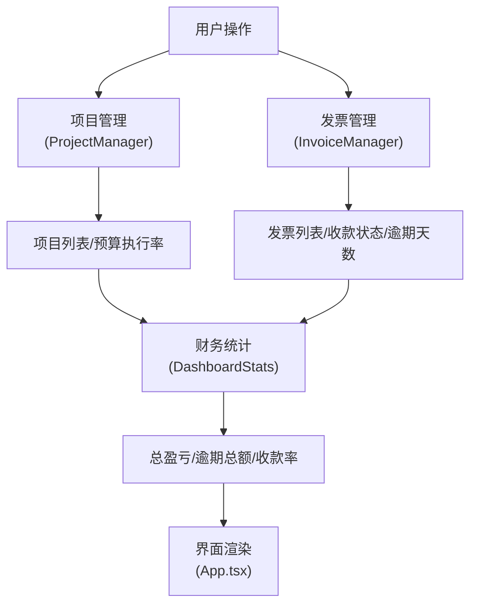

## 1. 产品概述

面向自由职业者团队的项目发票管理与财务追踪应用，解决零散表格难以跟踪项目盈亏和客户付款逾期的痛点。通过统一平台管理客户项目、发票生命周期、收款状态，提供实时财务仪表盘和预算超支预警，帮助团队掌控现金流和项目盈利能力。

## 2. 核心功能

### 2.1 用户角色

| 角色 | 注册方式 | 核心权限 |
|------|----------|----------|
| 自由职业者/团队成员 | 无需注册（本地应用） | 完整的项目、发票管理权限，查看财务仪表盘 |

### 2.2 功能模块

1. **项目管理模块**：客户项目创建、编辑、卡片展示、预算进度可视化
2. **发票管理模块**：发票生成、状态流转、逾期计算、表格展示
3. **财务仪表盘模块**：多维度图表展示、收款趋势、状态占比、预算执行率
4. **搜索筛选模块**：项目/客户搜索、发票状态筛选、分页浏览

### 2.3 页面详情

| 页面名称 | 模块名称 | 功能描述 |
|----------|----------|----------|
| 主应用页面 | 顶部导航栏 | 搜索框（0.3秒防抖）、状态筛选下拉框、逾期预警徽章 |
| 主应用页面 | 项目卡片区域 | 两列响应式网格、卡片悬浮动效、展开编辑详情、预算进度条（三色规则） |
| 主应用页面 | 发票表格区域 | 发票列表、状态切换按钮、逾期天数红色显示、分页（>100条时启用）、脉冲动画预警 |
| 主应用页面 | 仪表盘区域 | 折线图（近6个月收款趋势）、饼图（收款状态占比）、柱状图（项目预算执行率） |

## 3. 核心流程

用户进入应用后，可在顶部搜索栏输入项目名或客户名进行实时筛选，或通过下拉框筛选发票状态。在项目区域点击"添加项目"按钮创建新项目，填写项目名称、客户名称、预算金额和开始日期。项目卡片实时显示预算执行进度，点击卡片可展开编辑详情。为项目创建发票时，系统自动生成发票号，用户填写金额、开票日期和收款截止日期。发票状态可在已开票/部分收款/已结清间循环切换。系统自动计算逾期天数，对逾期发票显示红色感叹号脉冲动画，并在右上角显示逾期总数徽章。仪表盘实时统计总盈亏、逾期总额、收款率等指标，通过三种图表直观展示财务状况。

## 4. 用户界面设计

### 4.1 设计风格

- **主色调**：深色主题，背景#121212，卡片#1E1E1E，主文字#E0E0E0，次要文字#9E9E9E
- **强调色**：蓝色#2196F3（已开票/线条）、绿色#4CAF50（已结清/低于80%进度）、橙色#FF9800（部分收款/80%-100%进度）、红色#F44336（超支/逾期）
- **按钮风格**：圆角8px，悬浮有白色40%透明度波纹效果（0.6秒）
- **字体**：系统默认无衬线字体，标题16px-600，正文14px-400，辅助文字12px-400
- **布局风格**：卡片式布局，顶部搜索筛选栏，中部项目卡片+发票表格，底部仪表盘三图并列
- **图标风格**：使用lucide-react线性图标，与深色主题协调

### 4.2 页面设计概述

| 页面名称 | 模块名称 | UI元素 |
|----------|----------|--------|
| 主应用页面 | 顶部导航栏 | 搜索框（实时筛选，0.3s防抖）、状态下拉选择器、逾期红色徽章、"添加项目"按钮 |
| 主应用页面 | 项目卡片 | 圆角8px，悬浮阴影加深+上移2px（0.2s过渡），预算进度条（三色规则），展开/收起动画（0.3s淡入淡出） |
| 主应用页面 | 发票表格 | 行背景交替#1E1E1E/#2A2A2A，悬浮#333333，状态标签（三色），逾期红色感叹号脉冲动画（1s循环），状态按钮波纹效果 |
| 主应用页面 | 仪表盘 | 三图flex等宽布局，图表下方标题+简要分析文字（如月平均收款额），0.5秒内完成渲染 |

### 4.3 响应式

- 桌面端（>=1200px）：项目卡片两列网格布局
- 平板端（768px-1199px）：项目卡片单列布局
- 移动端（<768px）：整体流式布局，图表单列堆叠
- 触摸优化：按钮最小高度44px，足够点击区域

### 4.4 性能优化

- 发票列表>100条时自动分页，每页10条
- 搜索筛选响应时间<=100ms（使用memo优化）
- 图表渲染<=500ms（recharts原生优化）
- 使用React.memo避免不必要重渲染
