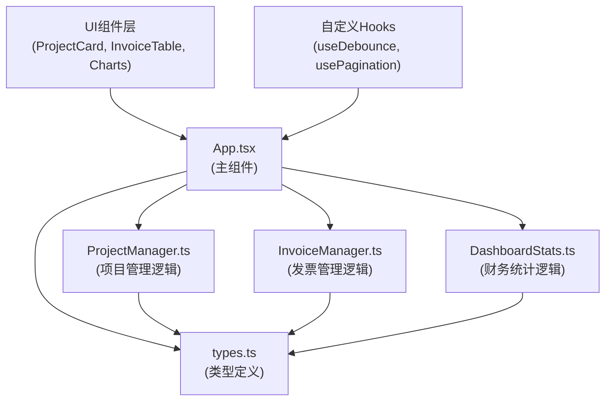
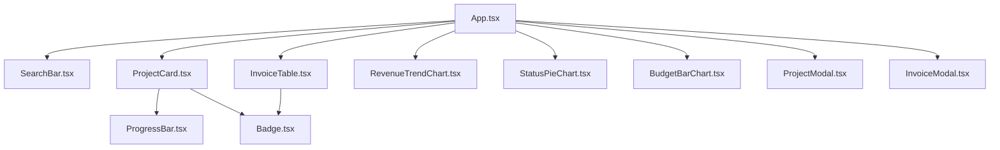

## 1. 架构设计



**数据流向说明**：
1. `types.ts` 作为基础模块，被所有其他模块引用
2. `ProjectManager.ts` 管理项目状态，输出项目列表和预算执行率
3. `InvoiceManager.ts` 管理发票状态，输出发票列表、收款状态和逾期天数
4. `DashboardStats.ts` 接收项目和发票数据，计算总盈亏、逾期总额、收款率等指标
5. `App.tsx` 作为调度中心，整合各模块数据并传递给UI组件渲染
6. 用户操作 → App.tsx → 各Manager → DashboardStats → 状态更新 → 重新渲染

## 2. 技术描述

- **前端框架**：React@18 + TypeScript
- **构建工具**：Vite@5 + @vitejs/plugin-react
- **图表库**：Recharts@2
- **状态管理**：React useState + useReducer (组件内管理，无额外状态库)
- **图标库**：lucide-react
- **初始化方式**：vite-init react-ts 模板

## 3. 目录结构

```
d:\Pro\tasks\auto304\
├── index.html                          # 入口页面（标题：财务中心）
├── package.json                        # 依赖配置
├── vite.config.js                      # Vite配置（路径别名@）
├── tsconfig.json                       # TypeScript配置
└── src/
    ├── types.ts                        # 类型定义（客户、项目、发票、财务统计）
    ├── ProjectManager.ts               # 项目管理逻辑类
    ├── InvoiceManager.ts               # 发票管理逻辑类
    ├── DashboardStats.ts               # 财务统计逻辑类
    ├── App.tsx                         # 主组件
    ├── main.tsx                        # React入口
    ├── index.css                       # 全局样式
    ├── components/
    │   ├── ProjectCard.tsx             # 项目卡片组件
    │   ├── ProjectModal.tsx            # 项目添加/编辑弹窗
    │   ├── InvoiceTable.tsx            # 发票表格组件
    │   ├── InvoiceModal.tsx            # 发票创建弹窗
    │   ├── SearchBar.tsx               # 搜索筛选栏组件
    │   ├── Dashboard/
    │   │   ├── RevenueTrendChart.tsx   # 收款趋势折线图
    │   │   ├── StatusPieChart.tsx      # 收款状态饼图
    │   │   └── BudgetBarChart.tsx      # 预算执行率柱状图
    │   └── common/
    │       ├── Badge.tsx               # 状态标签组件
    │       └── ProgressBar.tsx         # 进度条组件
    └── hooks/
        ├── useDebounce.ts              # 防抖Hook
        └── usePagination.ts            # 分页Hook
```

## 4. 核心模块说明

### 4.1 types.ts - 类型定义

```typescript
// 客户类型
interface Customer {
  id: string;
  name: string;
  email?: string;
  phone?: string;
}

// 项目类型
interface Project {
  id: string;
  name: string;
  customerId: string;
  customerName: string;
  budget: number;
  startDate: string;
  spent: number;
  createdAt: string;
}

// 发票状态枚举
type InvoiceStatus = 'invoiced' | 'partial' | 'paid';

// 发票类型
interface Invoice {
  id: string;
  invoiceNumber: string;
  projectId: string;
  amount: number;
  invoiceDate: string;
  dueDate: string;
  status: InvoiceStatus;
  paidAmount: number;
  createdAt: string;
}

// 财务统计类型
interface DashboardStatsData {
  totalRevenue: number;
  totalProfit: number;
  overdueAmount: number;
  overdueCount: number;
  collectionRate: number;
  monthlyRevenue: MonthlyRevenue[];
  statusDistribution: StatusDistribution[];
  projectBudgetRates: ProjectBudgetRate[];
}
```

### 4.2 ProjectManager.ts

```typescript
class ProjectManager {
  projects: Project[];
  
  addProject(data: Omit<Project, 'id' | 'spent' | 'createdAt'>): Project;
  updateProject(id: string, data: Partial<Project>): Project | null;
  deleteProject(id: string): boolean;
  getProjects(): Project[];
  getProjectById(id: string): Project | null;
  getBudgetExecutionRate(projectId: string): number;  // 已花费/预算 * 100
  getTotalSpentByProject(projectId: string): number;  // 从发票计算已花费
  searchProjects(keyword: string): Project[];
}
```

### 4.3 InvoiceManager.ts

```typescript
class InvoiceManager {
  invoices: Invoice[];
  
  createInvoice(data: Omit<Invoice, 'id' | 'invoiceNumber' | 'status' | 'paidAmount' | 'createdAt'>): Invoice;
  updateInvoiceStatus(id: string, status: InvoiceStatus, paidAmount?: number): Invoice | null;
  getInvoices(): Invoice[];
  getInvoicesByProject(projectId: string): Invoice[];
  getInvoicesByStatus(status: InvoiceStatus | 'all'): Invoice[];
  getOverdueDays(invoice: Invoice): number;  // 当前日期 - 截止日期
  isOverdue(invoice: Invoice): boolean;
  getNextInvoiceNumber(): string;  // 自动生成 INV-YYYY-XXXX
  generateInvoiceNumber(): string;
}
```

### 4.4 DashboardStats.ts

```typescript
class DashboardStats {
  static calculateStats(projects: Project[], invoices: Invoice[]): DashboardStatsData;
  static getTotalRevenue(invoices: Invoice[]): number;
  static getTotalProfit(projects: Project[], invoices: Invoice[]): number;
  static getOverdueAmount(invoices: Invoice[]): number;
  static getOverdueCount(invoices: Invoice[]): number;
  static getCollectionRate(invoices: Invoice[]): number;
  static getMonthlyRevenue(invoices: Invoice[], months: number): MonthlyRevenue[];
  static getStatusDistribution(invoices: Invoice[]): StatusDistribution[];
  static getProjectBudgetRates(projects: Project[], invoices: Invoice[]): ProjectBudgetRate[];
}
```

### 4.5 组件调用关系



## 5. 性能约束实现方案

### 5.1 搜索防抖
- 使用 `useDebounce` Hook 实现0.3秒防抖
- 使用 `useMemo` 缓存筛选结果，避免重复计算

### 5.2 发票分页
- 发票列表 > 100 条时自动启用分页
- 每页10条，使用 `usePagination` Hook 管理分页状态
- 页码切换无刷新，平滑过渡

### 5.3 渲染优化
- 列表项使用 `React.memo` 包装
- 使用 `useCallback` 缓存事件处理函数
- 图表组件单独拆分，避免父组件重渲染影响

### 5.4 动画性能
- 所有过渡动画使用 CSS transform 和 opacity
- 避免在动画中触发 layout 重排
- 脉冲动画使用 CSS @keyframes

## 6. Mock 数据

为便于演示，应用初始化时将生成以下 Mock 数据：
- 5个客户项目（含不同预算执行阶段）
- 15张发票（覆盖三种状态，包含2-3张逾期发票）
- 近6个月的收款数据（用于折线图展示）

数据初始化逻辑在 `App.tsx` 的 `useEffect` 中执行，仅在应用首次加载时生成。
