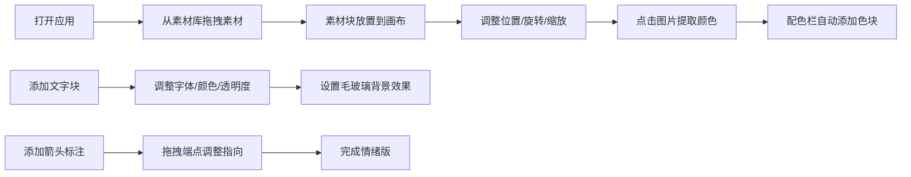

## 1. 产品概述

灵感情绪版（Mood Board）应用是一款面向设计师的创意工具，帮助用户在前期创意阶段快速整合零散的图片、文字摘录和颜色样本，生成可交互的灵感画布。解决设计师难以将多样化素材统一管理和可视化呈现的痛点。

- 目标用户：平面设计师、UI/UX设计师、创意总监等创意工作者
- 核心价值：提升创意探索效率，快速将灵感转化为可视化的情绪版

## 2. 核心功能

### 2.1 功能模块

1. **灵感素材库**：侧边栏素材展示、拖拽到画布、素材卡片交互
2. **画布编辑器**：素材块移动/旋转/缩放、滚轮缩放、全局视图
3. **颜色提取系统**：图片区域取色、主色调分析、配色栏管理
4. **文字标注系统**：文字样式调整、毛玻璃背景、排版控制
5. **箭头标注系统**：直线箭头绘制、端点拖拽、标注删除

### 2.2 页面详情

| 页面名称 | 模块名称 | 功能描述 |
|-----------|-------------|---------------------|
| 主编辑页 | 顶部配色栏 | 显示提取的颜色色块，点击复制十六进制码，最多8个，带动画效果 |
| 主编辑页 | 左侧素材库 | 280px宽侧边栏，120x120px素材卡片，圆角6px带阴影，悬停放大1.05倍 |
| 主编辑页 | 中央画布区 | 支持素材块拖拽、旋转（15度步进）、缩放，滚轮缩放（0.2x-3.0x），0.5秒平滑过渡 |
| 主编辑页 | 属性控制面板 | 选中文字块时显示字体、字号、颜色、透明度调整控件 |
| 主编辑页 | 可拖拽分隔条 | 4px宽分隔条，悬停变紫色，支持调整素材库宽度 |

## 3. 核心流程

用户从素材库拖拽图片或文字到画布 → 调整元素位置和角度 → 点击图片区域提取颜色到配色栏 → 添加文字说明和箭头标注 → 完成概念情绪版制作。

## 4. 用户界面设计

### 4.1 设计风格

- **主题色调**：暗色主题
  - 主背景：#1a1a2e
  - 次级背景：#16213e
  - 素材库背景：#2a2a3e
  - 配色栏背景：#1e1e2e
  - 强调色：#6c63ff（紫色）
  - 警示色：#ff6b6b（红色，用于箭头）
  - 文本色：#e0e0e0

- **按钮/控件样式**：
  - 圆角设计，统一使用6px圆角
  - 按钮点击有涟漪效果（半径扩展200%，0.4秒动画）
  - 选中元素显示8px白色圆形缩放手柄（四角）
  - 文字块选中时边框高亮：2px #6c63ff

- **字体选择**：
  - 展示字体：Playfair Display（优雅衬线）
  - 正文字体：Space Mono（等宽现代感）
  - 辅助字体：Cormorant Garamond（经典衬线）

- **动画规范**：
  - 统一使用0.3秒ease-out缓动
  - 色块插入动画：0.3秒滑动
  - 画布缩放：0.5秒平滑过渡
  - 悬停效果：素材卡放大1.05倍

### 4.2 页面设计概述

| 页面名称 | 模块名称 | UI元素 |
|-----------|-------------|-------------|
| 主编辑页 | 顶部配色栏 | 60px高度，30x30px圆角色块，滑动插入动画 |
| 主编辑页 | 左侧素材库 | 280px宽度，网格布局，卡片悬停放大，显示名称标签 |
| 主编辑页 | 中央画布 | 无限画布，网格背景，元素选中四角手柄 |
| 主编辑页 | 环形旋转控件 | 拖拽旋转，15度步进吸附 |
| 主编辑页 | 毛玻璃面板 | 背景#1e1e2e，透明度0.85，模糊20px，白色文本 |

### 4.3 响应式

- 桌面端优先设计，针对大屏优化
- 画布区域自适应剩余空间
- 素材库可通过分隔条调整宽度（最小200px，最大500px）
- 触控设备支持双指缩放和拖拽

### 4.4 性能要求

- 30个素材块 + 10个色块 + 5个标注同时显示时，帧率维持50fps以上
- 使用requestAnimationFrame优化动画
- 离屏元素减少重绘
- 拖拽操作使用CSS transform而非top/left
