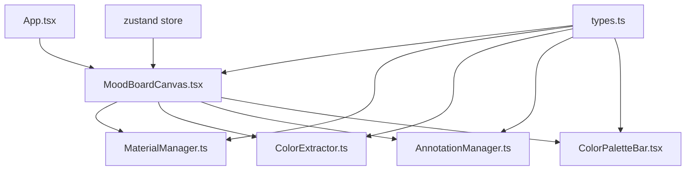

## 1. 架构设计



采用分层架构：
- **视图层**：React组件负责渲染（MoodBoardCanvas, ColorPaletteBar）
- **逻辑层**：独立管理器类处理业务逻辑（MaterialManager, ColorExtractor, AnnotationManager）
- **状态层**：Zustand管理全局应用状态
- **类型层**：集中定义所有接口类型

## 2. 技术描述

- **前端**：React@18 + TypeScript@5 + Vite@5
- **状态管理**：Zustand（轻量高性能）
- **样式方案**：CSS Modules + CSS Variables（避免Tailwind依赖，满足自定义UI细节）
- **初始化工具**：Vite + react-ts模板
- **后端**：无（纯前端应用）
- **数据库**：LocalStorage（可选，用于草稿保存）

## 3. 项目文件结构

```
d:\Pro\tasks\auto305\
├── package.json
├── vite.config.js
├── tsconfig.json
├── index.html
└── src/
    ├── types.ts                          # 类型定义
    ├── store/
    │   └── useMoodBoardStore.ts          # Zustand状态管理
    ├── moodboard/
    │   ├── MoodBoardCanvas.tsx           # 画布核心组件
    │   ├── ColorPaletteBar.tsx           # 顶部配色栏
    │   ├── MaterialManager.ts            # 素材拖拽与管理
    │   ├── ColorExtractor.ts             # 颜色提取算法
    │   ├── AnnotationManager.ts          # 箭头标注管理
    │   ├── MaterialItem.tsx              # 素材块组件
    │   ├── TextBlock.tsx                 # 文字块组件
    │   ├── ArrowAnnotation.tsx           # 箭头标注组件
    │   └── RotationControl.tsx           # 环形旋转控件
    ├── hooks/
    │   ├── useDrag.ts                    # 拖拽hook
    │   ├── useWheelZoom.ts               # 滚轮缩放hook
    │   └── useRipple.ts                  # 涟漪效果hook
    ├── utils/
    │   ├── colorUtils.ts                 # 颜色转换工具
    │   └── mathUtils.ts                  # 数学计算工具
    ├── App.tsx
    ├── main.tsx
    └── index.css
```

## 4. 路由定义

| Route | Purpose |
|-------|---------|
| / | 主编辑页面（单页应用） |

## 5. 数据模型

### 5.1 类型定义（types.ts）

```typescript
export interface MaterialItem {
  id: string;
  type: 'image' | 'text';
  name: string;
  thumbnail?: string;
  content?: string;
}

export interface CanvasBlock {
  id: string;
  type: 'image' | 'text';
  x: number;
  y: number;
  width: number;
  height: number;
  rotation: number;
  scale: number;
  zIndex: number;
  content: string;
  textStyle?: TextStyle;
}

export interface TextStyle {
  fontFamily: string;
  fontSize: number;
  color: string;
  opacity: number;
  backgroundType: 'solid' | 'glass';
  backgroundColor: string;
}

export interface ColorSwatch {
  id: string;
  hex: string;
  sourceBlockId?: string;
}

export interface ArrowAnnotation {
  id: string;
  startX: number;
  startY: number;
  endX: number;
  endY: number;
  color: string;
  lineWidth: number;
  zIndex: number;
}

export interface CanvasState {
  blocks: CanvasBlock[];
  colorSwatches: ColorSwatch[];
  annotations: ArrowAnnotation[];
  selectedId: string | null;
  zoom: number;
  panX: number;
  panY: number;
}
```

## 6. 核心模块技术要点

### 6.1 颜色提取（ColorExtractor.ts）

使用Canvas API的getImageData获取像素数据，采用k-means聚类算法提取主色调：

```typescript
export class ColorExtractor {
  static extractFromImage(
    imageElement: HTMLImageElement,
    x: number,
    y: number,
    areaSize: number = 50
  ): string;
  
  private static rgbToHex(r: number, g: number, b: number): string;
  private static kMeansCluster(colors: number[][], k: number): number[];
}
```

### 6.2 素材管理（MaterialManager.ts）

处理HTML5 Drag and Drop API，管理素材库数据和拖拽状态：

```typescript
export class MaterialManager {
  materials: MaterialItem[];
  
  loadDefaultMaterials(): void;
  handleDragStart(e: React.DragEvent, item: MaterialItem): void;
  handleDrop(e: React.DragEvent, canvasX: number, canvasY: number): CanvasBlock;
}
```

### 6.3 标注管理（AnnotationManager.ts）

管理箭头标注的创建、拖拽端点和删除逻辑：

```typescript
export class AnnotationManager {
  createAnnotation(startX: number, startY: number): ArrowAnnotation;
  updateEndpoint(
    annotation: ArrowAnnotation,
    point: 'start' | 'end',
    x: number,
    y: number
  ): ArrowAnnotation;
}
```

### 6.4 性能优化策略

1. **GPU加速**：所有元素使用transform: translate3d()触发硬件加速
2. **will-change**：对正在拖拽的元素设置will-change: transform
3. **requestAnimationFrame**：所有动画和更新通过rAF调度
4. **事件节流**：滚轮事件使用passive: true和节流处理
5. **CSS containment**：对独立组件设置contain: layout style paint
6. **避免布局抖动**：批量读取DOM样式，批量写入修改
