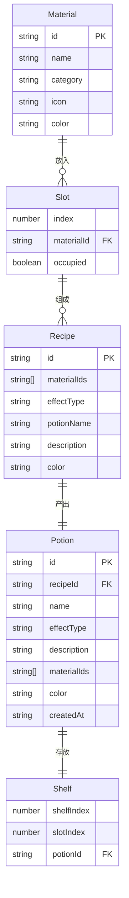

## 1. 架构设计

```mermaid
flowchart TD
    "Frontend (React + Three.js)" --> "UIPanel"
    "Frontend (React + Three.js)" --> "WorkshopScene"
    "Frontend (React + Three.js)" --> "App (全局状态)"
    "UIPanel" --> "材料库网格"
    "UIPanel" --> "效果描述卡片"
    "UIPanel" --> "详情弹窗"
    "WorkshopScene" --> "实验台 + 槽位"
    "WorkshopScene" --> "展示架 + 药水瓶"
    "WorkshopScene" --> "粒子特效"
    "App" --> "RecipeEngine (配方引擎)"
    "App" --> "Zustand Store (状态管理)"
```

## 2. 技术说明

- 前端：React@18 + TypeScript + Vite + Three.js + @react-three/fiber + @react-three/drei
- 初始化工具：vite-init (react-ts 模板)
- 后端：无
- 数据库：无（配方数据内置，药水数据存储在内存/Zustand中）

## 3. 路由定义

| 路由 | 用途 |
|------|------|
| / | 工坊主页（唯一页面） |

## 4. 数据模型

### 4.1 数据模型定义



### 4.2 配方引擎逻辑

RecipeEngine 是独立模块，接收材料ID数组，返回药水类型/颜色/描述：

- 材料分类：草药(herb)、矿物(mineral)、药剂基底(base)
- 效果类型：恢复(healing)、强化(buff)、毒药(poison)、爆炸(explosion)
- 组合规则：根据材料类别组合预定义映射表计算结果
- 无效组合返回 null

### 4.3 预定义材料清单

| 材料ID | 名称 | 类别 | 颜色 |
|--------|------|------|------|
| herb_mint | 薄荷叶 | 草药 | #66bb6a |
| herb_lavender | 薰衣草 | 草药 | #ab47bc |
| herb_chamomile | 洋甘菊 | 草药 | #fdd835 |
| mineral_quartz | 石英 | 矿物 | #e0e0e0 |
| mineral_ruby | 红宝石 | 矿物 | #e53935 |
| mineral_sapphire | 蓝宝石 | 矿物 | #1e88e5 |
| base_water | 纯净水 | 药剂基底 | #4fc3f7 |
| base_oil | 精炼油 | 药剂基底 | #ff8f00 |
| base_alcohol | 酒精 | 药剂基底 | #b0bec5 |

### 4.4 预定义配方映射表

| 材料组合 | 效果类型 | 药水名称 | 颜色 | 描述 |
|----------|----------|----------|------|------|
| 薄荷叶 + 纯净水 | 恢复 | 生命之泉 | #4caf50 | 恢复少量生命值的清新药水 |
| 薰衣草 + 纯净水 | 恢复 | 宁静之露 | #9c27b0 | 安抚心灵的紫色甘露 |
| 薄荷叶 + 红宝石 + 纯净水 | 强化 | 勇者之息 | #ff5722 | 短暂提升力量的烈焰药水 |
| 石英 + 蓝宝石 + 精炼油 | 强化 | 铁壁之护 | #1565c0 | 增强防御的蓝色药膏 |
| 洋甘菊 + 精炼油 | 强化 | 敏捷之风 | #ffc107 | 提升速度的金色药水 |
| 薰衣草 + 红宝石 + 酒精 | 毒药 | 暗影之吻 | #6a1b9a | 致命的紫色毒剂 |
| 洋甘菊 + 石英 + 酒精 | 毒药 | 迷雾之息 | #455a64 | 令人昏睡的灰色烟雾 |
| 红宝石 + 蓝宝石 + 精炼油 | 爆炸 | 烈焰之瓶 | #d50000 | 高温爆炸的红色炸弹 |
| 石英 + 纯净水 + 酒精 | 爆炸 | 雷霆之瓶 | #00bcd4 | 释放电弧的蓝色炸弹 |
