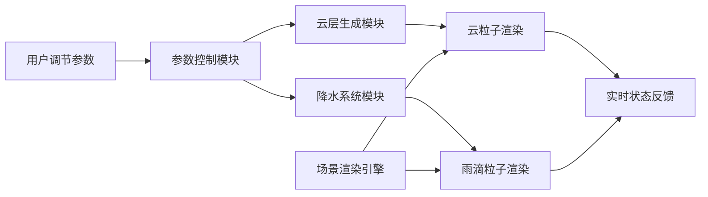

## 1. 产品概述
交互式三维动态云层生成与降水模拟应用，用于气象研究场景，通过调节核心气象参数直观观察云层生命周期。
- 目标用户：气象学家、气候研究人员
- 核心价值：将抽象的气象监测数据转化为可视化的三维动态模型，帮助研究云层形态与降水过程的关联

## 2. 核心功能

### 2.1 功能模块
1. **三维云层生成模块**：由粒子堆叠而成的云朵，支持形态、颜色、体积的参数化控制
2. **降水粒子系统**：雨滴粒子的发射、下落、生命周期管理
3. **参数控制面板**：湿度、温度、上升气流强度三个核心参数的实时调节
4. **场景交互系统**：视角旋转、缩放，场景环境渲染

### 2.2 页面详情
| 页面名称 | 模块名称 | 功能描述 |
|-----------|-------------|---------------------|
| 主场景页 | 三维场景渲染 | 全屏展示云层、地面、树木、天空等完整三维环境 |
| 主场景页 | 参数控制面板 | 右下角浮动面板，包含参数滑条、状态显示、预设按钮 |
| 主场景页 | 云层生成系统 | 根据参数实时生成并更新云粒子阵列 |
| 主场景页 | 降水模拟系统 | 根据气象条件触发雨滴粒子发射与下落 |

## 3. 核心流程
用户通过控制面板调节湿度、温度、上升气流强度参数 → 参数实时传递给云层生成模块 → 云粒子数量、颜色、分布形态在0.5秒内平滑过渡 → 当湿度>60%且温度<20°C时触发降水 → 雨滴从云底发射并在重力作用下落至地面 → 状态文本和降水概率实时更新。

## 4. 用户界面设计

### 4.1 设计风格
- **主色调**：深蓝 `#1a1a2e`
- **强调色**：橙色 `#ff7043`
- **文字颜色**：白色 `#ffffff`、浅灰 `#b0bec5`
- **视觉风格**：扁平化科技感，简洁现代
- **圆角**：统一使用12px圆角
- **字体**：系统无衬线字体
- **动画**：所有交互元素0.3秒ease-out过渡

### 4.2 页面设计概述
| 页面名称 | 模块名称 | UI元素 |
|-----------|-------------|-------------|
| 主场景页 | 三维场景 | 圆形草地、20棵随机树木、渐变天空、50颗星星、太阳光 |
| 主场景页 | 参数面板 | 半透明深色背景 `rgba(30,30,60,0.8)`，圆角12px，内边距20px |
| 主场景页 | 滑条组件 | 宽200px，轨道高4px，渐变 `#1a237e` → `#ff7043`，圆形滑块半径10px |
| 主场景页 | 按钮组件 | 重置按钮 `#5c6bc0` → `#3f51b5`，预设按钮 `#26a69a` |

### 4.3 响应式
- 桌面端：参数面板位于右下角，宽280px
- 移动端（<768px）：面板宽度300px，底部居中显示，滑条自适应宽度
- 触摸优化：滑条和按钮增加触摸热区

### 4.4 3D场景指引
- **环境**：渐变天空背景（顶部浅蓝 `#87ceeb` → 底部浅灰 `#dcdcdc`）
- **光照**：右上角方向光模拟太阳，开启柔和阴影
- **相机**：OrbitControls控制，阻尼系数0.1，缩放范围2-30
- **云层**：800个半透明球体粒子堆叠，颜色从白色到灰色渐变
- **雨滴**：细长圆柱体，重力加速度9.8单位/秒²
- **地面**：圆形草地半径20，颜色 `#4caf50`
- **树木**：20棵简易树模型（三个叠加圆柱体构成树冠）
