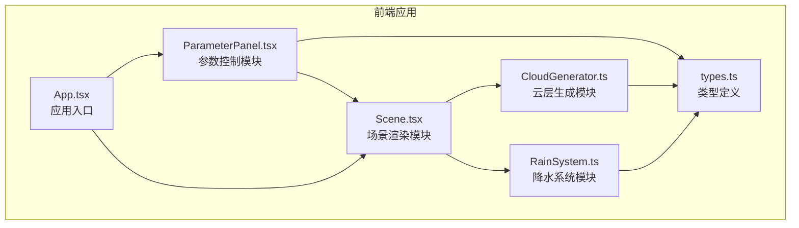

## 1. 架构设计



**数据流向**：
1. ParameterPanel → CloudParams → CloudGenerator → CloudParticle[] → Scene
2. CloudGenerator → CloudBounds → RainSystem → RainDrop[] → Scene
3. Scene → 动画帧驱动 → CloudGenerator.update() / RainSystem.update()

## 2. 技术描述
- **前端框架**：React@18 + TypeScript
- **构建工具**：Vite@5 + @vitejs/plugin-react
- **3D渲染**：Three.js + @react-three/fiber + @react-three/drei
- **状态管理**：React useState/useRef（轻量级场景，无需额外状态库）
- **项目初始化**：使用 `react-ts` 模板

## 3. 目录结构
```
src/
├── types.ts              # 类型定义：CloudParams, CloudParticle, RainDrop
├── CloudGenerator.ts     # 云层生成模块（非React类）
├── RainSystem.ts         # 降水系统模块（非React类）
├── components/
│   ├── ParameterPanel.tsx  # 参数控制面板组件
│   └── Scene.tsx           # Three.js场景组件
├── App.tsx               # 应用根组件
├── main.tsx              # 入口文件
└── index.css             # 全局样式
```

## 4. 核心模块说明

### 4.1 CloudGenerator.ts（云层生成模块）
- **职责**：根据CloudParams生成云粒子位置、大小、颜色
- **核心方法**：
  - `constructor(params: CloudParams)` - 初始化
  - `updateParams(params: CloudParams, deltaTime: number)` - 参数平滑过渡
  - `update(deltaTime: number)` - 每帧更新粒子位置
  - `getParticles(): CloudParticle[]` - 获取渲染数据
  - `getCloudBounds(): {minY: number, maxY: number, center: Vector3}` - 获取云区域

### 4.2 RainSystem.ts（降水系统模块）
- **职责**：管理雨滴粒子的发射、运动、生命周期
- **核心方法**：
  - `constructor()` - 初始化
  - `setCloudBounds(bounds)` - 设置云区域
  - `setParams(params: CloudParams)` - 更新气象参数
  - `update(deltaTime: number)` - 每帧更新雨滴
  - `getRainDrops(): RainDrop[]` - 获取渲染数据
  - `getRainProbability(): number` - 计算降水概率
  - `getStatus(): 'generating' | 'active' | 'raining'` - 获取状态

### 4.3 参数计算规则
- **粒子数量**：`400 + (humidity - 30) * (1200 - 400) / (90 - 30)`
- **颜色插值**：使用HSL色彩空间，温度从-10°C（纯白）到30°C（深灰）
- **Y轴分布范围**：`2 + (updraft - 1) * (8 - 2) / (10 - 1)`
- **雨滴发射率**：`Math.min(50, (humidity - 0.6) * 10 * (1 - temperature / 30))`
- **降水条件**：`humidity > 60% && temperature < 20°C`
- **停止条件**：`humidity < 50% || temperature > 25°C`

## 5. 性能约束
- 总粒子数（云+雨）≤ 1500
- 帧率 ≥ 30FPS
- 参数更新延迟 ≤ 200ms
- 使用InstancedMesh优化大量粒子渲染
