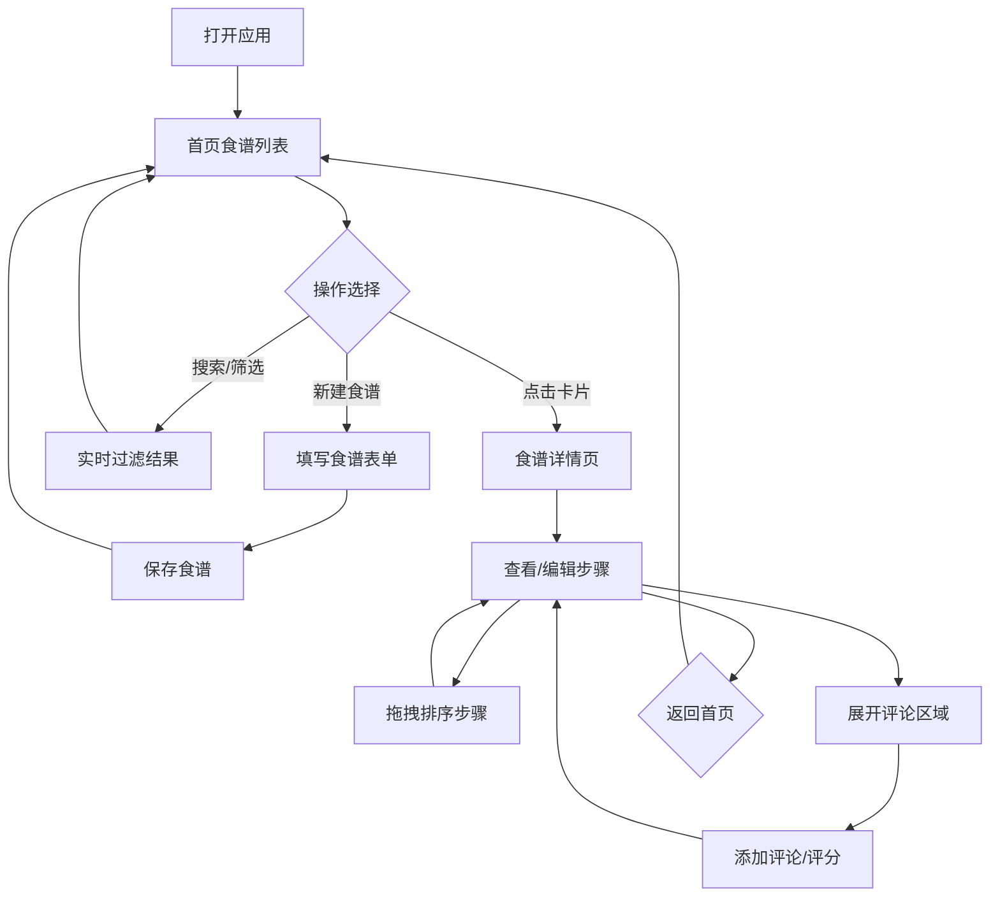

## 1. 产品概述

在线食谱分享与烹饪步骤协作编辑应用，让用户能够创建、保存和分享自己的食谱，并支持其他用户对食谱的每个步骤添加评论、修改建议和评分。
- 目标用户：烹饪爱好者、家庭厨师、美食博主
- 核心价值：提供结构化的食谱管理体验，支持步骤级别的社区协作与反馈

## 2. 核心功能

### 2.1 用户角色

| 角色 | 注册方式 | 核心权限 |
|------|----------|----------|
| 普通用户 | 无需注册（本地应用） | 创建/编辑食谱、添加评论和评分 |

### 2.2 功能模块

1. **首页**：食谱搜索与筛选、食谱卡片网格展示、新建食谱入口
2. **食谱详情页**：步骤列表展示与编辑、拖拽排序、评论与评分

### 2.3 页面详情

| 页面名称 | 模块名称 | 功能描述 |
|----------|----------|----------|
| 首页 | 搜索栏 | 400px圆角搜索框，支持防抖300ms实时搜索，聚焦时边框变#1976d2并放大1.02倍 |
| 首页 | 分类筛选 | 下拉筛选，标签：早餐、午餐、晚餐、甜点、饮品 |
| 首页 | 食谱卡片网格 | 每行3-4张卡片，宽260px，圆角12px，阴影，悬停上移5px加深阴影 |
| 首页 | 新建食谱表单 | 模态框，宽500px，背景#f5f5f5，填写名称/描述/封面链接/烹饪时间 |
| 食谱详情页 | 步骤列表 | 左侧步骤卡片列表，步骤编号+描述+操作按钮，垂直虚线连线 |
| 食谱详情页 | 拖拽排序 | 基于react-beautiful-dnd，拖拽时1.05倍缩放+半透明占位符 |
| 食谱详情页 | 评论区域 | 可展开/收起，高度过渡0.3s，显示评论列表和输入框 |
| 食谱详情页 | 评分组件 | 1-5星点击评分，灰色#bdbdbd→金色#ffb300 |
| 食谱详情页 | 步骤编辑 | 新增、编辑、删除步骤 |

## 3. 核心流程

用户打开应用 → 首页展示食谱卡片网格 → 搜索/筛选找到食谱 → 点击卡片进入详情页 → 查看/编辑步骤 → 对步骤添加评论和评分 → 返回首页

## 4. 用户界面设计

### 4.1 设计风格

- 主色：#FF7043（橙红），辅色：#66BB6A（翠绿），背景：#FAFAFA
- 按钮：圆角6-12px，点击涟漪动画，主要按钮背景#1976d2悬停#1565c0
- 字体：温暖的食物主题，标题使用醒目圆润字体，正文使用清晰易读字体
- 布局：卡片式布局，顶部导航栏，网格展示
- 图标：使用lucide-react图标库，温暖食物主题风格

### 4.2 页面设计概览

| 页面名称 | 模块名称 | UI元素 |
|----------|----------|--------|
| 首页 | 搜索栏 | 宽400px，圆角20px，边框#ccc，聚焦#1976d2+放大1.02倍 |
| 首页 | 分类筛选 | 下拉选择器，圆角8px，边框#ccc |
| 首页 | 食谱卡片 | 宽260px，圆角12px，阴影0 2px 8px rgba(0,0,0,0.1)，悬停上移5px+加深阴影，过渡0.3s ease-out |
| 首页 | 新建食谱模态框 | 宽500px，背景#f5f5f5，圆角12px，淡入动画 |
| 食谱详情页 | 步骤卡片 | 白色背景，左侧步骤编号圆圈，垂直虚线2px #e0e0e0连接 |
| 食谱详情页 | 评论区域 | 可展开面板，高度过渡0.3s ease，用户头像32px圆形 |
| 食谱详情页 | 评分星级 | 1-5星，未选#bdbdbd，已选#ffb300 |
| 食谱详情页 | 发表按钮 | 背景#1976d2，白色文字，悬停#1565c0 |

### 4.3 响应式适配

- 桌面端（≥768px）：网格布局，每行3-4张卡片
- 移动端（<768px）：单列布局，卡片宽calc(100% - 32px)，评论区域变为全屏底部弹出面板（0.3s ease-in-out滑动动画）

### 4.4 动画与交互

- 页面加载：内容淡入0.5s ease
- 卡片出现：缩放动画0.3s ease-out
- 悬停反馈：300ms内完成
- 拖拽排序：1.05倍缩放+半透明占位符
- 涟漪按钮：点击涟漪效果
