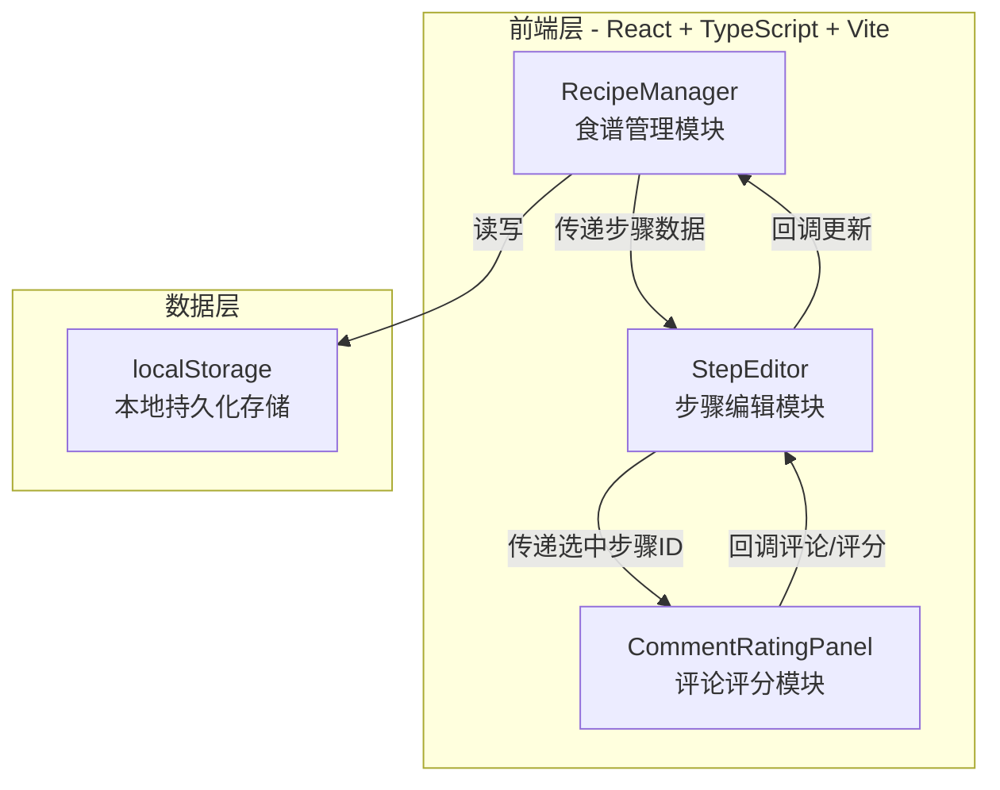
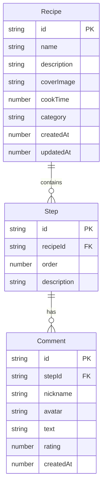

## 1. 架构设计



## 2. 技术说明

- 前端：React 18 + TypeScript + Vite
- 初始化工具：vite-init（react-ts模板）
- 状态管理：React useState/useCallback + props回调传递
- 后端：无（纯前端应用）
- 数据库：localStorage（本地持久化，建议不超过100条食谱）
- 拖拽：react-beautiful-dnd
- 路由：react-router-dom（首页/详情页切换）
- 图标：lucide-react
- 样式：CSS Modules + CSS变量（温暖食物主题配色）

## 3. 路由定义

| 路由 | 用途 |
|------|------|
| / | 首页，食谱搜索筛选与卡片网格展示 |
| /recipe/:id | 食谱详情页，步骤编辑、评论与评分 |

## 4. 数据模型

### 4.1 数据模型定义



### 4.2 类型定义

```typescript
interface Recipe {
  id: string;
  name: string;
  description: string;
  coverImage: string;
  cookTime: number;
  category: string;
  steps: Step[];
  createdAt: number;
  updatedAt: number;
}

interface Step {
  id: string;
  order: number;
  description: string;
  comments: Comment[];
}

interface Comment {
  id: string;
  nickname: string;
  avatar: string;
  text: string;
  rating: number;
  createdAt: number;
}

type Category = '早餐' | '午餐' | '晚餐' | '甜点' | '饮品';
```

## 5. 模块间数据流

```
用户输入食谱信息 → RecipeManager.addRecipe() → 更新recipes状态 → localStorage持久化 → UI重新渲染

用户点击食谱卡片 → 路由跳转至详情页 → RecipeManager传递steps给StepEditor → 渲染步骤卡片列表

用户操作步骤 → StepEditor回调更新 → RecipeManager更新状态 → localStorage持久化

用户选中步骤评论 → StepEditor传递stepId给CommentRatingPanel → 用户提交评论/评分 → 回调更新至StepEditor → 回调更新至RecipeManager → localStorage持久化
```

## 6. 性能策略

- 搜索输入防抖300ms，避免频繁过滤计算
- 使用React.memo优化步骤卡片渲染，避免不必要的重渲染
- localStorage批量读写，步骤更新时整体写入而非逐条操作
- 列表使用key绑定步骤id，确保diff算法高效
- 页面首屏渲染控制在1秒内（空数据状态）
- 50条食谱×10步骤场景下保持30fps以上帧率
