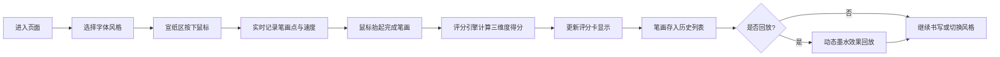

## 1. 产品概述
书法练习笔画打分与动态回放系统，为书法爱好者提供数字化练习平台，通过实时分析用户书写的笔画质量，结合多维度评分与动态回放，帮助用户提升书法技艺。

- 核心功能：毛笔模拟书写、实时笔画质量分析、动态墨水回放、多字体风格参考对比
- 目标用户：书法初学者、爱好者、学生及教师

## 2. 核心功能

### 2.1 功能模块
1. **宣纸书写区**：毛笔模拟、网格辅助线、墨水干湿效果
2. **实时评分卡**：总分与三维度（平滑度、结构、力度）评分展示
3. **历史记录面板**：笔画列表、缩略图、评分、日期时间
4. **动态回放系统**：墨水渐变效果、速度控制、停止功能
5. **字体风格选择**：楷/行/草/隶/篆五种预设风格参考与对比

### 2.2 页面详情

| 模块名称 | 子模块 | 功能描述 |
|-----------|--------|----------|
| 宣纸书写区 | 画布区域 | 占中央70%宽度，米白背景，30px间距网格辅助线 |
| | 毛笔模拟 | 起收笔细、中间粗、端点圆润、纯黑色 |
| | 墨水效果 | 抬起0.3秒后墨色变深并羽化边缘 |
| | 偏差标记 | 与参考轨迹偏差超10度时显示红色标记点 |
| 评分卡 | 总分展示 | 0-100分综合评分，半透明背景 |
| | 维度评分 | 平滑度/结构/力度各附2-3字标签 |
| 历史记录 | 列表条目 | 60px高度，含缩略图、评分、时间 |
| | 回放功能 | 1.5倍速慢速回放，渐变墨水蔓延 |
| 风格选择 | 风格按钮 | 印章样式按钮，5种字体风格 |
| | 参考轮廓 | 按钮下方显示样例笔画轮廓 |
| 响应式布局 | 三栏布局 | 1024px以上：评分卡-宣纸-历史列表 |
| | 双栏布局 | 768-1024px：评分卡抽屉+宣纸+历史列表下方 |
| | 单栏布局 | 768px以下：宣纸满宽，侧滑菜单访问面板 |

## 3. 核心流程
用户进入页面 → 选择字体风格 → 在宣纸区按下鼠标开始书写 → 系统实时记录笔画并计算参数 → 鼠标抬起完成笔画 → 评分引擎计算三维度得分与总分 → 笔画存入历史记录 → 可点击历史条目进行动态回放 → 可切换风格重新练习。

## 4. 用户界面设计

### 4.1 设计风格
- **主色调**：深棕(#8d6e63)背景，米白(#f5f0e1)宣纸，浅木色(#d7ccc8)面板
- **强调色**：深红(#b71c1c)印章边框与文字，浅红(#ffebee)悬停背景
- **辅助色**：网格线(#d6cbb0 透明度0.4)，偏差标记红色半透明
- **字体**：传统中文衬线体，印章按钮使用加粗字体
- **按钮**：方形印章样式，2px深红边框，悬停填充浅红，0.25秒ease-out过渡
- **阴影**：面板和评分卡2px柔和阴影

### 4.2 页面设计概述

| 模块 | UI元素 | 风格描述 |
|------|--------|----------|
| 宣纸区 | Canvas画布 | 米白底+细密网格，圆润毛笔笔迹 |
| 评分卡 | 卡片组件 | 半透明(0.9)圆角12px，阴影2px |
| 历史列表 | 竖向条目 | 60px高，左缩略图右评分时间 |
| 风格按钮 | 印章方形 | 2px深红边框，悬停浅红填充 |
| 侧滑菜单 | 抽屉面板 | 右侧滑入0.3秒，毛玻璃背景 |

### 4.3 响应式
- 桌面优先(1024px+)：三栏布局，左右面板固定宽度，中间宣纸自适应
- 平板(768-1024px)：评分卡折叠为抽屉(宣纸上方)，历史列表移至宣纸下方
- 手机(<768px)：宣纸占满宽度，底部Tab图标触发侧滑菜单，毛玻璃效果

### 4.4 动画与性能
- 墨水干湿过渡：0.3秒渐变
- 回放墨水蔓延：透明度0→1，时长1-4秒（按笔画长度）
- 交互过渡：所有操作0.25秒ease-out
- 侧滑菜单：0.3秒滑入
- 书写帧率：≥30fps
- 回放帧率：≥24fps
