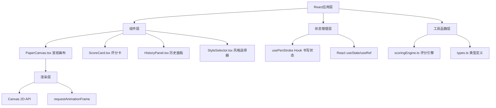

## 1. 架构设计
纯前端单页应用，采用React组件化架构，通过自定义Hook管理书写状态，Canvas 2D API负责墨迹渲染，纯函数模块处理评分计算。



## 2. 技术描述
- **前端框架**：React 18 + TypeScript
- **构建工具**：Vite 5 + @vitejs/plugin-react
- **渲染技术**：Canvas 2D API（高性能笔迹与回放渲染）
- **样式方案**：原生CSS（CSS变量管理主题，媒体查询响应式）
- **状态管理**：React Hooks（useState/useRef/useCallback）+ 自定义Hook
- **动画方案**：requestAnimationFrame（画布渲染）+ CSS transition（UI过渡）

## 3. 路由定义
单页应用，无路由跳转。

| 路由 | 用途 |
|------|------|
| / | 主应用页面，包含全部功能模块 |

## 4. 数据模型

### 4.1 核心类型定义（types.ts）

```typescript
// 笔画点：包含坐标、时间戳、速度
interface StrokePoint {
  x: number;
  y: number;
  timestamp: number;
  speed: number;
}

// 评分维度
interface ScoreDimension {
  score: number;      // 0-100
  label: string;      // 2-3字描述
}

// 笔画数据结构
interface Stroke {
  id: string;
  points: StrokePoint[];
  totalScore: number;
  smoothness: ScoreDimension;
  structure: ScoreDimension;
  pressure: ScoreDimension;
  style: StylePreset;
  timestamp: number;
  deviationMarkers: DeviationMarker[];
}

// 偏差标记点
interface DeviationMarker {
  x: number;
  y: number;
  angleDiff: number;
  createdAt: number;
}

// 字体风格预设
interface StylePreset {
  id: string;
  name: string;           // 楷体/行书/草书/隶书/篆体
  referencePath: StrokePoint[]; // 参考轨迹
  sampleOutline: string;  // 样例轮廓SVG path
}
```

### 4.2 评分维度计算规则（scoringEngine.ts）

| 维度 | 计算方法 | 公式思路 |
|------|----------|----------|
| 平滑度 | 点间角度变化的标准差 | σ(θ_i) → 归一化到0-100，标准差越小分越高 |
| 结构 | 笔画覆盖区域与参考轨迹的重叠率 | IoU(笔画bbox, 参考bbox) × 轨迹点距离匹配率 |
| 力度 | 点间速度变化曲线分析 | 速度方差×20% + 加速度平滑度×80% |
| 总分 | 加权平均 | 平滑度×0.4 + 结构×0.4 + 力度×0.2 |

## 5. 文件结构

```
auto309/
├── package.json              # 项目依赖与脚本
├── vite.config.js            # Vite配置（React插件）
├── tsconfig.json             # TS严格模式，target ES2020
├── index.html                # 入口HTML，100%长宽，深棕背景
└── src/
    ├── index.tsx             # React渲染入口
    ├── types.ts              # 类型定义：Stroke/ScoreDimension/StylePreset
    ├── styles.css            # 全局样式：配色/布局/动画/响应式
    ├── hooks/
    │   └── usePenStroke.ts   # 自定义Hook：管理书写状态与事件
    ├── components/
    │   └── PaperCanvas.tsx   # 宣纸画布：渲染/笔迹/回放/标记
    └── utils/
        └── scoringEngine.ts  # 评分引擎：三维度评分纯函数
```

## 6. 性能保障策略

| 场景 | 优化策略 |
|------|----------|
| 书写渲染(≥30fps) | 离屏Canvas双缓冲、rAF节流、点数据降采样(≥3px间距才记录) |
| 回放渲染(≥24fps) | 预计算回放帧数据、rAF时间戳插值、透明度渐变矩阵预计算 |
| 评分计算 | Web Worker可选（当前主线程同步，笔画点<500时足够快） |
| 内存管理 | 历史记录最多保留20条、Canvas resize时清理旧上下文、离屏Canvas复用 |
