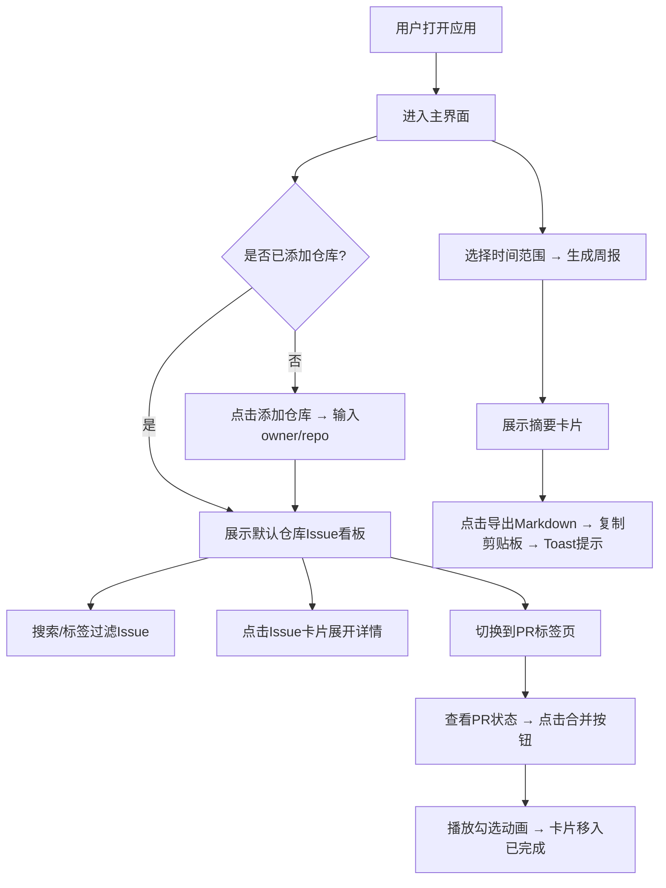

## 1. 产品概述

开源项目Issue看板与代码贡献周报生成器，专为独立开发者设计，用于同时管理多个GitHub仓库的Issue、Pull Request，并自动生成每周贡献摘要报告。解决多仓库维护时信息分散、难以统一追踪的痛点。

## 2. 核心功能

### 2.1 用户角色
| 角色 | 注册方式 | 核心权限 |
|------|---------|---------|
| 独立开发者 | 无需注册，本地使用 | 管理仓库、查看Issue/PR看板、生成周报、导出Markdown |

### 2.2 功能模块
1. **仓库管理面板**：添加/删除最多5个GitHub仓库，切换当前查看仓库
2. **Issue看板**：Kanban风格展示所有开放Issue，支持搜索、标签过滤、详情展开
3. **PR状态追踪**：展示开放PR列表，标注合并状态，模拟合并操作
4. **周报生成器**：统计选定时间范围的贡献数据，生成摘要卡片并支持导出

### 2.3 页面详情
| 页面名称 | 模块名称 | 功能描述 |
|---------|---------|---------|
| 主应用 | 仓库列表侧边栏 | 展示已添加仓库（图标+名称+开放Issue数徽标），点击切换，支持添加删除 |
| 主应用 | 顶部工具栏 | 搜索框、标签过滤器（多选下拉）、时间范围选择器、周报生成入口 |
| Issue看板 | Issue卡片列表 | 卡片展示标题、创建时间、彩色标签、评论数，悬停上浮，点击缩放反馈 |
| Issue看板 | Issue详情面板 | 点击卡片展开Markdown描述内容，支持收起 |
| PR追踪 | PR卡片列表 | 展示PR标题、状态标签（三色：未审查/需要修改/准备合并）、创建时间 |
| PR追踪 | 合并操作 | 点击合并按钮，本地状态变更，卡片移动到已完成列表，播放勾选动画 |
| 周报生成 | 摘要卡片 | 线性渐变背景，展示合并PR数、关闭Issue数、新增评论数、预计代码行数 |
| 周报生成 | 导出功能 | 点击"导出为Markdown"复制到剪贴板，弹出成功Toast |

## 3. 核心流程

## 4. 用户界面设计

### 4.1 设计风格
- **主背景**：#1a1a2e（深靛蓝夜空色）
- **卡片背景**：#16213e（深蓝石板色）
- **文字主色**：#e0e0e0（浅灰白）
- **强调色**：bug红#e74c3c、enhancement绿#2ecc71、未审查橙#f39c12、需修改黄#f1c40f、准备合并蓝#3498db
- **周报背景**：线性渐变 #2c3e50 → #34495e
- **按钮风格**：圆角4px，悬停阴影加深，点击scale(0.98)弹性反馈
- **字体**：使用JetBrains Mono（代码感强，适配开发者场景）+ 系统无衬线字体回退
- **布局**：左侧320px固定仓库列表，右侧工作区分两标签页（水平滑动切换）
- **图标**：使用Lucide图标库，统一线条风格

### 4.2 页面设计概述
| 页面名称 | 模块名称 | UI元素 |
|---------|---------|---------|
| 主应用 | 仓库列表侧边栏 | 宽320px，深色背景，仓库项带GitHub图标、名称、红色圆角徽标显示开放Issue数 |
| 主应用 | 顶部工具栏 | 搜索框（占位文字友好）、标签下拉多选（彩色标签预览）、日期选择器 |
| Issue看板 | Issue卡片 | 圆角8px，阴影柔和，悬停translateY(-3px) shadow加深，标题加粗，时间灰色小字，彩色圆角标签块，评论图标+数字 |
| Issue看板 | 展开详情 | 卡片下方展开区域，Markdown渲染，代码块深色背景，0.3s高度过渡 |
| PR追踪 | PR卡片 | 状态标签居右（橙色/黄色/蓝色圆角），合并按钮蓝色渐变，已完成卡片灰色淡出勾选标记 |
| PR追踪 | 勾选动画 | 绿色对勾图标，0.4s scale(0→1.2→1) + opacity淡入 |
| 周报生成 | 摘要卡片 | 渐变背景，标题白色加粗20px，数据行浅蓝色16px，图标+数值+单位，底部导出按钮白色描边 |
| 周报生成 | Toast提示 | 右下角弹出，绿色背景，白色勾图标+成功文字，3s自动消失 |

### 4.3 响应式设计
- **桌面端（≥768px）**：左侧320px仓库列表 + 右侧工作区，看板卡片网格/列表布局
- **移动端（<768px）**：仓库列表折叠为汉堡菜单（左上角按钮），看板列改为垂直滚动单列，标签页底部或顶部切换，卡片宽度100%
- **触控优化**：所有可点击元素≥44px高度，按钮间距合理，避免误触

### 4.4 性能优化
- Issue看板列表限制每页20条，滚动或分页加载更多
- PR卡片状态变更使用CSS transform而非布局重绘
- Markdown渲染使用纯文本处理（避免引入重型库）
- 搜索防抖300ms，避免频繁重渲染
