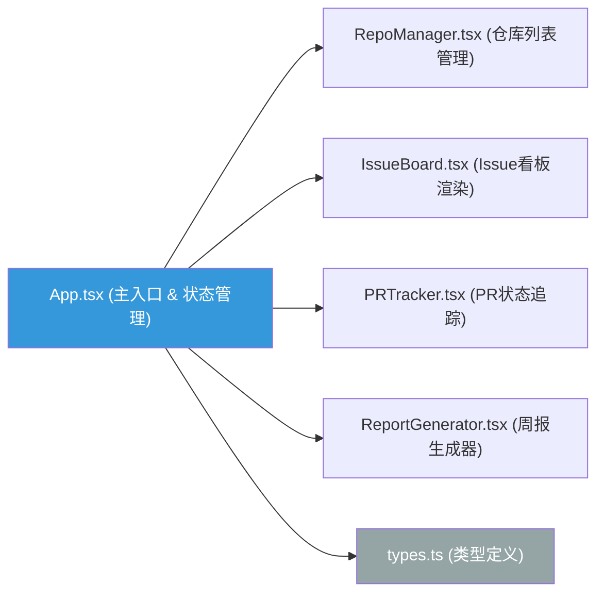

## 1. 架构设计



## 2. 技术说明
- **前端框架**：React 18 + TypeScript 5
- **构建工具**：Vite 5 + @vitejs/plugin-react
- **状态管理**：React useState/useReducer（本地组件级状态，无需引入zustand，保持轻量）
- **样式方案**：原生CSS Module + CSS变量，按文件组织样式，不引入tailwind（用户明确指定文件结构，无tailwind）
- **Mock数据**：内置模拟仓库、Issue、PR数据，无需后端即可运行演示
- **图标库**：lucide-react
- **字体**：Google Fonts JetBrains Mono（通过link引入）

## 3. 路由定义
本应用为单页SPA，无多路由需求，通过组件切换实现视图变化：
| 逻辑视图 | 切换方式 | 组件 |
|---------|---------|------|
| Issue看板 | 标签页切换 | IssueBoard |
| PR追踪 | 标签页切换 | PRTracker |
| 周报弹窗 | 按钮点击Modal | ReportGenerator |

## 4. API定义（模拟层，无真实后端）
```typescript
// types.ts
export interface Repo {
  id: string;
  owner: string;
  name: string;
  fullName: string; // owner/name
  openIssuesCount: number;
  color: string; // 仓库标识色
}

export type LabelName = 'bug' | 'enhancement' | 'documentation' | 'help wanted';

export interface IssueLabel {
  name: LabelName;
  color: string;
}

export interface Issue {
  id: string;
  repoId: string;
  number: number;
  title: string;
  description: string; // Markdown格式
  createdAt: string; // ISO格式，展示为YYYY-MM-DD
  labels: IssueLabel[];
  commentsCount: number;
  isOpen: boolean;
}

export type PRStatus = 'unreviewed' | 'changes_requested' | 'ready_to_merge' | 'merged';

export interface PullRequest {
  id: string;
  repoId: string;
  number: number;
  title: string;
  author: string;
  status: PRStatus;
  createdAt: string;
  mergedAt?: string;
  linesAdded: number; // 模拟50-200
  linesDeleted: number;
}

export interface WeeklyReport {
  startDate: string;
  endDate: string;
  mergedPRs: number;
  closedIssues: number;
  newComments: number;
  totalLinesAdded: number;
  reposBreakdown: { repoName: string; mergedPRs: number; linesAdded: number }[];
}
```

## 5. 数据模型（Mock数据生成策略）
```
Mock数据位于 src/mock/data.ts：
- 预置3-5个示例仓库（如 facebook/react, vuejs/core, vitejs/vite 等知名项目）
- 每个仓库生成8-15条Issue，覆盖4种标签类型
- 每个仓库生成5-10条PR，覆盖4种状态
- 周报数据通过时间过滤PR/Issue动态计算
- 代码行数使用Math.floor(Math.random() * 151) + 50 模拟
```

## 6. 组件交互数据流
```
App.tsx (持有全局state: repos, issues, prs, activeRepoId, activeTab, filters)
  ↓ props传递
  ├→ RepoManager.tsx：操作 repos 数组的增删、设置 activeRepoId
  ├→ IssueBoard.tsx：接收 currentIssues、filters、searchQuery → 渲染卡片
  ├→ PRTracker.tsx：接收 currentPRs → 渲染列表、处理合并(status→merged)
  └→ ReportGenerator.tsx：接收 allPRs、allIssues、dateRange → 计算并展示周报

状态变更：
  合并PR → App.updatePRStatus(id, 'merged') → 触发周报数据更新
  搜索/过滤 → App.setFilters → IssueBoard重新计算filteredIssues
```

## 7. 性能保障措施
- Issue看板使用分页显示（每页20条），超过数量显示"加载更多"按钮
- 所有动画使用transform/opacity（GPU加速），避免触发重排
- 搜索关键词高亮使用正则替换，不修改原数据引用
- 标签切换使用绝对定位+translateX实现水平滑动，而非条件挂载卸载
