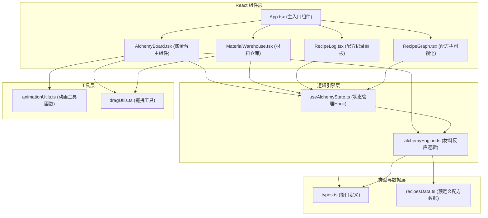

## 1. 架构设计



## 2. 技术选型

- **前端框架**：React 18 + TypeScript
- **构建工具**：Vite（端口3000）
- **唯一ID生成**：uuid
- **状态管理**：React Hooks + useReducer（简单场景，避免引入额外依赖）
- **动画方案**：CSS Animations/Transitions + requestAnimationFrame驱动高性能动画
- **拖拽实现**：原生HTML5 Drag & Drop API + 自定义鼠标跟随（确保16ms延迟）
- **树图渲染**：原生SVG + 贝塞尔曲线绘制

**依赖说明**：严格按照用户要求，仅使用react, react-dom, typescript, vite, @vitejs/plugin-react, uuid，不引入tailwind等额外依赖。

## 3. 文件结构

```
auto311/
├── package.json              # 项目依赖配置
├── vite.config.js            # Vite构建配置（端口3000，react插件）
├── tsconfig.json             # TypeScript配置（严格模式，esnext）
├── index.html                # 入口页面（标题Alchemy Lab）
└── src/
    ├── main.tsx              # React应用入口
    ├── App.tsx               # 根组件，三段式布局
    ├── types.ts              # 类型定义（Material, Recipe, ElementEffect, GameState）
    ├── alchemyEngine.ts      # 材料反应逻辑模块
    ├── AlchemyBoard.tsx      # 炼金台主组件（拖拽、合成、动画）
    ├── RecipeGraph.tsx       # 配方树可视化组件
    ├── components/
    │   ├── MaterialWarehouse.tsx    # 材料仓库组件
    │   ├── RecipeLog.tsx            # 配方记录面板
    │   ├── RecipeCard.tsx           # 单个配方卡片
    │   └── AlchemySlot.tsx          # 炼金台槽位组件
    ├── hooks/
    │   └── useAlchemyState.ts       # 游戏状态管理Hook
    ├── data/
    │   └── initialRecipes.ts        # 预定义配方表与初始材料
    └── utils/
        ├── animationUtils.ts        # requestAnimationFrame动画工具
        └── geometryUtils.ts         # 几何计算（槽位坐标等）
```

### 文件调用关系与数据流向：

| 文件 | 被调用者 | 调用者 | 数据流向 |
|------|----------|--------|----------|
| types.ts | - | 所有文件 | 基础类型定义导出 |
| alchemyEngine.ts | types.ts, initialRecipes.ts | AlchemyBoard.tsx, useAlchemyState.ts | 输入材料数组→输出合成结果对象 |
| AlchemyBoard.tsx | alchemyEngine.ts, useAlchemyState.ts, animationUtils, geometryUtils, AlchemySlot.tsx | App.tsx | 用户拖拽分配材料→调用引擎→更新状态→渲染结果动画 |
| RecipeGraph.tsx | types.ts | App.tsx | 通过props接收discoveredRecipes→SVG树渲染与交互 |
| MaterialWarehouse.tsx | types.ts, dragUtils | App.tsx | discoveredMaterials→网格渲染→拖拽源输出 |
| RecipeLog.tsx | types.ts, RecipeCard.tsx | App.tsx | recipeHistory→卡片列表→倒序渲染 |
| useAlchemyState.ts | types.ts, alchemyEngine.ts | AlchemyBoard, MaterialWarehouse, RecipeLog, RecipeGraph | 统一状态管理，dispatch动作→reducer更新→组件响应 |

## 4. 数据模型

### 4.1 接口定义

```typescript
// src/types.ts
export type ElementType = 'fire' | 'water' | 'earth' | 'air' | 'chaos' | 'spirit' | 'metal' | 'nature';

export interface Material {
  id: string;                    // uuid
  name: string;                  // 材料名称
  emoji: string;                 // 显示图标
  elementType: ElementType;      // 元素属性
  discovered: boolean;           // 是否已被发现
  discoveredAt?: number;         // 发现时间戳
  synthesisCount: number;        // 参与合成的次数
}

export interface Recipe {
  id: string;                    // uuid
  input: [string, string];       // 输入材料ID（顺序无关）
  output: string;                // 输出材料ID
  name: string;                  // 配方名称
  description: string;           // 配方描述（如"燃烧的玫瑰+龙息石→火焰精华"）
  discoveredAt: number;          // 发现时间戳
  isLocked: boolean;             // 是否锁定（不被移除）
  isNewDiscovery: boolean;       // 是否为新发现
}

export interface ElementEffect {
  type: 'glow' | 'spark' | 'smoke' | 'flash';
  color: string;
  duration: number;
  intensity: number;
}

export interface AlchemySlot {
  index: number;                 // 0-5 槽位索引
  materialId: string | null;     // 放置的材料ID
  position: { x: number; y: number }; // 相对坐标
  isGlowing: boolean;            // 是否发光（可合成状态）
}

export interface SynthesisResult {
  success: boolean;
  outputMaterial?: Material;
  recipeId?: string;
  effects: ElementEffect[];
  failReason?: string;
}

export interface GameState {
  materials: Record<string, Material>;       // 所有材料字典
  recipes: Record<string, Recipe>;           // 所有配方字典
  discoveredMaterialIds: string[];           // 已发现材料ID列表
  discoveredRecipeIds: string[];             // 已发现配方ID列表
  recipeHistory: string[];                   // 配方历史（按发现时间倒序，最多20条）
  slots: AlchemySlot[];                      // 炼金台6个槽位
  resultSlotMaterialId: string | null;       // 结果槽材料
  isAnimating: boolean;                      // 是否正在播放动画
  failureRate: number;                       // 当前失效率
  consecutiveSuccess: number;                // 连续成功次数
  consecutiveFailure: number;                // 连续失败次数
  hasPassionBuff: boolean;                   // 是否有炼金热情Buff
  selectedGraphNodeId: string | null;        // 配方树选中节点
  synthesisMessage: { type: 'success' | 'failure'; text: string } | null;
}
```

### 4.2 初始数据

初始提供8-10种基础材料和20-30条预定义配方，确保探索深度。材料元素属性覆盖8种元素类型，配方设计遵循元素相克相生逻辑。

## 5. 核心算法与逻辑

### 5.1 合成判定算法（alchemyEngine.ts）
- **复杂度要求**：≤5ms计算时间
- **输入**：两个材料ID
- **查找逻辑**：使用双向Map（`materialAId + "|" + materialBId`双向键）O(1)查找配方
- **随机失败**：基于当前failureRate生成[0,1)随机数判定
- **输出**：SynthesisResult对象，包含成功/失败状态、产物材料、特效列表

### 5.2 槽位几何计算（geometryUtils.ts）
- 6个槽位均匀分布在直径400px的圆周上
- 公式：`angle = (index / 6) * 2π - π/2`，`x = cos(angle) * r + centerX`，`y = sin(angle) * r + centerY`
- 相邻判定：`(indexA + 1) % 6 === indexB || (indexB + 1) % 6 === indexA`

### 5.3 失效率动态调整逻辑
- 基础失效率：20%
- 连续成功≥3次：失效率降至10%，设置hasPassionBuff=true
- 连续失败≥2次：失效率重置为20%，hasPassionBuff=false

### 5.4 配方历史管理（最多20条）
- 新配方插入数组头部
- 超出20条时，从尾部移除isLocked=false的记录
- 锁定记录（isLocked=true）永不被移除

### 5.5 配方树布局算法（RecipeGraph.tsx）
- 层次布局：根节点（混沌物质）在顶部
- BFS遍历派生关系确定层级
- 同层节点水平均匀分布
- 父节点→子节点用贝塞尔曲线连接
- 每次更新增量渲染，控制在≤50ms

## 6. 性能优化策略

1. **动画性能**：transform/opacity属性动画（GPU加速），避免触发重排
2. **拖拽性能**：使用requestAnimationFrame节流位置更新，避免频繁setState
3. **渲染优化**：React.memo包裹纯组件，useMemo缓存计算结果，useCallback稳定函数引用
4. **配方树渲染**：仅当discoveredRecipeIds长度变化时重算布局，节点点击仅更新selectedNode状态
5. **合成逻辑**：预构建配方查找Map，O(1)时间复杂度
