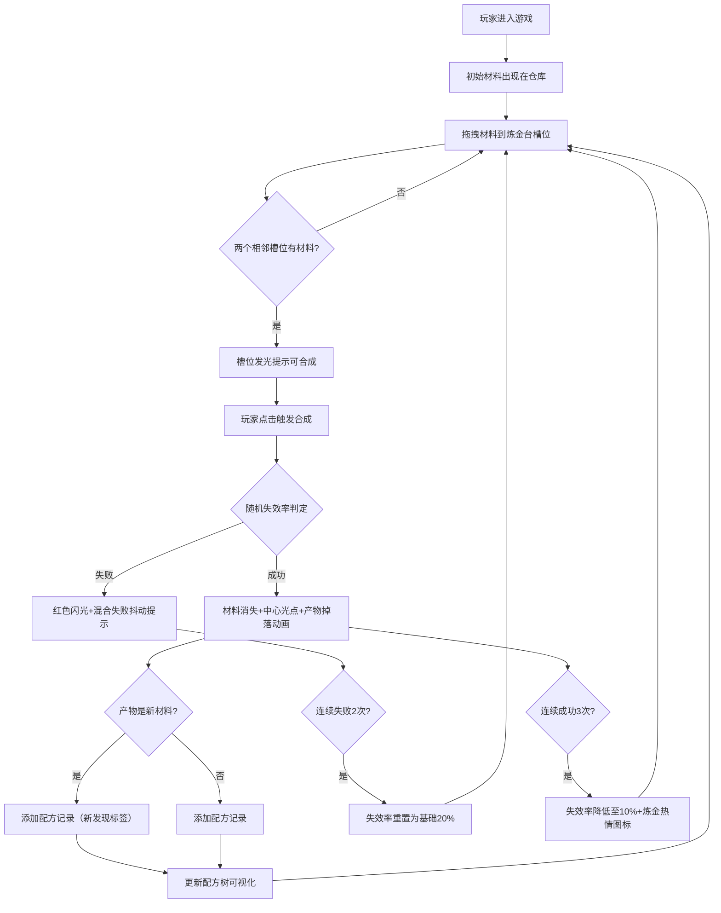

## 1. 产品概述
地宫炼金术主题策略Roguelike玩法原型应用，提供核心炼金配方解锁与元素转换系统。玩家通过拖拽材料到炼金台，观察元素反应并探索新的合成路径。

- 目标用户：独立游戏设计师、策略游戏爱好者、炼金术主题玩家
- 产品价值：验证炼金配方发现机制的可玩性，为完整Roguelike游戏提供核心玩法原型

## 2. 核心特性

### 2.1 功能模块
1. **炼金台合成模块**：圆形炼金台（6个材料槽位）、材料拖拽交互、合成动画与特效
2. **配方发现记录模块**：配方卡片展示、锁定功能、历史记录管理（最多20条）
3. **配方树可视化模块**：树状图展示派生关系、节点详情面板、交互高亮
4. **失败与状态反馈模块**：失效率系统、连续成功/失败状态切换、炼金热情Buff

### 2.2 页面详情
| 页面名称 | 模块名称 | 功能描述 |
|-----------|-------------|---------------------|
| 主应用页面 | 炼金台合成 | 6个圆形槽位均匀分布，拖拽材料入槽，相邻槽位可合成时发光动画，点击触发合成特效 |
| 主应用页面 | 材料仓库 | 网格展示已发现材料（65px格子），支持拖拽出库，毛玻璃半透明背景 |
| 主应用页面 | 配方记录面板 | 左侧300px宽区域，配方卡片按发现时间倒序排列，星形锁定按钮，"新发现！"标签 |
| 主应用页面 | 配方树可视化 | 右侧下方300×400px区域，贝塞尔曲线连接节点，根节点"混沌物质"，点击节点显示详情 |
| 主应用页面 | 状态反馈系统 | 合成失败红色闪光，"混合失败"抖动提示，连续3次成功显示炼金热情图标 |

## 3. 核心流程

## 4. 用户界面设计

### 4.1 设计风格
- **主色调**：深色炼金术主题 `#1a1a2e`（主背景）、`#0f0f1e`（炼金台区域）、`#2c1810`（炼金台台面）
- **强调色**：金色系 `#c9a961`（边框）、`#ffd54f`（高亮发光）、`#ffb300`（发光渐变）
- **辅助色**：成功 `#2e7d32`、失败 `#e74c3c`、中性文字 `#b8b8d0`
- **边框与分隔**：`#8b7355`（槽位边框）、`#4a4a6a`（卡片边框）、`#3a3a5a`（分隔线）
- **字体**：使用Cinzel装饰性字体（标题）搭配Crimson Text衬线字体（正文），营造古典炼金术氛围
- **按钮/交互元素**：圆角8px，悬停1.05倍缩放，0.3s ease-out过渡
- **图标风格**：emoji图标（材料）+ Lucide图标（星形锁定等功能图标）

### 4.2 页面布局
| 区域 | 位置 | 尺寸 | UI元素 |
|-----------|-------------|--------|-------------|
| 配方记录面板 | 左侧 | 宽300px，满高 | 配方卡片（220px宽）、卡片列表、滚动容器 |
| 炼金台区域 | 中央 | 自适应，最小宽500px | 圆形炼金台（直径400px）、6个材料槽位（直径60px）、结果展示区、中心光点动画 |
| 材料仓库 | 右侧上方 | 宽400px | 网格布局、毛玻璃效果（backdrop-filter: blur(8px)）、拖拽源 |
| 配方树可视化 | 右侧下方 | 宽300px，高400px | SVG树状图、圆形节点（直径50px）、贝塞尔连接线、详情浮层面板 |
| 分隔线 | 右侧面板中间 | 1px solid #3a3a5a | 水平分隔材料仓库与配方树 |

**动画设计**：
- 拖拽跟随：半透明阴影（offset 4px, blur 8px, #000000aa）
- 可合成发光：0.5s循环，`#ffd54f`→`#ffb300`渐变
- 合成光点：0.3s放大到40px后消散
- 产物掉落：0.4s弹性曲线
- 炼金台呼吸：1.01倍缩放，0.5s周期
- 失败闪光：0.2s全屏红色覆盖（透明度0.2）
- 失败抖动：0.3s抖动动画
- 炼金热情：脉冲缩放1.2↔1.0循环
- 节点选中：0.3s放大1.2倍，颜色变`#ffd54f`

### 4.3 响应式适配
- **桌面端（≥1000px）**：三段式布局（左300px | 中央自适应 | 右400px）
- **移动端（<1000px）**：右侧面板折叠到底部横排布局，材料仓库和配方树各占50%宽度，垂直滚动适配

### 4.4 性能指标
- 所有动画帧率≥50fps（使用requestAnimationFrame驱动）
- 拖拽操作延迟≤16ms
- 材料合成逻辑计算≤5ms
- 配方树节点更新渲染≤50ms
