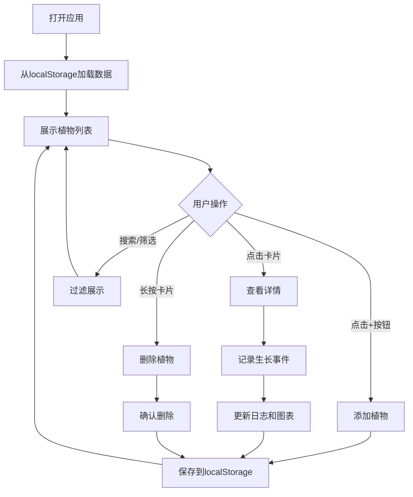

## 1. 产品概述
交互式植物图鉴与生长观察日志应用，帮助用户记录和管理植物生长过程，记录浇水施肥等养护事件，并通过可视化图表直观展示植物生长趋势。

- 面向植物爱好者和园艺从业者，解决植物养护记录混乱、生长过程难以追踪的问题
- 提供本地数据持久化和导出功能，确保数据安全，支持跨设备迁移

## 2. 核心功能

### 2.1 用户角色
无需登录，单用户本地应用。

### 2.2 功能模块
1. **植物列表页**：植物卡片网格展示、搜索筛选、添加植物、数据导入导出
2. **植物详情页**：生长曲线图表、时间线日志面板、事件记录
3. **数据管理模块**：植物增删改查、生长日志管理、图表数据生成

### 2.3 页面详情
| 页面名称 | 模块名称 | 功能描述 |
|-----------|-------------|---------------------|
| 植物列表页 | 植物卡片网格 | 展示所有植物卡片，支持响应式布局，每行1-4个卡片 |
| 植物列表页 | 搜索筛选栏 | 实时搜索（名称/品种）、品种筛选按钮（多肉/观叶/开花） |
| 植物列表页 | 浮动添加按钮 | 打开添加植物模态框 |
| 植物列表页 | 顶部操作菜单 | 数据导入、数据导出 |
| 植物详情页 | 生长曲线图 | 双轴折线图展示每周高度和叶片数量变化 |
| 植物详情页 | 日志面板 | 时间线展示生长事件、记录新事件（浇水/施肥/修剪/换盆） |
| 添加植物模态框 | 表单 | 名称、品种、初始高度、初始叶片数量输入 |

## 3. 核心流程

### 3.1 添加植物流程
用户点击浮动添加按钮 → 打开模态框 → 填写植物信息 → 保存 → 植物卡片淡入上滑出现 → 数据自动存入localStorage

### 3.2 记录生长事件流程
用户点击植物卡片 → 进入详情页 → 在底部日志面板选择事件类型和日期 → 填写备注 → 保存 → 事件添加到时间线顶部 → 平滑滚动到底部 → 图表数据自动更新

### 3.3 搜索筛选流程
用户在搜索框输入文字 → 实时过滤植物卡片 → 点击品种筛选按钮 → 进一步筛选 → 卡片缩放动画展示/隐藏

### 3.4 删除植物流程
用户长按植物卡片（>800ms） → 左侧出现删除按钮 → 点击删除 → 弹出确认对话框 → 确认后卡片向右滑出消失

## 4. 用户界面设计

### 4.1 设计风格
- **设计主题**：柔和自然风格，清新的绿色系配色
- **主色调**：#27ae60（深绿）、#2ecc71（浅绿）
- **背景色**：#f0f5f0（浅绿白）
- **卡片风格**：白色背景，圆角12px，阴影2px rgba(0,0,0,0.05)，悬停时阴影加深到6px
- **字体**：系统无衬线字体，-apple-system, BlinkMacSystemFont, 'Segoe UI', Roboto, sans-serif
- **动画**：所有交互0.3s ease平滑过渡，卡片添加0.4s淡入上滑

### 4.2 页面设计概述

| 页面名称 | 模块名称 | UI元素 |
|-----------|-------------|-------------|
| 植物列表页 | 搜索筛选栏 | 左侧放大镜图标搜索框（宽320px），右侧三个圆角筛选按钮 |
| 植物列表页 | 植物卡片 | 名称（加粗16px居中）、品种标签（圆角6px，颜色区分品种）、最后浇水/施肥时间 |
| 植物列表页 | 浮动按钮 | 圆形直径56px，背景#27ae60，白色加号，悬停放大1.1倍 |
| 植物列表页 | 顶部菜单 | 三点图标，下拉菜单含导入/导出选项 |
| 植物详情页 | 折线图 | 高度350px，上下留白15px，双Y轴，蓝色实线高度，绿色虚线叶片数 |
| 植物详情页 | 日志面板 | 左侧时间线（灰色竖线#bdc3c7，彩色节点圆点），右侧事件记录表单 |
| 添加模态框 | 表单 | 名称输入（20字符限制）、品种下拉（带图标）、高度滑块（0-100cm）、叶片数输入（0-20） |

### 4.3 响应式设计
- **桌面端**（≥768px）：每行最多4个卡片
- **平板端**（<768px）：每行2个卡片
- **移动端**（<480px）：每行1个卡片
- 触摸交互优化：长按删除、点击区域放大

### 4.4 性能指标
- 100个卡片渲染：滚动帧率≥50fps
- 搜索/筛选响应：≤100ms
- 动画流畅度：所有过渡动画60fps
