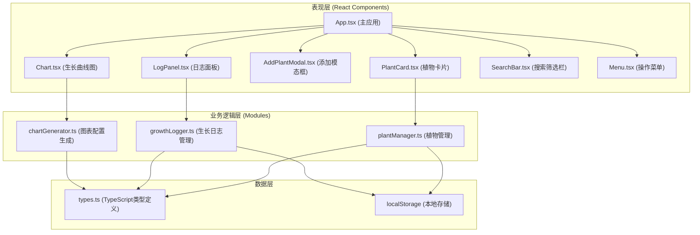

## 1. 架构设计



## 2. 技术描述

- **前端框架**：React@18 + TypeScript@5
- **构建工具**：Vite@5 + @vitejs/plugin-react@4
- **图表库**：recharts@2（React友好的图表库，替代ECharts）
- **工具库**：uuid@9（生成唯一ID）
- **状态管理**：React useState + useCallback（轻量应用，无需Redux）
- **样式方案**：CSS Modules + CSS Variables（组件化样式，避免冲突）
- **数据存储**：localStorage（本地持久化）

## 3. 项目文件结构

```
auto312/
├── package.json
├── vite.config.js
├── tsconfig.json
├── index.html
└── src/
    ├── types.ts              # Plant, GrowthRecord接口定义
    ├── plantManager.ts       # 植物CRUD管理，localStorage读写
    ├── growthLogger.ts       # 生长日志记录管理
    ├── chartGenerator.ts     # 生成图表配置（recharts兼容）
    ├── App.tsx               # 主应用组件
    ├── main.tsx              # React入口
    ├── index.css             # 全局样式
    └── components/
        ├── PlantCard.tsx     # 植物卡片组件
        ├── LogPanel.tsx      # 日志面板组件
        ├── AddPlantModal.tsx # 添加植物模态框
        ├── Chart.tsx         # 生长曲线图表
        ├── SearchBar.tsx     # 搜索筛选栏
        └── Menu.tsx          # 顶部操作菜单
```

## 4. 数据模型

### 4.1 TypeScript类型定义

```typescript
// 植物品种
type PlantCategory = '多肉' | '观叶' | '开花' | '水生';

// 事件类型
type EventType = '浇水' | '施肥' | '修剪' | '换盆';

// 施肥类型
type FertilizerType = '普通' | '促花' | '促根';

// 植物接口
interface Plant {
  id: string;
  name: string;
  category: PlantCategory;
  initialHeight: number;  // cm
  initialLeaves: number;
  createdAt: string;      // ISO timestamp
  growthRecords: GrowthRecord[];
}

// 生长记录接口
interface GrowthRecord {
  id: string;
  plantId: string;
  eventType: EventType;
  timestamp: string;      // ISO timestamp
  height?: number;        // 当前高度（cm）
  leaves?: number;        // 当前叶片数
  fertilizerType?: FertilizerType;
  note?: string;          // 备注
}
```

### 4.2 本地存储结构

```javascript
// localStorage key: 'plantData'
{
  plants: Plant[],
  version: '1.0.0',
  exportedAt: string  // ISO timestamp
}
```

## 5. 模块职责

### 5.1 plantManager.ts
- `getPlants(): Plant[]` - 获取所有植物
- `addPlant(plant: Omit<Plant, 'id' | 'createdAt' | 'growthRecords'>): Plant` - 添加植物
- `updatePlant(id: string, updates: Partial<Plant>): Plant | null` - 更新植物
- `deletePlant(id: string): boolean` - 删除植物
- `savePlants(): void` - 保存到localStorage
- `loadPlants(): Plant[]` - 从localStorage加载
- `exportData(): string` - 导出JSON字符串
- `importData(jsonString: string): boolean` - 导入数据

### 5.2 growthLogger.ts
- `getRecords(plantId: string): GrowthRecord[]` - 获取植物的所有记录
- `addRecord(plantId: string, record: Omit<GrowthRecord, 'id' | 'plantId'>): GrowthRecord | null` - 添加记录
- `canWater(plantId: string): boolean` - 检查是否可以浇水（间隔≥2小时）
- `getLastWatering(plantId: string): GrowthRecord | null` - 获取最后一次浇水记录
- `getLastFertilizing(plantId: string): GrowthRecord | null` - 获取最后一次施肥记录

### 5.3 chartGenerator.ts
- `generateWeeklyChartConfig(records: GrowthRecord[]): ChartOption` - 生成每周生长曲线配置
- 按周分组数据，计算每周平均高度和叶片数
- 返回recharts兼容的配置对象

## 6. 性能优化策略

1. **列表虚拟滚动**：使用CSS `content-visibility: auto` 优化100+卡片渲染性能
2. **搜索防抖**：使用useMemo缓存搜索结果，避免不必要的重渲染
3. **组件memo化**：使用React.memo包裹PlantCard等频繁渲染的组件
4. **事件节流**：滚动事件使用requestAnimationFrame优化
5. **批量更新**：数据导入时批量更新state，减少重渲染次数
6. **CSS硬件加速**：动画使用transform和opacity，触发GPU加速
