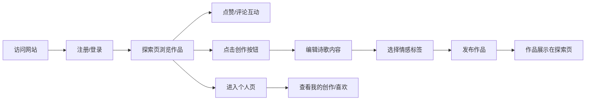

## 1. 产品概述

诗韵社区是一个面向诗歌爱好者的在线创作与分享平台，用户可以围绕每日主题创作短诗、互相点评，并通过热度排行和标签聚合发现优质作品。

- 目标用户：社区书店顾客、诗歌爱好者、文艺青年
- 核心价值：低门槛的诗歌创作体验，温暖的社区氛围，优质作品的发现机制

## 2. 核心特性

### 2.1 用户角色

| 角色 | 注册方式 | 核心权限 |
|------|----------|----------|
| 普通用户 | 用户名+密码注册 | 发布诗歌、点赞评论、浏览作品、编辑个人资料 |

### 2.2 功能模块

1. **用户模块**：注册、登录、登出、个人资料编辑
2. **作品模块**：发布诗歌、作品列表、标签过滤、热度排行
3. **互动模块**：点赞、评论、作品详情
4. **个人中心**：我的创作、我的喜欢、个人简介

### 2.3 页面详情

| 页面名称 | 模块名称 | 功能描述 |
|---------|---------|----------|
| 登录注册页 | 用户模块 | 表单验证、登录/注册切换、加载动画、错误提示 |
| 探索页 | 作品模块 | 作品卡片列表、标签过滤、排序切换、交错动画 |
| 创作页 | 作品模块 | 标题输入、正文编辑、标签选择、发布提交 |
| 个人页 | 用户模块 | 我的创作/我的喜欢标签切换、简介编辑、空状态 |
| 详情弹窗 | 互动模块 | 诗歌展示、作者信息、点赞、评论区 |

## 3. 核心流程

用户访问网站 → 注册/登录账号 → 浏览探索页发现作品 → 点赞/评论互动 → 创作发布自己的诗歌 → 在个人页管理作品

## 4. 用户界面设计

### 4.1 设计风格

- **主背景色**：米白色 #FDF5E6，营造温暖书卷气息
- **主文字色**：深褐色 #3E2723，优雅易读
- **主操作色**：墨绿色 #2E7D32，悬停变深绿 #1B5E20
- **卡片风格**：柔和圆角 12px，浅阴影，悬停上浮效果
- **导航栏**：半透明磨砂玻璃效果（backdrop-filter: blur(10px)），固定顶部
- **字体**：标题使用衬线字体，正文使用优雅的无衬线字体，诗歌正文使用手写体

### 4.2 页面设计概览

| 页面名称 | 模块名称 | UI元素 |
|---------|---------|--------|
| 登录注册页 | 表单模块 | 居中卡片、输入框、切换标签、脉冲加载按钮、抖动错误动画 |
| 探索页 | 作品列表 | 顶部导航、标签过滤栏、两列卡片网格、交错渐入动画 |
| 创作页 | 表单模块 | 标题输入、多行文本域（字符计数）、标签多选、发布按钮 |
| 个人页 | 个人中心 | 用户头像昵称、简介编辑、标签切换、作品列表、空状态插画 |
| 详情弹窗 | 模态框 | 半透明遮罩、左侧信纸背景诗歌、右侧作者信息与评论区、粒子动画背景 |

### 4.3 响应式设计

- 桌面端：探索页两列卡片网格布局
- 移动端（<768px）：自动切换为单列布局
- 触摸优化：按钮最小尺寸 44px，足够的点击区域

### 4.4 交互动效

- 按钮点击：波纹效果
- 卡片悬停：上浮 5px 并加深阴影
- 列表切换：交错放大渐入动画（≤600ms）
- 点赞：爱心图标空心变实心并缩放一次
- 新评论：从下往上滑入动画
- 模态框关闭：向下滑出并淡出
- 加载状态：旋转的墨水瓶图标动画
- 详情弹窗背景：Canvas 动态渐变粒子动画
