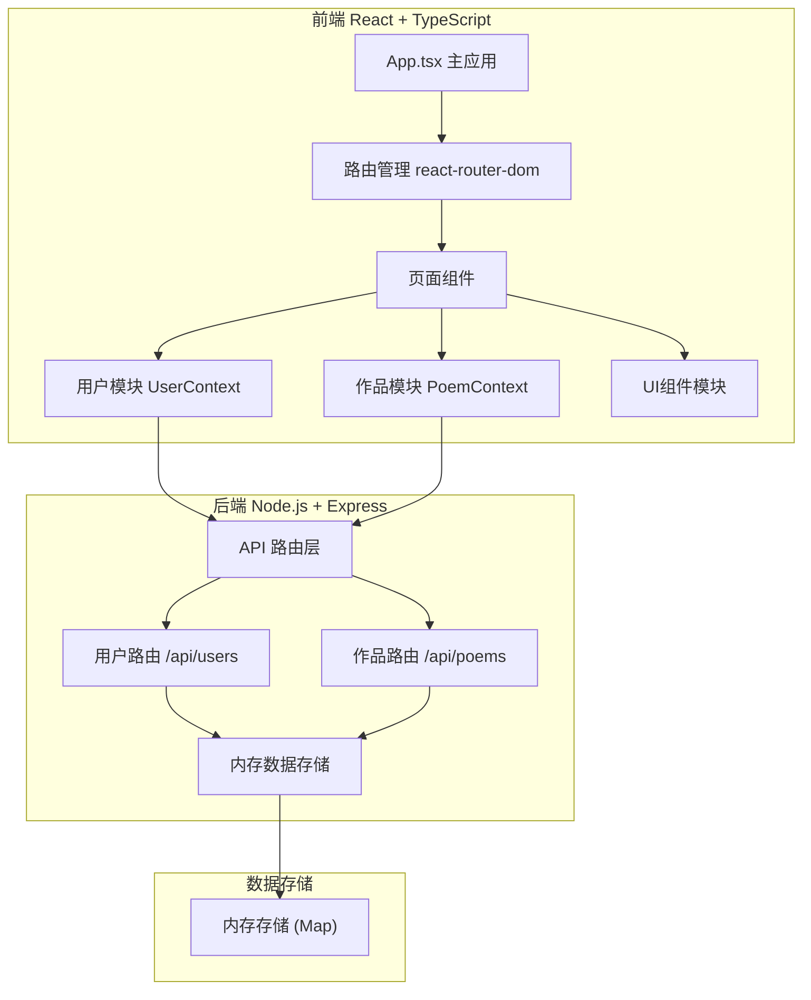

## 1. 架构设计



## 2. 技术栈说明

- **前端框架**：React 18 + TypeScript
- **构建工具**：Vite 5
- **路由管理**：react-router-dom
- **状态管理**：React Context API
- **样式方案**：CSS Modules / 内联样式
- **后端框架**：Express 4
- **密码加密**：bcryptjs
- **唯一标识**：uuid
- **跨域处理**：cors
- **数据存储**：内存存储（开发阶段）

## 3. 路由定义

| 路由路径 | 页面组件 | 功能说明 |
|---------|---------|----------|
| /login | LoginPage | 登录注册页面 |
| /explore | ExplorePage | 探索页，作品列表 |
| /create | CreatePoemPage | 创作页，发布诗歌 |
| /profile | ProfilePage | 个人中心页 |
| / | 重定向到 /explore | 首页重定向 |

## 4. API 接口定义

### 4.1 用户模块 API

| 方法 | 路径 | 描述 | 请求体 | 响应 |
|------|------|------|--------|------|
| POST | /api/users/register | 用户注册 | `{username, password, nickname}` | `{id, username, nickname, token}` |
| POST | /api/users/login | 用户登录 | `{username, password}` | `{id, username, nickname, token}` |
| GET | /api/users/profile | 获取用户信息 | (header: token) | `{id, username, nickname, bio}` |
| PUT | /api/users/profile | 更新用户信息 | `{nickname, bio}` (header: token) | `{id, username, nickname, bio}` |

### 4.2 作品模块 API

| 方法 | 路径 | 描述 | 请求体 | 响应 |
|------|------|------|--------|------|
| POST | /api/poems | 发布诗歌 | `{title, content, tags}` (header: token) | `{id, title, content, authorId, authorName, tags, likes, comments, createdAt}` |
| GET | /api/poems | 获取作品列表 | query: `sort?, tag?` | `[{id, title, content, authorId, authorName, tags, likes, comments: [], createdAt}]` |
| GET | /api/poems/:id | 获取作品详情 | - | 完整作品对象 |
| POST | /api/poems/:id/like | 点赞/取消点赞 | - (header: token) | `{likes, liked}` |
| POST | /api/poems/:id/comments | 添加评论 | `{content}` (header: token) | `{id, userId, userName, content, createdAt}` |
| GET | /api/users/:id/poems | 获取用户作品 | - | 作品列表 |
| GET | /api/users/liked/poems | 获取我点赞的作品 | (header: token) | 作品列表 |

## 5. 数据模型

### 5.1 用户模型 (User)

```typescript
interface User {
  id: string;
  username: string;
  password: string;
  nickname: string;
  bio: string;
  createdAt: number;
}
```

### 5.2 作品模型 (Poem)

```typescript
interface Poem {
  id: string;
  title: string;
  content: string;
  authorId: string;
  authorName: string;
  tags: string[];
  likes: number;
  likedBy: string[];
  comments: Comment[];
  createdAt: number;
}
```

### 5.3 评论模型 (Comment)

```typescript
interface Comment {
  id: string;
  userId: string;
  userName: string;
  content: string;
  createdAt: number;
}
```

## 6. 文件结构

```
project/
├── package.json
├── vite.config.js
├── tsconfig.json
├── index.html
├── src/
│   ├── App.tsx                    # 主应用组件，路由配置
│   ├── main.tsx                   # 入口文件
│   ├── index.css                  # 全局样式
│   ├── modules/
│   │   ├── user/
│   │   │   ├── UserContext.tsx    # 用户上下文
│   │   │   ├── LoginPage.tsx      # 登录注册页
│   │   │   └── ProfilePage.tsx    # 个人中心页
│   │   └── poem/
│   │       ├── PoemContext.tsx    # 作品上下文
│   │       ├── ExplorePage.tsx    # 探索页
│   │       └── CreatePoemPage.tsx # 创作页
│   ├── components/
│   │   ├── Navbar.tsx             # 导航栏
│   │   ├── PoemCard.tsx           # 作品卡片
│   │   ├── PoemDetailModal.tsx    # 作品详情弹窗
│   │   └── ParticleBackground.tsx # 粒子背景
│   ├── types/
│   │   └── index.ts               # 类型定义
│   └── utils/
│       └── api.ts                 # API 请求工具
└── server/
    ├── index.js                   # 后端入口
    ├── routes/
    │   ├── users.js               # 用户路由
    │   └── poems.js               # 作品路由
    ├── middleware/
    │   └── auth.js                # 认证中间件
    └── store/
        └── memoryStore.js         # 内存存储
```

## 7. 数据流向

1. **用户登录流程**：
   - LoginPage → UserContext.register()/login() → API 调用 → 后端验证 → 返回 token → 存储 localStorage → 更新全局状态 → 跳转探索页

2. **发布作品流程**：
   - CreatePoemPage → PoemContext.createPoem() → API 调用 → 后端存储 → 返回作品数据 → 更新作品列表 → 跳转探索页

3. **作品列表加载**：
   - ExplorePage → PoemContext.fetchPoems() → API 调用 → 后端查询 → 返回作品列表 → 更新 Context 状态 → 渲染卡片

4. **点赞/评论流程**：
   - PoemDetailModal → PoemContext.likePoem()/addComment() → API 调用 → 后端更新 → 返回最新数据 → 更新 Context 状态 → 刷新 UI

## 8. 性能优化策略

- **代码分割**：使用 React.lazy 和 Suspense 实现页面级别的代码分割
- **懒加载**：探索页组件延迟加载，减少首屏体积
- **动画优化**：使用 CSS transform 和 opacity 实现 GPU 加速动画
- **防抖节流**：搜索、滚动等操作使用防抖节流优化
- **内存管理**：及时清理事件监听和定时器，避免内存泄漏
